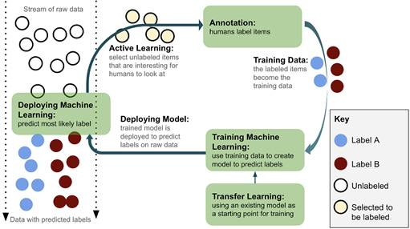
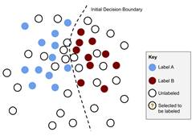
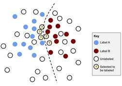
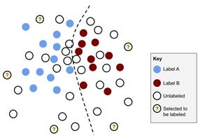
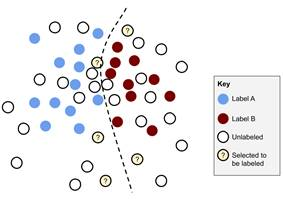
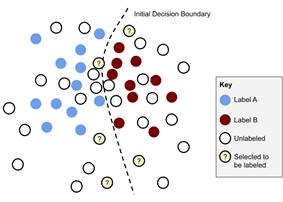
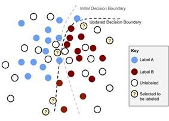
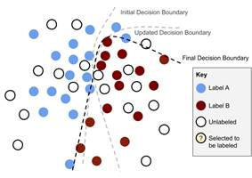
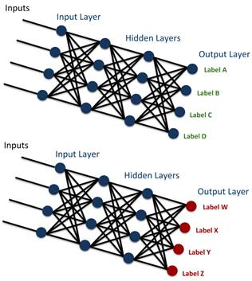
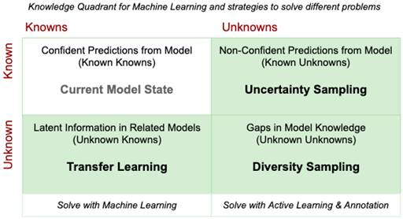

***
## Introduction to Human-in-the-Loop Machine Learning

### This chapter covers
- An overview of Human-in-the-Loop Machine Learning architectures and the key components
- An introduction to Annotation
- An introduction to Active Learning
- An introduction to Human-Computer Interaction
- An introduction to Transfer Learning

---

Unlike robots in the movies, most of today’s Artificial Intelligence (AI) cannot learn by itself: it relies on intensive human feedback. Probably 90% of Machine Learning applications today are powered by Supervised Machine Learning. This covers a wide range of use cases: an autonomous vehicle can drive you safely down the street because humans have spent thousands of hours telling it when its sensors are seeing a ‘pedestrian’, ‘moving vehicle’, ‘lane marking’, and every other relevant object; your in-home device knows what to do when you say ‘turn up the volume’, because humans have spent thousands of hours telling it how to interpret different commands; and your Machine Translation service can translate between languages because it has been trained on thousands (or maybe millions) of human-translated texts.

Our intelligent devices are learning less from programmers who are hard-coding rules, and more from examples and feedback given by non-technical humans. These examples - the training data - are used to train Machine Learning models and make them more accurate for their given tasks. However, programmers still need to create the software that allows the feedback from non-technical humans. So this raises one of the most important questions in technology today: what are the right ways for humans and machine learning algorithms to interact to solve problems? After reading this book, you will be able to answer these questions for many uses that you might face in Machine Learning.

Annotation and Active Learning are the cornerstones of Human-in-the-Loop Machine Learning. They determine how you get training data from people, and what is the right data to put in front of people when you don’t have the budget or time for human feedback on all of your data. Transfer Learning allows us avoid a cold-start, adapting existing Machine Learning models to our new task, rather than starting at square one. Transfer Learning is more recently popular, so it is an advanced topic that we will return to towards the end of the text. We will introduce each of these concepts in this chapter.

---

### 1.1       The Basic Principles of Human-in-the-Loop Machine Learning

Human-in-the-Loop Machine Learning is when humans and Machine Learning processes interact to solve one or more of the following:

- Making Machine Learning more accurate
- Getting Machine Learning to the desired accuracy faster
- Making humans more accurate
- Making humans more efficient

Figure 1.1 shows what this process looks like for adding labels to data. This process could be any labeling process: adding the topic to news stories, classifying sports photos according to the sport being played, identifying the sentiment of a social media comment, rating a video for how explicit the content is, etc. In all cases, you could use Machine Learning to automate some of the process of labeling, or to speed up the human process. In all cases, best practices means implementing the cycle in Figure 0: selecting the right data to label; using that data to train a model, and deploying/updating the model that you are using to label data at scale.



---

### 1.2       Introducing Annotation

Annotation is the process of labeling raw data so that it becomes training data for Machine Learning. If you ask any data scientist, they will tell you that they spend much more time curating and annotating data sets than they spend actually building the Machine Learning models.

#### 1.2.1   Simple and more complicated annotation strategies

An annotation process can be very simple. For example, if you want to label social media posts about a product as “positive”, “negative” or “neutral” to analyze broad trends in sentiment about product, you could probably build and deploy an HTML form in a few hours. A simple HTML form could allow someone to rate each social media post according the sentiment option, and each rating would become the label on the social media post for your training data.

An annotation process can also be very complicated. If you want to label every object in a video with a simple bounding box, a simple HTML form is not enough: you need a graphical interface and a good user experience might take months of engineering hours to build.

#### 1.2.2   Plugging the gap in data science knowledge

This text book will help you optimize your Machine Learning algorithm strategy and your data strategy at the same time. The two are closely intertwined, and you will often get better accuracy from your models faster if you have a combined approach: algorithms and annotation are equally important and intertwined components of good Machine Learning.

Every computer science department offers Machine Learning courses, but very few offer courses on how to create training data. At most, there might be one or two lectures about creating training data among hundreds of Machine Learning lectures across half a dozen courses. This is changing, but slowly. For historical reasons, academic Machine Learning researchers have tended to keep the datasets constant, and evaluated their Machine Learning in terms of different algorithms.

In contrast to academic Machine Learning, it is more common in industry to improve model performance by annotating more training data. Especially when the nature of the data is changing over time (which is also common) then just a handful of new annotations can be far more effective than trying to adapt an existing Machine Learning model to a new domain of data. But far more academic papers have focused on how to adapt algorithms to new domains without new training data than have focused on how to efficiently annotate the right new training data.

Because of this imbalance in academia, I’ve often seen people in industry make the same mistake. They will hire a dozen smart PhDs in Machine Learning who will know how to build state-of-the-art algorithms, but who won’t have experience creating training data or thinking about the right interfaces for annotation. I saw exactly this recently within one of the world’s largest auto-manufacturers. They had hired a large number of recent Machine Learning graduates, but they weren’t able to operationalize their autonomous vehicle technology because they weren’t able to scale their data annotation strategy. They ended up letting that entire team go. I was an advisor in the aftermath about how they needed to rebuild their strategy: with algorithms and annotation as two equally important and intertwined components of good Machine Learning.

#### 1.2.3   Quality human annotations: why is it hard?

For those that do study it, annotation is a science tied very closely to Machine Learning. The most obvious example is that the humans providing the labels can make errors, and overcoming these errors requires surprisingly sophisticated statistics.

Human errors in training data can be more or less important, depending on the use case. If a Machine Learning model is only being used to identify broad trends in consumer sentiment, it probably won’t matter if errors propagate from 1% bad training data.

But if a Machine Learning algorithm powering an autonomous vehicle doesn’t see 1% of pedestrians due to errors propagated from bad training data, it would be disastrous. Some algorithms can handle a little noise in the training data, and random noise will even help some algorithms become more accurate by avoiding overfitting. But human errors tend not to be random noise and therefore tend to introduce irrecoverable bias into training data. No algorithm can survive truly bad training data.

For simple tasks, like binary labels on objective tasks, the statistics are fairly straightforward to decide which is the ‘correct’ label when different annotators disagree. But for subjective tasks, or even objective tasks with continuous data, there are no simple heuristics for deciding what the correct label should be. Think about the critical task of creating training data by putting a bounding box around every pedestrian for a self-driving car. What if two annotators have slightly different boxes? Which is the correct one? It’s not necessarily either individual box or the average of the two boxes. In fact, the best way to resolve this problem is with Machine Learning itself.

I am hopeful that readers of this book will become excited about annotation as a science, and readers will appreciate that it goes far beyond creating quality training data to more sophisticated problems that we are trying to solve when humans and machines work together.

---

### 1.3       Introducing Active Learning: improving the speed and reducing the cost of training data

Supervised learning models almost always get more accurate with more labelled data. Active Learning is the process of selecting which data needs to get a human label. Most research papers on Active Learning have focused on the number of training items. But the speed can be an even more important factor in many cases. Working in disaster response, I have often deployed Machine Learning models to filter and extract information from emerging disasters. Any delay in disaster response is potentially critical, so getting a usable model out quickly is more important than the number of labels that need to go into that model.

Just like there is no one algorithm, architecture, or set of parameters that will make one Machine Learning model more accurate in all cases, there is no one strategy for Active Learning that will be optimal across all use cases and data sets. But just like with Machine Learning models, there are some approaches that you should try first because they are more likely to work.

#### 1.3.1   Three broad Active Learning sampling strategies: uncertainty, diversity, and random
There are many Active Learning strategies and many algorithms for implementing them. But there are three basic approaches that work well in most contexts and should almost always be the starting point: uncertainty sampling, diversity sampling, and random sampling.

Random sampling sounds the simplest, but it can actually be the trickiest: what is random if your data is pre-filtered, when your data is changing over time, or if you know for some other reason that a random sample will not be representative of the problem you are addressing? These are addressed in more detail in the following sub-section. Regardless of the strategy, some amount of random data should always be annotated in order to gauge the accuracy of your model and compare your Active Learning strategies to a baseline of randomly selected items.

Uncertainty Sampling and Diversity Sampling go by various names in the literature. They are often referred to as “Exploitation” and “Exploration”, which are clever names that alliterate and rhyme, but are not otherwise very transparent.

Uncertainty Sampling is a strategy for identifying unlabeled items that are near a decision boundary in your current Machine Learning model. If you have a binary classification task, these will be items that are predicted close to 50% probability of belonging to either label, and therefore the model is “uncertain” or “confused”. These items are most likely to be wrongly classified, and therefore they are the most likely to result in a label that is different from the predicted label, moving the decision boundary once they have been added to the training data and the model has been retrained.

Diversity Sampling is a strategy for identifying unlabeled items that are unknown to the Machine Learning model in its current state. This will typically mean items that contain combinations of feature values that are rare or unseen in the training data. The goal of diversity sampling is to target these new, unusual or outlier items for more labels in order to give the Machine Learning algorithm a more complete picture of the problem space.

While “Uncertainty Sampling” is a widely used term, “Diversity Sampling” goes by different names in different fields, often only tackling one part of the problem. In addition to “Diversity Sampling”, names given to types of Diversity Sampling include “Outlier Detection” and “Anomaly Detection”. For some use cases, like identifying new phenomena in astronomical databases or detecting strange network activity for security, the goal of the task itself is to identify the outlier/anomaly, but we can adapt them here as a sampling strategy for Active Learning.

Other types of Diversity Sampling, like Representative Sampling, are explicitly trying to find the unlabeled items that most look like the unlabeled data, compared to the training data. For example, Representative Sampling might find unlabeled items in text documents that have words that are really common in the unlabeled data but aren’t yet in the training data. For this reason, it is a good method to implement when you know that the data is changing over time.

Diversity Sampling can mean using intrinsic properties of the dataset, like the distribution of labels. For example, you might want to deliberately try to get an equal number of human annotations for each label, even though some labels are much rarer than others. Diversity Sampling can also mean ensuring that the data is representative of important external properties of the data, like ensuring that data comes from a wide variety of demographics of the people represented in the data, in order to overcome real-world bias in the data. We will cover all these variations in depth in the chapter on Diversity Sampling.

There are shortcomings to both Uncertainty Sampling and Diversity Sampling in isolation. Examples can be seen in Figure 1.2. Uncertainty Sampling might just focus on one part of the decision boundary, and Diversity Sampling might just focus on outliers that are a long distance from the boundary. So the strategies are often used together to find a selection of unlabeled items that will maximize both Uncertainty and Diversity.

```js
Bottom Right shows one possible result from combining Uncertainty Sampling and Diversity Sampling. By combining
the strategies, items are selected that are near diverse sections of the decision boundary. Therefore, we are
optimizing the chance of finding items that are likely to result in changed decision boundary.

Bottom Left   shows one possible result from Diversity Sampling. This Active Learning strategy is effective in
selecting unlabeled items that are in very different parts of the problem space. However, if the diversity is
away from the decision boundary then they are unlikely to be wrongly predicted and so they will not have a
large effect on the model when a human gives them the label that is the same as the model already predicted.

Top Right shows one possible result from Uncertainty Sampling. This Active Learning strategy is effective in
selecting unlabeled items near the decision boundary. They are the most likely to be wrongly predicted, and
therefore the most likely to get a label that will move the decision boundary. However, if all the uncertainty
is in one part of the problem space, giving them labels will not have a broad effect on the model.
Top Left shows the decision boundary from a Machine Learning algorithm between items, where some items have
been labeled as “A” and some have been labeled as B.

Figure 1.2: Pros and Cons for Different Active Learning Strategies
```



The boundary from a Machine Learning model, that would predict Label A to the left and Label B to the right.



Uncertainty Sampling: selecting unlabeled items near the decision boundary.



Diversity Sampling: selecting unlabeled items that are in very different parts of the problem space.



Combined Uncertainty & Diversity Sampling: finding a diverse selection that are also near the boundary

It is important to note that the Active Learning process is iterative. In each iteration of Active Learning, a selection of items are identified and receive a new human-generated label. The model is then re-trained with the new items and the process is repeated. This can be seen in Figure 1.3, below, where there are two iterations for selecting and annotating new items, resulting in a changing boundary.

```js
Ideally, our Active Learning strategy means that we have requested human labels for the minimum number
of items. This speeds up the time to get to an accurate model, and reduces the cost of human labeling.
From Top Left to Bottom Right, two iterations of Active Learning. In each iteration, items are selected
along a diverse selection of the boundary that causes the boundary to move, and therefore results in a
more accurate Machine Learning model.

Figure 1.3: The iterative Active Learning Process
```



> Step 1: Apply Active Learning to sample items that require a human label to create additional training items.


> Step 2: Retrain the model with the new training items, resulting in a new decision boundary.



> Step 3: Apply Active Learning again to select a new set of items that require a human label.



> Step 4: (and beyond): Retrain the model again, and repeat the process to keep getting a more accurate model.

The iteration cycles can be a form of Diversity Sampling in themselves. Imagine that you only used Uncertainty Sampling, and you only sampled from one part of the problem space in an iteration. It may be the case that you solve all uncertainty in that part of the problem space, and therefore the next iteration will concentrate somewhere else. With enough iterations, you might not need Diversity Sampling at all: each iteration from Uncertainty Sampling focused on a different part of the problem space, and together they are enough to get a diverse sample of items for training. Implemented properly, Active Learning should have this self-correcting function: each iteration will find new aspects of the data that are the best for human annotation. However, if you have some part of your data space that is inherently ambiguous, then each iteration could keep bringing you back to the same part of the problem space with those ambiguous items. So, it is generally wise to consider both Uncertainty and Diversity sampling strategies.

Figures 1.2 and 1.3 provide a good intuition of the process for Active Learning. As anyone who has worked with high dimensional data or sequence data knows, it is not always straightforward to identify distance from a boundary or diversity. Or at least, it is more complicated than the simple Euclidean distance in Figures 1.2 and 1.3. But the same intuition still applies: we are trying to reach an accurate model as quickly as possible with as few human labels as possible.

The number of iterations and the number of items that need to be labeled within each iteration will depend on the task. When I’ve worked in adaptive Machine+Human Translation, a single keystroke from a human translator was enough to guide the Machine Learning model to a different prediction, and a single translated sentence was enough training data to require the model to update, ideally within a few seconds at most. It is easy to see why from a User Experience perspective: if a human translator corrects the machine prediction for some word, but the machine doesn’t adapt quickly, then the human might need to (re)correct that machine output 100s of times. This is a common problem when translating words that are highly context specific. For example, you might want to translate a person’s name literally in a news article, but translate it into a localized name when translating a work of fiction. It will be a bad experience if the software keeps making the same mistake so soon after a human has corrected it, because we expect recency to help with adaptation. On the technical side, of course, it is much more difficult to adapt a model quickly. For example, it takes a week or more to train large Machine Translation models today. From the experience of the translator, a software system that can adapt quickly is employing continuous learning. In most use cases I’ve worked on, like identifying the sentiment in social media comments, I’ve only needed to iterate every month or so to adapt to new data. While there aren’t that many applications with real-time adaptive Machine Learning today, more and more are moving this way.

For the question of how often to iterate, and strategies for retraining quickly when a short iteration is required, we will cover strategies in later chapters on Active Learning and Transfer Learning.

1.3.2   What is a random selection of evaluation data?
It's easy to say that you should always evaluate on random selection of held-out data. But in practical terms, it might not be that easy. If you have pre-filtered the data that you are working with by keyword, time, or some other factor, then you already have a non-representative sample. The accuracy on that sample is not necessarily indicative of the accuracy on a broader selection of data.

I've seen this in the past when people have used the well-known ImageNet dataset, and applied the Machine Learning models to a broad selection of data. The canonical ImageNet dataset has 1000 labels where each describe the category of that image, like "basketball", "taxi", "swimming", and other primary categories. The ImageNet challenges evaluated on held-out data from that data set, and got to near human-level accuracy within that randomly held-out data set. However, if you take those same models and applied them to a random selection of images posted on a social media platform, the accuracy immediately drops to something like 10%.

As with almost every application of Machine Learning I've seen, the data will change over time, too. If you're working with language data, then the topics that people talk about will change over time and the languages themselves will innovate and evolve in reasonably small time frames. If you're working with Computer Vision data, then the types of objects that you encounter will change over time, and sometimes just as importantly, the images themselves will change based on advances and changes in camera technology.

If you can't define a meaningful random set of evaluation data, then you should try to define a representative evaluation data set. If you define a representative data set, you are admitting that a truly random sample isn't possible or isn't meaningful for your data set. It is up to you to define what is representative for your use case, as it will be determined by how you are applying the data. You might want to select a number of data points for every label that you care about, a certain number from every time period, or a certain number from the output of a clustering algorithm to ensure diversity (more about this in a later chapter).

You might also want to have multiple evaluation data sets that are compiled through different criteria. One common strategy is to have one data set drawn from the same data as the training data, and having one or more out of domain evaluation data sets drawn from different data sets. The out of domain data sets are often drawn from different types of media or from different time periods. For most real-world applications, having an out-of-domain evaluation data set is recommended, as this is the best indicator for how well your model is truly generalizing to the problem and not simply overfitting quirks of that particular data set. This can be tricky with Active Learning, because as soon as you start labelling that data, it is no longer out of domain. If practical, it is recommended that you keep an out-of-domain data set for which you don't apply Active Learning. You can then see how well your Active Learning strategy is generalizing the problem, and not just adapting and overfitting to the domains that it encounters.

#### 1.3.3   When to use Active Learning?

You should use Active Learning when you can only annotate a very small fraction of your data and when random sampling will not cover the diversity of data. This covers most real-world scenarios, as the scale of the data becomes an important factor in many use cases.

A good example is the amount of data present in videos. If you want to put a bounding box around every object in every frame of a video, this would be very time consuming. Imagine this is for a self-driving car, and it is a video of a street with only about 20 objects you care about: 10 other cars, 5 pedestrians and 5 other objects like signs. At 30 frames a second, that’s 30 frames * 60 seconds * 20 objects. So, you would need to create 36,000 boxes for just one minute of data! For the fastest human annotators, it would take at least 12 hours to get just one minute’s worth of data annotated.

If we run the numbers, we see how intractable this is. In the USA alone, people drive an average of 1 hour per day, which gives us 95,104,400,000 hours that people in the USA drive per year. Soon, every car will have a video camera on the front to drive or assist in driving. So one year’s worth of driving just in the USA alone would take 60,000,000,000 (60 Trillion) hours to annotate. There are not enough people on earth to annotate the videos of USA drivers today, even if the rest of world did nothing else but annotate data all day to make USA drivers safer. Whatever an autonomous vehicle company’s budget for annotation might be, it will be much lower than the amount of data that they have available to annotate.

So, the data scientists at the autonomous vehicle company need to make decisions about the annotation process: is every Nth frame in a video ok? Can we sample the videos so we don’t have to annotate them all? Are there ways that we can design interface for annotation to speed up the process?

The intractability of annotation will be true for most situations: there will be more data to annotate than there is budget or time to put each data point in front of a human. That’s probably why the task is using Machine Learning in the first place: if you have the budget and time to manually annotate all the data points, you probably don’t need Machine Learning.

There are also use cases where you don’t need Active Learning, although Human-in-the-Loop learning might still be relevant. If you have a small dataset and the budget to have a human label everything, then you don’t need Active Learning. For example, there might be cases where, by law, humans have to annotate every data point. For example, a court-ordered audit might require a human to look at every communication within a company for potential fraud. Even then, while a human will ultimately need to look at every data point, Active Learning can help them find the “fraud” examples faster and can help determine the best user interface for the person to use. In fact, this process is how many audits are conducted today.

There are also some narrow use cases where you almost certainly don’t need Active Learning in any way. For example, if you are monitoring equipment in a factory with consistent lighting, it should be easy to implement a Computer Vision model to determine whether or not a given piece of machinery is “on” or “off” from a light or switch on that machine. As the machinery and lighting, camera, etc, are not changing over time, you probably don’t need to use Active Learning to keep getting training data once your model has been built. These use cases are very small. Less than 1% of the use cases that I have encountered in industry truly have no use for more training data.

Similarly, there might be use cases where your baseline model is already accurate enough for your business use case, or the cost of more training data exceeds any value that a more accurate model would bring. This criteria could also be the stopping point for Active Learning iterations.

---

### 1.4       Machine Learning and Human-Computer Interaction

For decades, a lot of really smart people failed to make Human Translation faster and more accurate with the help of Machine Translation. It seems intuitively obvious that it should be possible to combine Human Translation and Machine Translation. However, as soon as a human translator needs to correct 1 or 2 errors in a sentence from Machine Translation output, it would have been quicker from the translator to type out the whole sentence from scratch. Using the Machine Translation sentence as a reference when translating made little difference in speed, and unless the human translator took extra care they would end up perpetuating errors in the Machine Translation, making their translation less accurate.

The eventual solution to this problem was not in the accuracy of the Machine Translation algorithms, but in the user interface. Instead of editing whole sentences, modern translation systems now let human translators use the same kind of predictive text that has become common in phones and (increasingly) in email and document composition tools. This allows the translator to type translations as they always have, and to quickly hit enter or tab to accept the next word in the predicted translation, increasing their overall speed every time the Machine Translation prediction is correct. So, the biggest breakthrough was in Human-Computer Interaction not the underlying Machine Learning.

Human-Computer Interaction is an established field in Computer Science that has recently become especially important for Machine Learning. When you are building interfaces for humans to create training data, then you are drawing on a field that is at the intersection of cognitive science, social sciences, psychology, user-experience design, and several other fields.

#### 1.4.1   User interfaces: how do you create training data?

Often, a simple web form is enough to collect training data. The Human-Computer Interactions principles that underlie this are equally simple: people are accustomed to web forms because they see them all day. The forms are intuitive because a lot of really smart people worked on and refined HTML forms. So, you are building on these conventions: people know how a simple HTML form works and you don’t need to educate them on it. On the other hand, if you break these conventions, it will confuse people, so you are constrained to expected behavior. For example, you might have some idea about how dynamic text could speed up some task, but it could confuse more people than it helped.

The simplest interface is also the best for quality control: binary responses. If you can simplify or break up your annotation project into binary tasks, then it is a lot easier to design an intuitive interface, and it will also be a lot easier to implement the annotation quality control features that we will cover in the next chapter.

However, when you are dealing with more complicated interfaces, the conventions become more complicated. Imagine you are asking people to put polygons around certain objects in an image, which is a common use case for autonomous vehicle companies. What modalities would an annotator expect? Would they expect free-hand, lines, paint-brushes, smart selection by color/region, and other selection tools? If people are accustomed to working on images in programs like Adobe PhotoShop, then they might be expecting the same functionality for annotating images for Machine Learning. Just as you are building on and constrained by people’s expectations for web forms, you are constrained by their expectations for selecting and editing images. Unfortunately, those expectations might require 100s of hours of coding to build if you are offering fully-featured interfaces.

For anyone who is undertaking repetitive tasks like creating training data, moving a mouse is inefficient and should be avoided if possible. If the entire annotation process can happen on a keyboard, including the annotation itself and any form submissions or navigations, then the rhythm of the annotators will be greatly improved. If you have to include a mouse, you should be getting rich annotations to make up for the slower inputs.

Some annotation tasks have specialized input devices. For example, people who transcribe speech to text often use foot-pedals to navigate back and forward in time in the audio recording. This allows their hands to remain on the keyboard to type the transcription of what they hear. Navigating with their feet is much more efficient than if their hands had to leave the main keys to navigate the recording with a mouse or hot-keys.

With exceptions like transcription aside, the keyboard alone is still king: most annotation tasks haven’t been as popular for as long as transcription and therefore haven’t developed specialized input devices. For most tasks, a keyboard on a laptop or PC will be faster than using the screen of a tablet or phone, too. It’s not easy to type on a flat surface while keeping your eyes on inputs, so unless it’s a very simple binary selection task or something similar, phones and tablets are not suited to high volume data annotation.

#### 1.4.2   Priming: what can influence human perception?

To get accurate training data, you have to take into account the focus of the human annotator, their attention span, and contextual effects that might cause them to make errors or to otherwise change their behavior. There is a great example from researchers in linguistics, where people were asked to distinguish between Australian and New Zealand accents called “Stuffed toys and speech perception” by Hay & Drager. The researchers placed stuffed toy Kiwis and Kangaroos (a national and iconic animal of each country) on a shelf in the room where participants undertook the study. But, the people running the study did not mention the stuffed toys to the participants - they were simply there in the background of the room. Incredibly, this was still enough to make people interpret an accent as sounding more New Zealand-like when a Kiwi was present, and more Australian-like when a Kangaroo was present. Given this, it is easy to image that if you are building a Machine Learning model to detect accents - perhaps you are working on a smart home device that you want to work in as many accents as possible - then you need to take the context into account when collecting training data.

When the context or sequence of events can influence human perception, it is known as priming. We will talk about the types of priming you need to control for in a later chapter on annotation. The most important one when creating training data is “Repetition Priming”. Repetition priming is when the sequence of tasks can influence someone’s perception. For example, if an annotator is labeling social media posts for sentiment, and they encounter 99 negative sentiment posts in a row, then they are more likely to make an error by labeling the 100th post as negative, when it is actually positive. This could be because the post is inherently ambiguous (perhaps it might be sarcasm) or it could be a simple error from an annotator losing attention from repetitive work.

#### 1.4.3   The pros and cons of creating labels by evaluating Machine Learning predictions

One way to combine Machine Learning and ensure quality annotations is to use a simple binary-input form to have people evaluate a Machine Learning prediction and confirm/reject that prediction. This can be a nice way to turn a more complicated task into a binary annotation task. For example, you can ask someone whether a bounding box around an object is correct as a simple binary question that doesn’t involve a complicated editing/selection interface. Similarly, it is easy to ask an annotator whether some word is a “location” in a piece of text, then it is to provide an interface to efficiently annotate phrases that are locations in free text.

However, you run the risk of focusing on localized model uncertainty and missing important parts of the problem space. So, while you can simplify the interface and annotation accuracy evaluation by simply having humans evaluate the predictions of Machine Learning models, you will still need a diversity strategy for sampling, even if it is just ensuring that a random selection of items are also available. 

#### 1.4.4   Basic principles for designing annotation interfaces

From what we’ve covered so far, here are some basic principles for designing annotation interfaces. We’ll go into more detail about all of these principles, and when they do/do not apply in the chapters focused on Annotation:

1. Cast your problems as binary choices wherever possible
2. Ensure that expected responses are diverse to avoid priming
3. Use existing interaction conventions
4. Allow keyboard-driven responses

---

### 1.5       Machine Learning-Assisted Humans vs Human-Assisted Machine Learning

There can be two distinct goals in Human-in-the-Loop Machine Learning: making a Machine Learning application more accurate with human input, and improving a human task with the aid of Machine Learning.

The two are sometimes combined, and Machine Translation is a good example. Human Translation can be sped up by using Machine Translation to suggest words/phrases that a human can choose to accept/reject, just like your phone predicts the next word as you are typing. This is a Machine Learning-Assisted human processing task. However, I’ve also worked with customers who use Machine Translation for large volumes of content where they would otherwise pay for human translation. Because the content is similar across both the human and machine translated data, the Machine Translation systems gets more accurate over time from the data that is human-translated. So these systems are hitting both goals: making the humans more efficient and making the machines more accurate.

Search Engines are another great example of Human-in-the-Loop Machine Learning. It is often forgotten that Search Engines are a form of AI, despite being so ubiquitous, both for general search and for specific use cases like online commerce sites (eCommerce) and navigation (online maps). When you search for a page online and you click the 4th link that comes up instead of the 1st link, you are training that search engine (information retrieval system) that the 4th link might be a better top response for your search query. There is a common misconception that search engines are trained only on the feedback from end users. In fact, all the major search engines also employ thousands annotators to evaluate and tune their search engines. This use case - evaluating search relevance - is the single largest use case for human-annotation in Machine Learning. While there has been a recent rise in popularity for Computer Vision use cases, like autonomous vehicles, and Speech use cases, like for in-home devices and your phone, search relevance is still the largest use case for professional human annotation today.

However they appear at first glance, most Human-in-the-Loop Machine Learning tasks will have some element of both Machine Learning-Assisted Humans and Human-Assisted Machine Learning. So, you will need to design for both.

---

### 1.6       Transfer learning to kick-start your models

You don’t need to start building your training data from scratch in most cases. Often, there will be existing datasets that are close to your needs. For example, if you are creating a sentiment analysis model for movie reviews, you might have a sentiment analysis dataset from product reviews that you can start with and then adapt to your use cases. This is known as Transfer Learning: taking a model from one use case and adapting it to another.

Recently, there has been a large increase in the popularity of adapting general pre-trained models to new, specific use cases. In other words, people are building models specifically to be used in Transfer Learning for many different use cases. These are often referred to as “pre-trained models”.

Historically, Transfer Learning meant feeding the outputs of one process into another. An example in Natural Language Processing might be:

```js
General Part-of-Speech Tagger -> Syntactic Parser -> Sentiment Analysis Tagger
```

Today, Transfer Learning more typically means:

Retraining part of a neural model to adapt to a new task (pre-trained models), OR

Using the parameters of one neural model as inputs to another

An example of Transfer Learning is in Figure 1.4, showing how a model can be trained on one set of labels, and the model can be retrained on another set of labels by keeping the architecture the same and “freezing” part of the model, only retraining the last layer in this case.

```js
Figure 1.4: An example of Transfer Learning. A model was built to predict a label as “A”, “B”, “C”, or “D”.
Retraining just the last layer of the model, and using far fewer human-labeled items than if we were training
a model from scratch, the model is now able to predict labels “W”, “X”, “Y”, and “Z”.
```



#### 1.6.1   Transfer Learning in Computer Vision

Transfer Learning has seen the most progress recently in Computer Vision. A popular strategy is to start with the ImageNet dataset and build a model from the millions of examples to classify the 1000 labels: sports, birds, man-made objects, etc.

In order to learn to classify different types of sports, animals and objects, the Machine Learning model is learning about the types of textures and edges that are needed to distinguish a 1000 different types of items in images. Many of these textures and edges are more general than the 1000 labels, and they can be used elsewhere. Because the textures and edges are all learned in the intermediate layers of the network, you can retrain just the last layer on a new set of labels. You might only need a few hundred or a few thousand examples for each new label, instead of millions, because you are already drawing on millions of images for the textures and edges. ImageNet has seen high success when people have retrained the final layer to new labels with little data, including very different types of objects like cells in biology and geographic features from satellite views.

It is also possible to retrain several layers, instead of just the last one and also to add more layers to the model you are transferring from. There are many different architectures and parameters in which transfer learning can be used to adapt one model to a new use case, but all with the same goal of limiting the number of human labels needed to build an accurate model on new data.

Computer Vision has been less successful to-date when trying to move beyond image labeling. For tasks like object detection - detecting objects within an image - there have not yet been systems that show such a dramatic increase in accuracy when going between very different kinds of objects. This is because the objects are really being detected as collections of edges and textures rather than as whole objects. However, many people are working on this problem, so there is no doubt that breakthroughs will occur.

#### 1.6.2   Transfer Learning in Natural Language Processing

The big push in pre-trained models for Natural Language Processing (NLP) is even more recent than for Computer Vision. It is only in the last 2-3 years that Transfer Learning of this form has become popular in NLP, so it is one of the more bleeding-edge technologies that are covered in this text, but also one that might become out of date the fastest.

ImageNet-like adaptation does not work for language data. Transfer learning for one Sentiment Analysis dataset to another Sentiment Analysis dataset gives only ~2-3% increase in accuracy. Unlike Computer Vision, models predicting document-level labels don’t capturing the breadth of human language to the extent that equivalent Computer Vision models captured so many textures and edges.

However, you can learn interesting properties about words by looking at the contexts in which they regularly occur. For example, words like “doctor” and “surgeon” might occur in similar contexts to each other. Let’s say that you found 10,000 contexts in which any English word occurs, looking at the set of words before and after. You can then take “doctor” and see how likely it is to occur in each of these 10,000 contexts. Some of these contexts will be medical-related and therefore “doctor” will have a high score in those contexts. But most of the 10,000 contexts will not be medical-related and therefore “doctor” will have a low score in those contexts. You can treat these 10,000 scores as a 10,000-long vector. The word “surgeon” is likely to have a vector this is similar to “doctor” as “surgeon” often occurs in the same contexts as “doctor”. These representations are therefore known as “word vectors” or “embeddings”, and will we return to them in later chapters.

The concept of understanding a word by its context is old and forms the basis of functional theories of linguistics:

You shall know a word by the company it keeps (Firth, J. R. 1957:11)

Strictly, we need to go below the “word” to get to the most important information. English is an outlier in that words tend to make good atomic units for Machine Learning. English allows for complex words like “un-do-ing” where it is obvious why we would want to interpret the separate parts (morphemes) but it does this much more rarely than a typical language. What English expresses with word order, like Subject-Verb-Object, is more frequently expressed with affixes that English limits to things like present/past tense and single/plural distinctions. So, for Machine Learning that is not biased towards a privileged language like English, which is an outlier, we need to model sub-words.

Firth would appreciate this. He founded England’s first Linguistics department at SOAS, where I ended up working for two years helping to record and preserve endangered languages. It was clear from my time there that the full breadth of linguistic diversity means that we need more fine-grained features than words alone, and Human-in-the-Loop Machine Learning methods are necessary if we are going to adapt the world’s Machine Learning capabilities to as many of the 7000 languages of the world as possible.

When Transfer Learning did have its recent breakthrough moment, it was following these principles of understanding words (or word segments) in context. We can get millions of labels for our models for free if we are predicting the word from its context:

```js
My ___ is cute. He ___  play-ing
```

There is no human-labeling required: we can remove some percent of the words in raw text, and then turn this into a predictive Machine Learning task to try to re-guess what those words are. As you can guess, the first blank word is likely to be “dog”, “puppy” or “kitten” and second blank word is likely to be “is” or “was”. Like “surgeon” and “doctor” above, we can predict words from the context.

Unlike our early example where Transfer Learning from one type of sentiment to another failed, these kinds of pre-trained models have been widely successful. With only minor tuning from a model that predicts a word in context, it is possible to build state-of-the-art systems with small amounts of human labeling in tasks like “Question Answering”, “Sentiment Analysis”, “Textual Entailment” and many more seemingly very different language tasks. Unlike Computer Vision, where Transfer Learning has been less successful outside of simple image-labeling, Transfer Learning is quickly becoming ubiquitous for more complicated tasks in Natural Language Processing, including Summarization and Translation.

The pre-trained models are not very complicated: the most sophisticated ones today are simply trained to predict a word in context, the order of words in a sentence, and the order of sentences. From that baseline model of just three types of predictions that are inherent in the data, we can build almost any NLP use-case with a head-start. Because word order and sentence order are inherent properties of the documents, the pre-trained models don’t need human labels. They are still built like Supervised Machine Learning tasks, but the training data is generated for free. For example, the models might be asked to predict one in every ten words that have been removed from the data, and to predict when certain sentences do and do not follow each other in the source documents. It can be a very powerful head-start before any human labels are first required for your task.

However, the pre-trained models are obviously limited by how much unlabeled text is available. There is much more unlabeled text available in English relative to other languages, even when you take the overall frequency of different languages into account. There will be cultural biases, too. The example above, “my dog is cute”, will be found frequently in online text, which is the main source of data for pre-trained models today. But not everyone has dogs as pets. When I briefly lived in the Amazon to study the Matsés language, monkeys were more popular pets. The English phrase “my monkey is cute” is very rare online and a Matses equivalent “chuna bëdambo ikek” doesn’t occur at all. Word vectors and the contextual models in pre-trained systems do allow for multiple meanings to be expressed by one word, so they could capture both “dog” and “monkey” in this context, but they are still biased towards the data they are trained on, and the “monkey” context is unlikely to occur in large volumes in any language. So, we need to be aware that pre-trained systems will tend to amplify cultural biases.

Pre-trained models still require additional human labels in order to achieve accurate results on their tasks, so Transfer Learning does not change our general architecture for Human-in-the-Loop Machine Learning. However, it can give us a substantial head-start in labeling, which can influence the choice of Active Learning strategy that we use to sample additional data items for human annotation, and even the interface by which humans provide that annotation. As the most recent and advanced Machine Learning approach used in this text, we will return to Transfer Learning and in the later advanced chapters.

---

### 1.7       What to expect in this text

To think about how the pieces of this text all fit together, it can be useful to think of the topics in terms of a Knowledge Quadrant. This is given in Figure 1.5.

```js
Figure 1.5: The “Machine Learning Knowledge Quadrant”, covering the topics in this book and expressing them in
terms of what is known and unknown for your Machine Learning models.
```



The four quadrants are:

1. Known Knowns: what your Machine Learning model can confidently and accurately do today. This is your model in its current state.
2. Known Unknowns: what your Machine Learning model cannot confidently do today. You can apply Uncertainty Sampling to these items.
3. Unknown Knowns: knowledge within pre-trained models that can be adapted to your task. Transfer learning allows you to use this knowledge.
4. Unknown Unknowns: gaps in your Machine Learning model where it is blind today. You can apply Diversity Sampling to these items.

The columns and rows are meaningful, too, with the rows capturing knowledge about your model in its current state, and the columns capturing the type of solutions needed:

1. The top row captures your model’s knowledge.
2. The bottom row captures knowledge outside of your model.
3. The left column can be addressed by the right algorithms.
4. The right column can be addressed by human interaction.This text covers a wide range of technologies, so it might help to keep this handy to know where everything fits in.

I have included a similar “cheatsheet” at the end of most of the chapters as a quick reference for the major concepts that are covered.

---

### 1.8       Summary

- The broader Human-in-the-Loop Machine Learning architecture is an iterative process combining human and machine components. Understanding these lets know how all the parts of this book come together.

- There are some basic annotation techniques that you can use to start creating training data. Understanding these techniques will ensure that you are getting annotations accurately and efficiently.

- The two most common Active Learning strategies are Uncertainty Sampling and Diversity Sampling. Understanding the basic principles behind each type will help you strategize about the right combination of approaches for your particular problems.

- Human-Computer Interaction gives you a framework for designing the User Experience components of Human-in-the-Loop Machine Learning systems.

- Transfer learning allows us to adapt models trained from one task to another. This allows us to build more accurate models with fewer annotations.