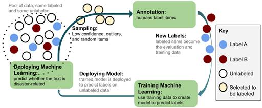
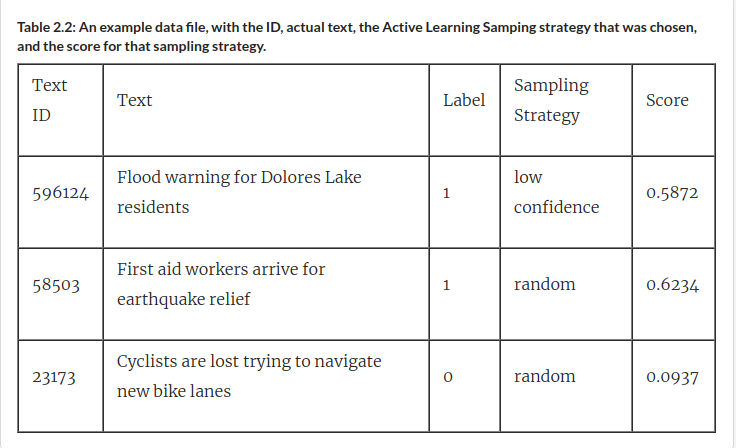
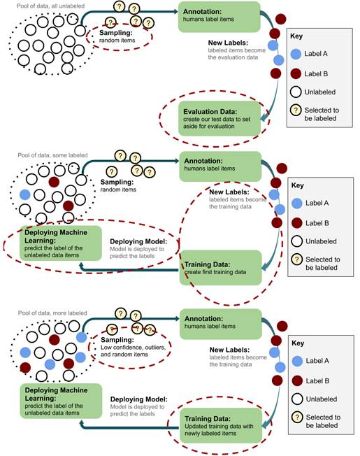
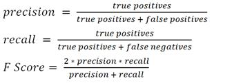
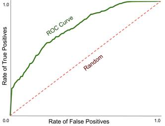
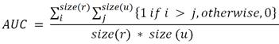

***

## Getting Started with Human-in-the-Loop Machine Learning

### This chapter covers

- Methods for ranking multiple predictions via their overall confidence, so that you can identify where your model is confused.
- Ways of finding unlabeled items with novel information so that you can expand your model’s knowledge.
- Creating a simple interface to elicit annotation so that you can create more training data.
- Retraining a model efficiently with new training data to make it more accurate.
- Evaluating the change in accuracy of your model to measure your progress.

---

For any Machine Learning task, you should start with a simple but functional system and build out more sophisticated components as you go. In fact, this applies to most technology: ship the Minimum Viable Product (MVP) and then iterate on that product. The feedback you get from what you ship first will tell you which are the most important pieces to build out next.

This chapter is dedicated to building your first Human-in-the-Loop Machine Learning MVP. We will build on this system as this book progresses, allowing you to learn about the different components that are needed to build more sophisticated data annotation interfaces, Active Learning algorithms, and evaluation strategies.

Sometimes, a simple system is enough. Imagine you work at a media company and your job is to tag news articles according to their topic. You already have topics like “sports”, “politics”, and “entertainment”. Natural disasters have been in the news lately and your boss has asked you to annotate the relevant past news articles as “disaster related” to allow better search for this new tag. You don't have months to build out an optimal system – you just want to get an MVP out as quickly as possible.

---
### 2.1 Beyond “Hack-tive Learning:” your first Active Learning algorithm

You may not realize it, but you've probably used Active Learning before. As you learned in Chapter 1, Active Learning is the process of selecting the right data for human review. Filtering your data by keyword or some other pre-processing step is a form of Active Learning, although not a very principled one.

If you have only recently started experimenting with Machine Learning, you have probably used common academic datasets like ImageNet, the MNIST Optical Character Recognition (OCR) dataset, and the CoNLL Named Entity Recognition (NER) datasets. These datasets were heavily filtered using various sampling techniques before the actual training data was created. So, if you "randomly" sample from any of these popular datasets, it is not truly random: it is a selection of data that conforms to whatever sampling strategies were used when these datasets were created. In other words, you unknowingly used a sampling strategy that was probably some hand-crafted heuristic from more than a decade ago. You will learn more sophisticated methods in this text.

There is a good chance that you have used ImageNet, MNIST OCR, or the CoNLL NER datasets without realizing how filtered they are. There is little formal documentation and it is not mentioned at all in most research papers using these datasets. I know this by chance: ImageNet was created by colleagues when I was at Stanford; I ran one of the 15 research teams in the original CoNLL NER task; and I learned about the limitations of MNIST when it was mentioned in passing in a now-famous foundational Deep Learning paper.[1] It is obviously not ideal that is so difficult and arbitrary to piece together how an existing dataset was created, but until this book, there is no place telling you: don’t trust any existing dataset to be representative of data that you encounter in the real world.

Because you are probably using filtered data by the time you build a Machine Learning model, it can be helpful to think of most Machine Learning problems as already being in the middle of the iteration process for Active Learning. Some decisions have already been made about data sampling. They led you to the current state of what data is annotated, and they probably weren't entirely optimal. So, one of the first things you need to worry about is how to start sampling the right data as you move forward.

If you aren't explicitly implementing a good Active Learning strategy and instead employing ad-hoc methods to sample your data, then you are implementing "Hack-tive Learning." It's fine to hack something together, but it is better to get the fundamentals right even if you are doing something quickly.

```javascript
HACK-TIVE LEARNING: AN ACCIDENTAL TERM

I owe thanks to Jennifer Prendki (one of the authors of an anecdote in this text) for the term “Hack-tive Learning."
We worked together a few years ago, and one day found ourselves discussing Machine Learning concepts. Due to our
French and Australian accents, we misheard each other, and both understood “Active Learning” as “Hack-tive Learning
accidentally inventing this phrase.
```



Your first Human-in-the-Loop Machine Learning system is going to look something like Figure 2.1. For the remainder of this chapter, you will be implementing this architecture. This chapter assumes that you will be using the dataset introduced in the next section, but you can easily use your own data instead. Alternatively, you can build the system described here, and then by making changes to the data and annotation instructions you should be able to drop in your own text annotation task.

#### 2.1.1 The architecture of your first HuML system

The first Human-in-the-Loop Machine Learning (HuML) system that you will build in this text will be to label a set of news headlines as “disaster-relatedSUNLIGHTted“ tag to news articles in order to improve their searchability and indexability in a database.
3. Supporting a social study about how disasters are reported in the media, by allowing someone to analyze the relevant headlines.

In global epidemic tracking, identifying news articles about outbreaks is an important task. H5N1 (Bird Flu) was reported openly weeks before it was identified as a new strain of the flu, and H1N1 (Swine Flu) was reported openly months in advance. If these reports had been put in front of virologists and epidemiologists sooner, then they would have recognized the patterns of new strains of the flu and we could have reacted sooner. So, while this is a very simple use case for your first Human-in-the-Loop Machine Learning system, it is also a real-world use case that can save lives. [2](https://livebook.manning.com/book/human-in-the-loop-machine-learning/chapter-2/v-6/1)

For data that you will be using throughout the text book, we will use messages from several past disasters that I have personally worked on as a professional disaster responder. In many of these cases I ran the Human-in-the-Loop Machine Learning systems to process this data, so it is very relevant for this text. The data includes messages sent following earthquakes in Haiti and Chile in 2010, floods in Pakistan in 2010, super-storm (hurricane) Sandy in the U.S.A. in 2012, and a large collection of news headlines focused only on disease outbreaks.

You will be joining students in NLP at Stanford, Data Science students at Udacity, and high school students enrolled in “AI for All” [http://ai-4-all.org/](http://ai-4-all.org/), who are also using this dataset as part of their courses today.

We will specifically be doing the task we introduced at the start of the chapter: classifying news headlines. You can download the code and data here:
[https://github.com/rmunro/pytorch_active_learning](https://github.com/rmunro/pytorch_active_learning)

See the Readme file for instructions on how to install Python 3.6 or later and PyTorch on your machine. Versions of Python and PyTorch change rapidly, so I will keep the readme updated with instructions for installation, rather than trying to include them here.If you are not familiar with PyTorch, start with the examples in this PyTorch tutorial:

https://pytorch.org/tutorials/beginner/nlp/deep_learning_tutorial.html

The example in this Chapter was purposefully adapted from a combination of this PyTorch example and the one in the following page of the PyTorch tutorial. If you can become familiar with those two tutorials, then all the code in this Chapter should be clear to you.

The data in the CSV files comprises 2-5 fields, depending on how processed it is, and looks something like the example in Table 2.2.
https://pytorch.org/tutorials/beginner/nlp/deep_learning_tutorial.html

The example in this Chapter was purposefully adapted from a combination of this PyTorch example and the one in the following page of the PyTorch tutorial. If you can become familiar with those two tutorials, then all the code in this Chapter should be clear to you.

The data in the CSV files comprises 2-5 fields, depending on how processed it is, and looks something like the example in Table 2.2.



The data that you will be using in this particular Chapter is from a very large collection of news headlines. The articles span many years and hundreds of different disasters, but most headlines are not disaster related.

There are four locations for data in the repo:

`/training_data`: the data that your models will be trained on

`/validation_data`: the data that your models will tuned with

`/evaluation_data`: the data that your models will be evaluated on for accuracy

`/unlabeled_data`: the large pool of data that you wish to label

You will see the data in the CSV files in this repo, and they will have format as above:

0. `Text ID`: a unique ID for this item

1. `Text`: the text itself

2. `Label`: the label: 1 = “disaster-related”, 0 = “not disaster-related”

3. `Sampling Strategy`: the Active Learning strategy that we used to sample this item

4. `Confidence`: the Machine Learning confidence that this item as “disaster-related”

(This list counts from 0 instead of 1 above, so that it will match the index of each field in the items/rows in the code).

These fields are enough information for you to build your first model. You will see that the unlabeled data in the example does not yet have a “label”, “sampling strategy” or “confidence”, for obvious reasons.

If you want to jump in right away, you can run this script straight away:

```javascript
> python active_learning_basics.py
```
You will initially be prompted to annotate messages as “disaster-related” or “not disaster-related” to create the evaluation data. Then will be prompted to do the same again for the initial training data. Only after these, will you see models start being built on your data and the Active Learning process beginning. We will return to the code later in this Chapter and first introduce the strategy behind it.

In an actual disaster, you would be classifying data into a very large number of fine-grained categories. For example, you might separate requests for “food” and “water”, because people can go for much longer without food than water, and therefore requests for drinking water need to be responded to with more urgency than requests for food. On the other hand, you might be able solve water locally with filtration, while food still needs to be shipped into the disaster-affected region for a longer period of time. As a result, there are often completely different disaster relief organizations focused on “food” vs “water”. The same is true for distinctions between types of medical aid, security, housing, and so on: they all need fine-grained categories to be actionable. But for any of these situations, filtering between “relevant” and “not relevant” can be an important first step in the process. If the amount of data is low enough volume, you might only need Machine Learning assistance to separate related from unrelated information, and then humans can take care of the rest of the categories. I have run disaster response efforts myself where this was the case.

Also, in most disasters you wouldn’t be working in English. English only makes up about 5% of the world’s conversations daily, so around 95% of communications about disasters are not in English. However, the broader architecture here could be applied to any language. The biggest difference is that English is unusual in that white-space is a useful delimiter to break up sentences into words as features. Most languages have more sophisticated prefixes, suffixes, and compounds that make individual words more complicated. Some languages, like Chinese, don’t use white-spaces between most words. Breaking up words into their constituent parts (“morphemes”) is an important task in itself. In fact, this was part of my PhD thesis: automatically discovering word-internal boundaries for any language in disaster response communications. It is an interesting and important research area to make Machine Learning truly equal across the world that I encourage people to pursue!

It helps to make your data assumptions explicit so that you can build and optimize the architecture that is best for your use case. It is good practice to include the assumptions in any Machine Learning system, so here are ours:

1. The data is only in English
2. The data is in different varieties of English (UK, USA, English as second-language)
3. We can use white-space delimited words as our features
4. A binary classification task is sufficient for the use case

It should be easy to see how the broader framework for Human-in-the-Loop Machine Learning will work for any similar use case. The framework in this chapter could be adapted to Image Classification almost as easily as to another Text Classification task.

```javascript
“SUNLIGHT IS THE BEST DISINFECTANT” - AN EXPERT ANECDOTE BY PETER SKOMOROCH
You need to look at real data in depth to know exactly what models to build. In addition to high level charts and
aggregate statistics, I recommend that data scientists go through a large selection of randomly selected, granular
data regularly to let these examples “wash over you”. Just as executives look at company-level charts every week 
and network engineers look over stats from system logs, data scientists should have an intuition for their data and 
how it is changing.

When I was building LinkedIn’s Skill Recommendations feature, I built a simple web interface with a “random” button
that would show individual recommendation examples alongside the corresponding model inputs so that I could quickly
view the data and get an intuition for the kinds of algorithms and annotation strategies that might be the most 
successful. This is the best way to ensure that you have uncovered potential issues and obtain the high quality
input  data that is vital: you’re shining a light on your data, and sunlight is the best disinfectant.

Bio: Peter Skomoroch is the former CEO of SkipFlag (acquired by WorkDay) and worked as a Principal Data Scientist at
LinkedIn in the team that invented the title "data scientist".
```
---
### 2.2 Interpreting model predictions and data to support Active Learning

Almost all Supervised Machine Learning models will give you to things:

 - A predicted label (or set of predictions)

 - A number (or set of numbers) associated with each predicted label

The numbers are generally interpreted as confidences in the prediction, although this can be more or less true depending on how the numbers are generated. If there are mutually exclusive categories with similar confidence, then this is good evidence that the model is confused about its prediction and that a human judgment would be valuable. Therefore, the model will benefit most when it learns to correctly predict the label of an item with an uncertain prediction.

For example, let’s assume we have a message that might be disaster-related and the prediction looks like this:
```javascript
{
    "Object": {
        "Label": "Not Disaster-Related",
        "Scores": {
            "Disaster-Related": 0.475524352,
            "Not Disaster-Related": 0.524475648
        }
    }
}
```
In this prediction, the message is predicted to be “Not Disaster-Related”. In the rest of Supervised Machine Learning, this label is what people care about most: was the label prediction correct, and what is the overall accuracy of the model when predicting across a large held-out data set?

But in Active Learning, it is the numbers associated with the prediction that we typically care about most. You can see in the example that “Not Disaster-Related” is predicted with a 0.524 score. This means that the system is 52.4% confident that the prediction was correct.

From the perspective of the task here, you can see why you might want a human to review this anyway: there is a still a relatively high chance that this is disaster related. If it is disaster related, then your model is getting this example wrong for some reason, so it is likely that you want to add it to your training data so that you don’t miss other similar examples.

In Chapter 6, we will turn to the problem of how reliable "0.524" really is. Especially for Neural Models, these confidences can be widely off. For the sake of this chapter, we can assume that while the exact number may not be accurate, we can generally trust the relative differences in confidence across multiple predictions.

#### 2.2.1 Confidence ranking

Let's say we had another message with this prediction:

```javascript
{
    "Object": {
        "Label": "Not Disaster-Related",
        "Scores": {
            "Disaster-Related": 0.015524352,
            "Not Disaster-Related": 0.984475648
        }
    }
}
```
This item is also predicted as "Not Disaster-Related" but with 98.4% confidence here, compared to 52.4% confidence for the first item.

So, the model is more confident about the second item than about the first. It is therefore reasonable to assume that the first item is more likely to be wrongly labeled and would benefit from human review. Even if we don't trust the 52.4% and 98.4% numbers (and we probably shouldn't, as you will learn in later chapters) it is reasonable to assume the rank order of confidence will correlate with accuracy. This will generally be true of almost all Machine Learning algorithms and almost all ways of calculating accuracy: you can rank-order the items by the predicted confidence and sample the lowest confidence items. For a probability distribution over a set of labels y for the item x, this is given by the equation, where y* is the most confident label:

```javascript
ϕC(x) = Pθ (y* | x)
```
For a binary prediction task like our example here, you can simply rank by confidence and sample the items closest to 50% confidence. However, if you are attempting anything more complicated, like predicting three or more mutually exclusive labels, labeling sequences of data, generating entire sentences (including translation and speech transcription), or identifying objects within images and videos, then there are multiple ways to calculate confidence. We will return to other ways of calculating confidence in later chapters. The intuition about low confidence remains the same and a binary task is easier for your first Human-in-the-Loop system.

#### 2.2.2 Identifying outliers

As we covered in Chapter 1, you often want to make sure you are getting a diverse set of items for humans to label, so that all the newly sampled items aren’t all like each other. This can include making sure that you are not missing any important outliers. For example, some disasters are very rare, like a large asteroid crashing into the earth. If a news headline says “Asteroid flattens Walnut Creek”, and your Machine Learning model hasn’t learned what an “asteroid” is, or that “Walnut Creek” is a city, then it is easy to see why your Machine Learning model might not have predicted this headline as being disaster related. You could call this sentence an “outlier” in this regard: it lies the furthest from anything you’ve seen before.

As with confidence ranking, there are many ways to ensure that we are maximizing the diversity of the content that is selected for human review. You will learn more about such approaches in later chapters. For now, we will focus on a very simple metric: the average training data frequency of words in each unlabeled item:

1. Take each item in the unlabeled data and count the average number of word matches it has with items already in the training data
2. Rank the items by their average match
3. Sample the item with the lowest average number of matches
4. Add that item to the ‘labeled’ data and repeat 1-3 until we have sampled enough for one iteration of human review

Note that in step 4, once you have sampled the first item, you can treat that as ‘labeled’, because you know you are going to get a label for it later.

This method for determining outliers will tend to favor small and completely novel headlines, so you will see that code adds 1 to the count as a smoothing factor. It will also disfavor sentences with a lot of common words like “the” even if the other words are uncommon. So instead of average matching, you could track the raw number of novel words. This would model the total amount of novel information in a headline, instead of the overall average.

You could also divide the number of matches in the training data by the total number of times that word occurs across all the data and multiply each of these fractions, which would more-or-less give you the Bayesian probability of the element being an outlier or not. Instead of word matching, you could use more sophisticated edit-distance based metrics that take the order of words within the sentence into account. There are many other string matching algorithms and many other algorithms for determining outliers.

As with everything else, you can start by implementing the simple one in this chapter and then experiment with others later. The main goal here is an insurance policy: is there something completely different that we haven’t seen yet? Probably not, but if there was, those would be the highest value items to correctly annotate. We will look at ways of combining sampling by confidence and sampling by diversity in later chapters.

We will also look at ways to combine your Machine Learning strategy with your annotation strategy. If you have worked in Machine Learning for a while but never before in annotation or Active Learning, then you have probably only optimized models for accuracy. For a complete architecture, you might want a more holistic approach where your Annotation, Active Learning and Machine Learning strategies all inform each other. You could decide to implement Machine Learning algorithms that can give more accurate estimates of their confidence at the expense of accuracy in label prediction. Or you might augment your Machine Learning models to have two types of inference: one to predict the labels and one to more accurately estimate the confidence of each prediction. If you are building models for more complicated tasks like generating sequences of text (as in Machine Translation) or regions within images (as in Object Detection), then this is the most common approach today: building separate inference capabilities for the task itself and for interpreting the confidence. We will look at these architectures in later chapters, too.

The process for building your first Human-in-the-Loop Machine Learning model is summarized in Figure 2.2.
```javascript
Figure 2.2: The Iterative Process in your first Human-in-the-Loop Machine Learning system. Initially (top) you are
annotating a random sample of unlabeled items to set aside as your evaluation data. Then you are labeling the first
items to be used for training data (middle), also starting with a random selection. After this point, you start 
using Active Learning (bottom) to sample items that are low confidence or outliers.
```



#### 2.2.3 What to expect as you iterate

In our example code, after we have enough evaluation and initial training data then we will iterate on Active Learning every 100 items. This is probably a little small in terms of the number of items per iteration, as you’ll be spending a lot of time waiting for the model to retrain for a relatively small number of new labeled items. But 100 is about right to get a feel for how much the sampled data changes in each iteration.

Here are some things you might notice as you iterate through the Active Learning process:

1. `First Iteration`: You are annotating mostly “not disaster-related” headlines, and it can feel tedious. It will improve when Active Learning kicks in, but for now it is necessary to get the randomly sampled evaluation data. You should also notice that this is not a trivial problem, because journalists often use disaster metaphors for non-disasters, especially sports teams: “declaring war”, “a scoring drought”, etc. You will also be challenged by edge cases. For example, is a plane crash a disaster or does it depend on the size of plane and/or the cause? These edge cases will help you refine the definition of your task and create the right instructions for when you are engaging a larger workforce to annotate your data at scale.

2. `Second Iteration`: You have created your first model! Your F-Score is probably terrible: maybe only 0.20. However, your AUC might be around 0.75 (more on F-Score and AUC later in this Chapter if you are not familiar with either). So despite the bad accuracy, you can find disaster-related messages better than chance. You could fix the F-Score by playing with the model parameters and architecture, but more data is more important than model architecture right now. The evidence of this will be clear when you start annotating: you will immediately notice on your second iteration that a very large number of items will be disaster-related. In fact, it might be most of them. Early on, your model will still try to predict most things as “not disaster-related”, so anything close to 50% confidence is at the most “disaster-related” end of the scale. This is one way that Active Learning can be self-correcting: it is over-sampling a lower frequency label without us explicitly implementing a targeted strategy for sampling important labels (more about those strategies in an advanced chapter). You will also see evidence of overfitting. For example, if your randomly selected items in the first iteration happened to have many headlines about “floods”, then now there are probably too many headlines now about floods and not enough about other types of disasters.

3. `Third and Fourth Iterations`: You should start to see model accuracy improve as you are now labeling many more “disaster-related” headlines, bringing the proposed annotation data closer to 50:50 of each label. If your model had overfit some terms, like the “floods” example, then you should have seen some counterexamples like “new investment floods the marketplace”. This will help push your models back to more accurate predictions for headlines with these terms. If the data genuinely was disaster-related for everything with “flood” in it, then these items are now predicted with high confidence and no longer near 50% confidence. Either way, the problem self-corrected and the diversity of the headlines you are seeing should increase.

4. `Fifth-to-Tenth Iterations`: Your models will start to reach reasonable levels of accuracy and you should see more diversity in the headlines. So long as either the F-Score or AUC are going up by a few percent for every 100 annotations, you are getting good gains in accuracy. You are also probably wishing that you had annotated more evaluation data so that you are calculating accuracy on a bigger variety of held-out data. Unfortunately you can’t: it’s almost impossible to go back to truly random sampling unless you are prepared to give up a lot of your existing labels (more on evaluation data later in this chapter).

While this feels very simple, the system that you are building in this chapter follows the same strategy as AWS's SageMaker Ground Truth’s initial release, which was in 2018 (less than a year before this Chapter was written). In fact, SageMaker only sampled by confidence and didn’t look for outliers in that release. So while the system you are building here is simple, it is also beyond the level of algorithmic sophistication of an Active Learning tool that is currently offered by a major cloud provider. I worked briefly on SageMaker Ground Truth when I was at AWS, so this is not a criticism of that product or my colleagues who put much more into than I did: it shows that while Active Learning is becoming part of large scale commercial offerings for the first time right now, it is still very much at an early stage!

We will cover more sophisticated methods for sampling later in the text. For now, it is more important to focus on the getting the iterative process for Active Learning established along with the best practices for annotation and retraining/evaluating your models. If you don't get your iteration strategy and evaluation strategy correct, you can easily make your model worse instead of better and not even realize it.

---

### 2.3 Building an interface to get human labels

To label your data you need to start with the right interface. We’ll cover what that looks like for our example data in this chapter.

The right interface for human labeling is as important as the right sampling strategy. If you can make your interface 50% more efficient, that's just as good as improving your Active Learning Sampling strategy by 50%. Out of respect for the people doing the labeling, you should do as much as you can to ensure that they feel as though they are as effective as possible. If you genuinely don't know whether an interface or algorithm improvements are the best thing to focus on next, then start with the interface to improve the work of the human and worry about your CPU’s feelings later.

Three later chapters are dedicated to data annotation, so we will make a few assumptions to keep it simple in this Chapter:

1. Assume that annotators aren't making a significant number of errors in the labels, so we don’t have to implement quality control for annotations.
2. Assume that the annotators understand the task and labels perfectly, so that they aren’t accidentally choosing the wrong labels.
3. Assume that there is only one annotator working at a time, so we don’t have to keep track of any labeling ‘in progress’.

These are big assumptions. In most deployed systems, you will need to implement quality control to ensure that annotators are not making mistakes; you will most likely need several iterations of annotation to refine the definitions of the labels and instructions; and you will need a system to track work assigned to multiple people in parallel. A simple annotation interface like the one discussed here is enough if you just want to quickly annotate some data yourself for exploratory purposes, like we are doing here.

#### 2.3.1 A simple interface for labeling text

The interface that you build will be determined by your task and the distribution of your data. For a binary labeling task like the one we are implementing here, a simple command-line interface is enough. You will see it immediately if you run the script that we introduced above:
```
> python active_learning_basics.py
```


Like we discussed in the Introduction, there are many Human-Computer Interaction factors that go into making a good interface for annotation. But if you have to build something quick:

1. Build an interface that allows annotators to focus on one part of the screen.
2. Allow hot-heys for all actions.
3. Include a “back/undo” option.

Get those three things right first and graphic design can come later.

To see exactly what the code is doing, look at the repo shared above [https://github.com/rmunro/pytorch_active_learning/](https://github.com/rmunro/pytorch_active_learning/) or clone it locally and experiment with it there. Excerpts from that code will be shared in this book for illustrative purposes, but we won’t include it all.

You can see the code to elicit annotations in the first 20 lines of the get_annotations() function:
```python
def get_annotations(data, default_sampling_strategy="random"):
    """Prompts annotator for label from command line and adds annotations to data
   
    Keyword arguments:
        data -- an list of unlabeled items where each item is
                [ID, TEXT, LABEL, SAMPLING_STRATEGY, CONFIDENCE]
        default_sampling_strategy -- strategy to use for each item if not already specified
    """
 
    ind = 0
    while ind <= len(data):
        if ind < 0:
            ind = 0 # in case you've gone back before the first
        if ind < len(data):
            textid = data[ind][0]
            text = data[ind][1]
            label = data[ind][2]
            strategy =  data[ind][3]
 
            if textid in already_labeled:
                print("Skipping seen "+label)
                ind+=1
            else:
                print(annotation_instructions)
                label = str(input(text+"\n\n> "))
                ...
                ...
```
For our data, the labels are a little unbalanced, because most headlines are not related to disasters. This has interface design implications. So, it is going to be very inefficient and boring if someone is continually selecting “Not Disaster-Related.” You can make “Not Disaster-Related” the default option to improve efficiency so long as you have a “back” option when annotators inevitably get primed to select the default.

You probably did this yourself: annotated quickly and then had to go back when you pressed the wrong answer. You should see this functionality in the next and final 20 lines of code of the `get_annotations()` function:

```python
def get_annotations(data, default_sampling_strategy="random"):
                ...
                ...
 
                if label == "2":                  
                    ind-=1  # go back
                elif label == "d":                   
                    print(detailed_instructions) # print detailed instructions
                elif label == "s":
                    break  # save and exit
                else:
                    if not label == "1":
                        label = "0" # treat everything other than 1 as 0
                       
                    data[ind][2] = label # add label to our data
 
                    if data[ind][3] is None or data[ind][3] == "":
                        data[ind][3] = default_sampling_strategy # default if none given
                    ind+=1       
 
        else:
            #last one - give annotator a chance to go back
            print(last_instruction)
            label = str(input("\n\n> "))
            if label == "2":
                ind-=1
            else:
                ind+=1
 
    return data
```
#### 2.3.2 Managing Machine Learning data

For a deployed system it is best to store your annotations in a database that takes care of backups, availability, and scalability. However, you cannot always browse a database as easily as files that are on a local machine. In addition to adding training items to your database, or if you are only building a simple system, it can help to have locally stored data and annotations that you can quickly spot-check.

In our example, we will separate the data into separate files according to the label, for additional redundancy. Unless you are working in an organization that already has good data management processes in place for annotation and Machine Learning, then you probably don’t have the same kind of quality control for your data as you do for your code, like unit tests, and good versioning. So, it is wise to be redundant in how you store your data. Similarly, you will see that the code appends files but never writes over files. It also keeps the unlabeled_data.csv file untouched, checking for duplicates in the other datasets instead of deleting from that file when the item has been labeled.

Redundancy in how you store labels and enforcing non-deletion of data will save you a lot of headaches when you start experimenting. I’ve never met a Machine Learning professional who hasn’t accidently deleted labeled data at some point, so follow this advice! Also remember that if you are storing data to your local machine, it might belong to someone else or contain sensitive content. So be sure you have permission to do this and that you delete the data when you no longer need it, if this is the case.

---

### 2.4 Deploying your first Human-in-the-Loop Machine Learning system

Now let’s put it all together!

If you didn’t do it earlier in the Chapter, download the code and data here:

[https://github.com/rmunro/pytorch_active_learning](https://github.com/rmunro/pytorch_active_learning)

See the Readme file for instructions on how to install it on your machine.

You can run this immediately and it will start prompting you annotate data and then automatically train after each iteration. You should experience the changes in data at each iteration that you learned above.

To see what is happening under the hood, let’s go through the main components of this code and the strategies behind it.

We use a simple PyTorch Machine Learning model for text classification. We will use a shallow 3-layer model that can be retrained quickly in order to make our iterations fast. In PyTorch, this entire model definition is only a dozen lines of code:

```python
class SimpleTextClassifier(nn.Module):  # inherit pytorch's nn.Module
    """Text Classifier with 1 hidden layer
 
    """
   
    def __init__(self, num_labels, vocab_size):
        super(SimpleTextClassifier, self).__init__() # call parent init
 
        # Define model with one hidden layer with 128 neurons
        self.linear1 = nn.Linear(vocab_size, 128)
        self.linear2 = nn.Linear(128, num_labels)
 
    def forward(self, feature_vec):
        # Define how data is passed through the model
 
        hidden1 = self.linear1(feature_vec).clamp(min=0) # ReLU
        output = self.linear2(hidden1)
        return F.log_softmax(output, dim=1)
```

Our input layer contains the one-hot encoding for every word in our feature set (1000s), our output layer is the two labels, and our hidden layer is 128 nodes.

For training, we know the data is imbalanced between the labels initially, so we want to ensure that we select something closer to an even number of items for each label. This is set in these variables at the start of the code:

```
epochs = 10 # number of epochs per training session
select_per_epoch = 200  # number to sample per epoch per label
```

We are going to train our models for 10 epochs, and for each epoch we are going to randomly select 200 items from each label. This won’t make our model completely even, because we are still selecting from a bigger variety of not disaster-related text across all the epochs. But, it will be enough that we get some signal from our data even when there’s only 100 or so disaster-related examples.

The code to train our model is the `train_model()` function:

```python
def train_model(training_data, validation_data = "", evaluation_data = "", num_labels=2, vocab_size=0):
    """Train model on the given training_data
 
    Tune with the validation_data
    Evaluate accuracy with the evaluation_data
    """
 
    model = SimpleTextClassifier(num_labels, vocab_size)
    # let's hard-code our labels for this example code
    # and map to the same meaningful booleans in our data,
    # so we don't mix anything up when inspecting our data
    label_to_ix = {"not_disaster_related": 0, "disaster_related": 1}
 
    loss_function = nn.NLLLoss()
    optimizer = optim.SGD(model.parameters(), lr=0.01)
 
    # epochs training
    for epoch in range(epochs):
        print("Epoch: "+str(epoch))
        current = 0
 
        # make a subset of data to use in this epoch
        # with an equal number of items from each label
 
        shuffle(training_data) #randomize the order of the training data       
        related = [row for row in training_data if '1' in row[2]]
        not_related = [row for row in training_data if '0' in row[2]]
       
        epoch_data = related[:select_per_epoch]
        epoch_data += not_related[:select_per_epoch]
        shuffle(epoch_data)
               
        # train our model
        for item in epoch_data:
            features = item[1].split()
            label = int(item[2])
 
            model.zero_grad()
 
            feature_vec = make_feature_vector(features, feature_index)
            target = torch.LongTensor([int(label)])
 
            log_probs = model(feature_vec)
 
            # compute loss function, do backward pass, and update the gradient
            loss = loss_function(log_probs, target)
            loss.backward()
            optimizer.step()
```
You can see that we are keeping our training parameters constant here. For an actual system, you would probably want to experiment with training parameters and also with architectures that better model the sequence of words, like RNNs, or can better model clusters of pixels if you are doing image classification, like CNNs.

If you are doing any parameter tuning at all, you should create validation data and use that to tune your model, just like you are accustomed to in Machine Learning already. In fact, you might want multiple kinds of validation datasets, including one drawn from your training data at each iteration, one drawn from your unlabeled data before you use Active Learning, and one drawn from the remaining unlabeled items at each iteration. We will return to validation data for Active Learning in a later chapter. For now, we save you the additional annotations: if you want to tune your model in the example in this chapter, pull a random selection of data from your training data set at each iteration.

The remainder of the `train_model()` function evaluates the accuracy of the new model and saves it to file in `models/`. We’ll cover evaluation later in the next section.

As stated above, you should become familiar with your data before you start building any Machine Learning system. Fortunately, this is best practice for Active Learning, too. You should select your evaluation data first and you should be one of the people who labels it.

#### 2.4.1 Always get your evaluation data first!

Evaluation data is often called a “test set” or “held-out data,” and for this task it should be a random sample of headlines that we annotate. We will always hold out these headlines from our training data, so that we can track the accuracy of our model after each iteration of Active Learning.

It is important to get the evaluation data first, as there are many ways to inadvertently bias your evaluation data after you have started other sampling techniques. Here are just some of the things that can go wrong if don’t pull out your evaluation data first:

1. If you forget to sample evaluation data from your unlabeled items until after you have sampled by low confidence, then your evaluation data will be biased towards the remaining high-confidence items and your model will appear more accurate than it really is.
2. If you forget to sample evaluation data and so you pull evaluation data from your training data after you have sampled by confidence, then your evaluation data will be biased towards low-confidence items, and your model will appear less accurate than it really is.
3. If you have implemented outlier detection and then later try to pull out evaluation data, it is almost impossible to avoid bias as the items you have pulled out have already contributed to the sampling of additional outliers.

```javascript
WHAT HAPPENS IF YOU DON’T MAKE EVALUATION DATA FIRST?
It’s really difficult to know how accurate your model is if you don’t remember to get evaluation data first. This
is one of the biggest mistakes I’ve seen people make: as soon as data scientists get any new human labels, it is 
natural to want to add them to their training data to see how much more accurate their model gets. But if your 
evaluation data is an afterthought and you aren’t careful about making it truly random, then you won’t truly know 
how accurate your model is. I have seen companies building self-driving cars, social media feeds, and dating apps
all get evaluation data wrong. So, know that the car that swerved past you today, the news article that was 
recommended to you, and the person you may one day marry might have all been determined by Machine Learning models
of uncertain accuracy.
```
Finally, it might not be possible to select truly random data if you are applying your model to a continuously changing feed of information. In ongoing disaster response situations this will absolutely be the case as new information is reported about the changing conditions and needs over time. For the example we are working on here, we are tasked with labeling a finite set of news headlines, so it is meaningful to select a random sample of the headlines to be in our training data. We will return to sampling strategies for evaluation data in more complicated contexts in later chapters.

The code to evaluate the accuracy of your model at each iteration is in the evaluate_model() function:
```python
def evaluate_model(model, evaluation_data):
    """Evaluate the model on the held-out evaluation data
 
    Return the f-value for disaster-related and the AUC
    """
 
    related_confs = [] # related items and their confidence of being related
    not_related_confs = [] # not related items and their confidence of being _related_
 
    true_pos = 0.0 # true positives, etc
    false_pos = 0.0
    false_neg = 0.0
 
    with torch.no_grad():
        for item in evaluation_data:
            _, text, label, _, _, = item
 
            feature_vector = make_feature_vector(text.split(), feature_index)
            log_probs = model(feature_vector)
 
            # get confidence that item is disaster-related
            prob_related = math.exp(log_probs.data.tolist()[0][1])
 
            if(label == "1"):
                # true label is disaster related
                related_confs.append(prob_related)
                if prob_related > 0.5:
                    true_pos += 1.0
                else:
                    false_neg += 1.0
            else:
                # not disaster-related
                not_related_confs.append(prob_related)
                if prob_related > 0.5:
                    false_pos += 1.0
                    ...
                    ...
```
This code has got the predicted confidence that each item is “disaster-related” and tracked whether each prediction was correct or incorrect. Raw accuracy would not be a good metric to use here. Because the frequency of the two labels is unbalanced, you will get almost 95% accuracy from predicting “not disaster-related” each time. This is not very informative, and our task is specifically to find the disaster-related headlines. So, we will calculate accuracy as the F-score of the disaster-related predictions.

F-score is the harmonic mean of precision and recall for a label. In our example data, we want the F-score for disaster-related headlines. Let true positives = tp, false positives = fp, false negatives = fn:



In addition, we care about whether confidence correlates with accuracy. So, we calculate Area Under the ROC Curve (AUC). A ROC curve (Receiver Operating Characteristic curve) rank orders a dataset by confidence and calculates the rate of true positives versus false positives.

An example is shown in Figure 2.3. The ROC curve is created by plotting the true positive rate (TPR) against the false positive rate (FPR) in an order determined by model confidence.

```javascript
The area under the curve (AUC) is the calculation of the space under the curve, relative to the overall space. You
can eye-ball this to be about 0.80 in the graph above. As the code example in this chapter shows, there is a short-
cut to calculating AUC that avoids needing to construct an actual ROC Curve, but is good to have an intuition about
what is being calculated regardless.

For the example in this chapter, this curve would let us say something like “our model can detect 20% of disaster-
related messages with high confidence and detect 30% of non disaster-related messages with high confidence, but has
much ambiguity in-between.” This can help us decide on an Active Learning strategy to make the model more accurate.
For a real-world use case, this can also help us decide where we could trust the model’s decision and where we want
to back-off to human judgments.

Figure 2.3: An example ROC curve, plotting the true positive rate (TPR) against the false positive rate (FPR) in an
order determined by model confidence. In this example, we can see that the line of the ROC curve is near-vertical
for the first 20%. This tells us that for the 20% most confident predictions, we are almost 100% accurate. The ROC
curve is almost horizontal at 1.0 for the final 30%. This tells us that by the time we get to the 30% least most
confident predictions for a label, there are few very items with that label remaining.
```



AUC is exactly as it sounds: the area under the curve generated by ROC as a percentage of the entire possible area. But you don’t have to generate a ROC curve to calculate AUC thanks to a nice mathematical trick: AUC is also the probability that of any two randomly selected items with different labels, the correct label was predicted with higher confidence. So, in our example we can calculate AUC by comparing the confidence of every disaster-related item in our evaluation data with every not disaster-related item. Let the set of confidences for every disaster-related headline be r and the set of confidences for every not disaster-related headline be u, and the size of a set given by size():



This makes AUC code as simple as F-Score (although more expensive to compute). The rest of the evaluate_model() function calculates both types of accuracy:
```python
def evaluate_model(model, evaluation_data):
                    ...
                    ...
    # Get FScore
    if true_pos == 0.0:
        fscore = 0.0
    else:
        precision = true_pos / (true_pos + false_pos)
        recall = true_pos / (true_pos + false_neg)
        fscore = (2 * precision * recall) / (precision + recall)
 
    # GET AUC
    not_related_confs.sort()
    total_greater = 0 # count of how many total have higher confidence
    for conf in related_confs:
        for conf2 in not_related_confs:
            if conf < conf2:
                break
            else:                 
                total_greater += 1
 
 
    denom = len(not_related_confs) * len(related_confs)
    auc = total_greater / denom
 
    return[fscore, auc]
```
If you look at file names for any models that you have built in the models/ directory, you will see that the filename includes a timestamp, the accuracy of the model by F-Score and AUC, and the number of training items. It is good data management practice to give your models verbose and transparent names, and this will let you track the accuracy over time with each iteration simply by looking at the directory listing.

#### 2.4.2 Every data point gets a chance

By including new randomly sampled items in each iteration of Active Learning, you will get a baseline in that iteration. You can compare the accuracy from training on just the random items to your other sampling strategies. This can tell you how effective your sampling strategies are compared to random sampling. You will already know how many newly annotated items are different from your model’s predicted label, but this does not tell you how much they will change the model for future predictions after they have been added to the training data.

Even if your other Active Learning strategies fail for some reason in the iteration, you will still get incremental improvement from the random sample, so it is a nice fallback.

There is an ethical choice here, too. We are acknowledging that all strategies are imperfect, and so every data item still has some chance of being selected randomly and being reviewed by a human, even if none of the sampling strategies would have selected it. If this was an actual disaster scenario, would you want to completely eliminate the chance of someone seeing an important headline because your sampling strategies would never select it? The ethical question is one you should ask yourself, depending on the data and use case you are addressing.

#### 2.4.3 Select the right strategies for your data

We know that disaster-related headlines are rare in our data, so the strategy of selecting outliers is not likely to select many disaster-related items. Therefore, the example code focuses on selecting by confidence and sampling data for each iteration according to the following strategy:

1. 10% randomly selected from unlabeled items
2. 80% selected from the lowest confidence items
3. 10% selected as outliers.

Assuming that the low confidence items are truly 50:50 disaster-related and not disaster-related, the annotators should see a little more than 4/10 disaster-related messages once a large number of items have been annotated and our models are stable. This is close enough to equal that we don’t have to worry about ordering effects priming the annotators in later iterations.

Here is the code for the three strategies:
```python
def get_low_conf_unlabeled(model, unlabeled_data, number=80, limit=10000):
    confidences = []
    if limit == -1: # we're predicting confidence on *everything* this will take a while
       print("Get confidences for unlabeled data (this might take a while)")
    else:
       # only apply the model to a limited number of items
       shuffle(unlabeled_data)
       unlabeled_data = unlabeled_data[:limit]
   
    with torch.no_grad():
        for item in unlabeled_data:
            textid = item[0]
            if textid in already_labeled:
                continue
 
            text = item[1]
 
            feature_vector = make_feature_vector(text.split(), feature_index)
            log_probs = model(feature_vector)
 
            # get confidence that it is related
            prob_related = math.exp(log_probs.data.tolist()[0][1])
 
            if prob_related < 0.5:
                confidence = 1 - prob_related
            else:
                confidence = prob_related
 
            item[3] = "low confidence"
            item[4] = confidence
            confidences.append(item)
 
    confidences.sort(key=lambda x: x[4])
    return confidences[:number:]
 
 
def get_random_items(unlabeled_data, number = 10):
    shuffle(unlabeled_data)
 
    random_items = []
    for item in unlabeled_data:
        textid = item[0]
        if textid in already_labeled:
            continue
        random_items.append(item)
        if len(random_items) >= number:
            break
 
    return random_items
 
 
def get_outliers(training_data, unlabeled_data, number=10):
    """Get outliers from unlabeled data in training data
    Returns number outliers
   
    An outlier is defined as the percent of words in an item in
    unlabeled_data that do not exist in training_data
    """
    outliers = []
 
    total_feature_counts = defaultdict(lambda: 0)
   
    for item in training_data:
        text = item[1]
        features = text.split()
 
        for feature in features:
            total_feature_counts[feature] += 1
               
    while(len(outliers) < number):
        top_outlier = []
        top_match = float("inf")
 
        for item in unlabeled_data:
            textid = item[0]
            if textid in already_labeled:
                continue
 
            text = item[1]
            features = text.split()
            total_matches = 1 # start at 1 for slight smoothing
            for feature in features:
                if feature in total_feature_counts:
                    total_matches += total_feature_counts[feature]
 
            ave_matches = total_matches / len(features)
            if ave_matches < top_match:
                top_match = ave_matches
                top_outlier = item
 
        # add this outlier to list and update what is 'labeled',
        # assuming this new outlier will get a label
        top_outlier[3] = "outlier"
        outliers.append(top_outlier)
        text = top_outlier[1]
        features = text.split()
        for feature in features:
            total_feature_counts[feature] += 1
 
    return outliers
```
You can see that by default in the `get_low_conf_unlabeled()` function, we are only predicting the confidence for 10,000 unlabeled items, rather than from across the entire dataset. Here, this is to make the time more manageable between iterations as you would be waiting for many minutes or even hours for all predictions, depending on your machine. This will increase the diversity of the data, too, as we are selecting low confidence items from a different subset of unlabeled items each time.

#### 2.4.4 Retrain the model and iterate

Now that you have your newly annotated items, you can add them to your training data and see the change in accuracy from your model. If you run the script that you downloaded at the start of this chapter, you will see that retraining happens automatically after you finish annotating each iteration.

If you look at that code, you will also see the controls that combine all the code that we went through above. This additional code are the parameters, like the number of annotations per iteration, and the code at the end of the file will make sure that you get the evaluation data first and then train the models and start iterating with Active Learning when you have enough evaluation data. There are less than 500 lines of unique code in our example for this chapter, so it is worth taking the time to understand what is going on in each step and thinking about how you might extend any part of the code.

If you come from a Machine Learning background, the number of features will probably jump out at you. You probably have 10,000+ features for only 1,000 labeled training items. You would almost certainly get better accuracy if you reduced the number of features. But somewhat counter-intuitively, you want a large number of features, especially in the early iterations of Active Learning, when you really did want to make every feature count for the rare ‘disaster-related’ headlines. Otherwise, your early model would be even more biased towards the type of headlines that you happened to sample first randomly. There are many ways that you might want to combine your Machine Learning architecture and Active Learning strategies, and we will cover the major ones in later chapters.

Having completed 10 or so iterations of annotation, have a look at your training data. You will notice that most of the items were selected through “low confidence”, which is not a surprise. Look for ones that are listed as selected by “outlier”, and you might be surprised. There will probably be a few examples in there with words that are obvious (to you) as being disaster-related, which means that these examples increased the diversity of your dataset in a way that might have otherwise been missed.

While Active Learning can be self-correcting, can you see any evidence where it didn’t self-correct some bias? Common examples would be over sampling extra long or extra short sentences. The Computer Vision equivalent would be over sampling images that are extra large/small or hi/low resolution. Your choice of outlier strategy and Machine Learning model might over sample based on features like this which are not core to your goal. You might consider applying the methods in this chapter to different buckets of data, in that case: lowest confident short sentences, lowest confident medium sentences, and lowest confident long sentences.

If you like, you can also experiment with variations on your sampling strategies within this code. Try retraining just on the randomly selected items, and compare the resulting accuracy to another system retrained on the same number of items selected by low confidence and again using outlier sampling. Which strategy has the biggest impact and by how much?

You can also think about what you should develop next:

1. A more efficient interface for annotation
2. Quality controls to help stop errors in annotation
3. Better Active Learning sampling strategies
4. More sophisticated neural architectures for the classification algorithm

Your subjective experience might be different from mine, and if you tried this on your own data instead of the example data set provided here, then that might have changed things, too. But the chances are good that you identified one of the first three options was the most important next component to build out. If you come from a Machine Learning background, then your first instinct might be to keep the data constant and start experimenting with more sophisticated neural architectures. That can be the best next step, but it’s rarely the most important next step early on. You should generally get your data right first; and then tuning the Machine Learning architecture becomes a more important task later on in the iterations. The rest of this book will help you learn how to design better interfaces for annotation, implement better quality control for annotation, devise better active learning strategies, and arrive at better ways to combine them all.

---

### 2.5 Summary

- A simple Human-in-the-Loop Machine Learning system can cover the entire cycle, from sampling unlabeled data to updating the model. This lets you get started quickly with a complete MVP system, that you can then build out as needed.

- There are two simple Active Learning strategies that are easy to implement, sampling the least confident items from predictions and sampling outliers. Understanding the basic goals of each of these strategies will help you dive deeper into the later chapters on Uncertainty Sampling and Diversity Sampling.

- A simple command-line interface can allow humans to annotate data efficiently. This shows that even a simple text-only interface can be efficient if it is built according general Human-Computer Interaction principles.
Good data management, like creating evaluation data as the first task, is important to get right. If you don’t get your evaluation data right, you might never know how accurate your model truly is!

- Retraining a Machine Learning model with newly annotated data at regular iterations shows how your model gets more accurate over time. If designed correctly, the Active Learning iterations will be naturally self-correcting, with over-fitting in one iteration corrected by the sampling strategy in the following iterations.
---
### Reference
[[1]](https://livebook.manning.com/book/human-in-the-loop-machine-learning/chapter-2/v-6/id_ftnref1). LeCun, Bottou, Bengio & Haffner. Gradient-based learning applied to document recognition. 1998. Proceedings of the IEEE. [http://yann.lecun.com/exdb/publis/pdf/lecun-01a.pdf](http://yann.lecun.com/exdb/publis/pdf/lecun-01a.pdf)

[[2]](https://livebook.manning.com/book/human-in-the-loop-machine-learning/chapter-2/v-6/id_ftnref2). For more on how we were tracking epidemics, see:

Munro, Gunasekara, Nevins, Polepeddi & Rosen (2012). Tracking Epidemics with Natural Language Processing and Crowdsourcing. AAAI Spring Symposium

[https://nlp.stanford.edu/pubs/Munro2012epidemics.pdf](https://nlp.stanford.edu/pubs/Munro2012epidemics.pdf)