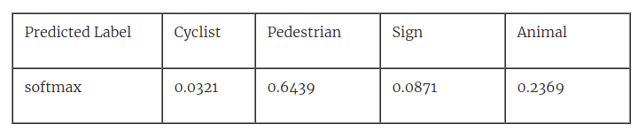

***

## Uncertainty Sampling

### This chapter covers

- Methods for understanding the scores of a Machine Learning prediction so that you know when you can and cannot rely on the confidence of a prediction
- Methods for combining predictions over multiple labels into a single uncertainty score so that you have multiple ways of determining where your model is most confused
- Strategies for deciding on the right number of items to put in front of humans per iteration cycle
- Strategies for evaluating the success of uncertainty sampling to track your progress

---

The most common strategy that people use to make AI smarter is for the Machine Learning models to tell humans when they are uncertain about a task, and then ask the humans for the correct feedback. In general, unlabeled data that confuses a Machine Learning algorithm will be the most valuable when it is labeled and added to the training data. If the Machine Learning algorithm can already label an item with high confidence it is probably correct already.

So, this chapter is dedicated to this problem: interpreting when our Machine Learning algorithm is trying to tell us when it is uncertain about its task. However, it is not always easy to know when a Machine Learning algorithm is uncertain and how to calculate that uncertainty. Beyond simple binary labeling tasks, the different ways of measuring uncertainty can produce vastly different results. You need to understand and consider all methods for determining uncertainty in order to select the right one for your data and objectives.

For example, imagine you are building a self-driving car. You want to help the car understand the new types of objects (“Pedestrians”, “Cyclists”, “Street Signs”, “Animals”, etc) that it is encountering as it drives along. However, to do that you need to understand when your car is uncertain about what to do when it encounters an object, and how to best interpret and address that uncertainty.

---

### 3.1 Interpreting Uncertainty in a Machine Learning Model

Uncertainty Sampling is a strategy for identifying unlabeled items that are near a decision boundary in your current Machine Learning model. While it is easy to identify when a model is confident - there is one result with very high confidence - there are many different ways to calculate uncertainty and your choice will depend on your use case and what is the most effective for your particular data.

We explore four approaches to Uncertainty Sampling in this chapter:

1. Least Confidence Sampling: difference between the most confident prediction and 100% confidence. In our example, if the model was most confident that a “Pedestrian” was in the image, than Least Confidence captures how confident (or uncertain) that prediction was.
2. Margin of Confidence Sampling: difference between the top two most confident predictions. In our example, if the model was most confident that a “Pedestrian” was in the image and was the second most confident that it was an “Animal”, then Margin of Confidence captures the difference between the two confidences.
3. Ratio of Confidence Sampling: ratio between the top two most confident predictions. In our example, if the model was most confident that a “Pedestrian” was in the image and was the second most confident that it was an “Animal”, then Ratio of Confidence captures the ratio (not difference) between the two confidences.
4. Entropy-based Sampling: difference between all predictions, as defined by information theory. In our example, Entropy-based Sampling would capture how much every confidence differed from each other.

We’ll also look at how to determine uncertainty from different types of Machine Learning algorithms, and combining predictions from different models.

To understand the strengths and weaknesses of each method required going deeper into exactly what each strategy is going, and so this chapter gives detailed examples of each along with the equations and code. You also need to know how the confidences are generated before you can start interpreting them correctly. So, this chapter starts with how to interpret your model’s probability distributions, especially if they are generated using softmax, the most popular algorithm for generating confidences from neural models.

#### 3.1.1 Why look for uncertainty in your model?

Let’s return to our self-driving car example. Suppose your car spends most of its time on highways, which it is already very good at navigating and where there are a limited number of objects: you don’t see many cyclists or pedestrians on major highways. If you randomly selected video clips from the car’s video cameras, it will mostly be from highways where the car is already confident and driving well. There will be little that a human can do to improve the driving skills of the car if humans are mostly giving the car feedback about highway driving where the car is already confident.

Therefore, you want to know when your self-driving car is most confused as it is driving. So, you decide to take video clips from where the car is most uncertain about the objects it is detecting and then have the human provide the ground-truth (training data) for the objects in those video clips. The human can identify whether a moving object is a pedestrian, another car, a cyclist, or some other important object that the car’s object detection might have missed. Different objects can be expected to move at different speeds and be more or less predictable, which will help the car anticipate the movements of those objects.

However, it might be the case that the car was most confused when driving through snowstorms. If you only show video clips from a snowstorm, it doesn’t help the car in 99% of situations when the car is not in snowstorms. In fact, that could make the car worse. The snowstorm will limit the visible range and you could unintentionally bias the data so that the car’s behavior only makes sense in a snowstorm, but is dangerous elsewhere. For example, you might teach the car to ignore all distant objects down the road as they simply cannot be seen when it is snowing, and therefore limit the car’s ability to anticipate objects at a distance in non-snowing conditions. So, you need different kinds of conditions in which your car is experiencing uncertainty.

Furthermore, it’s not clear how to define “uncertainty” in the context of multiple objects. Is it just the uncertainty about the most likely object that was predicted? Or the uncertainty between the top two most likely predictions? Or should you take into account every possible object when coming up with an overall “uncertainty” score for some object that the car detected? When you drill down into it, deciding what objects from self-driving car videos you should put in front of a human for review is difficult.

Finally, your model is not telling you in plain language when it is uncertain: even for a single object, the Machine Learning model gives you a number that might correspond to the confidence of the prediction, but it might not actually be a reliable measure of accuracy. So this will be our starting point in this chapter: knowing when your model is uncertain, and from that base you will be able to build your broader uncertainty sampling strategies.

#### 3.1.2 Interpreting the scores from your model

As you experimented with in Chapter 2, almost all Machine Learning models will give you two things:

- A predicted label (or set of predictions)
- A number (or set of numbers) associated with each predicted label.

The numbers are generally interpreted as confidences in the prediction, although this can be more or less true depending on how the numbers are generated. The general principle of Uncertainty Sampling is that if there are mutually exclusive categories with similar confidence, then this is good evidence that the model is confused in the prediction and that a human judgment would be valuable. Therefore, the model will benefit most when it learns to correctly predict the label of an item with an uncertain prediction.

For example, let’s assume we have a very simple object detection model for our self-driving car that only tries to distinguish between four types of objects. The model might give us a prediction like this:
```javascript
{
    "Object": {
        "Label": "Cyclist",
        "Scores": {
            "Cyclist": 0.9192784428596497,
            "Pedestrian": 0.01409964170306921,
            "Sign": 0.049725741147994995,
            "Animal": 0.016896208748221397
        }
    }
}
```
You can see in the example that a “Cyclist” is predicted with a 0.919 score. The scores that might have been “Pedestrian”, “Sign” or “Animal” are 0.014, 0.050 and 0.0168. The four scores total to 1.0, which makes the score like a probability or confidence. For example, you could interpret 0.919 as 91.9% confidence that object is a “Cyclist”. This interpretation is a simplification and it is unlikely that the model is correct 91.9% of the time that it sees objects like this one: it can be widely different. This won’t always matter. If you are ranking the predictions to find the “most uncertain” for human review, the actual uncertainty scores won’t matter. However, even the rank order can change depending on how you interpret the outputs from your model, so it is important to know exactly what statistics are generating these confidences.

Finally, your model is not telling you in plain language when it is uncertain: even for a single object, the Machine Learning model gives you a number that might correspond to the confidence of the prediction, but it might not actually be a reliable measure of accuracy. So this will be our starting point in this chapter: knowing when your model is uncertain, and from that base you will be able to build your broader uncertainty sampling strategies.

#### 3.1.2 Interpreting the scores from your model

As you experimented with in Chapter 2, almost all Machine Learning models will give you two things:

- A predicted label (or set of predictions)
- A number (or set of numbers) associated with each predicted label.

The numbers are generally interpreted as confidences in the prediction, although this can be more or less true depending on how the numbers are generated. The general principle of Uncertainty Sampling is that if there are mutually exclusive categories with similar confidence, then this is good evidence that the model is confused in the prediction and that a human judgment would be valuable. Therefore, the model will benefit most when it learns to correctly predict the label of an item with an uncertain prediction.

For example, let’s assume we have a very simple object detection model for our self-driving car that only tries to distinguish between four types of objects. The model might give us a prediction like this:
```javascript
{
    "Object": {
        "Label": "Cyclist",
        "Scores": {
            "Cyclist": 0.9192784428596497,
            "Pedestrian": 0.01409964170306921,
            "Sign": 0.049725741147994995,
            "Animal": 0.016896208748221397
        }
    }
}
```
You can see in the example that a “Cyclist” is predicted with a 0.919 score. The scores that might have been “Pedestrian”, “Sign” or “Animal” are 0.014, 0.050 and 0.0168. The four scores total to 1.0, which makes the score like a probability or confidence. For example, you could interpret 0.919 as 91.9% confidence that object is a “Cyclist”. This interpretation is a simplification and it is unlikely that the model is correct 91.9% of the time that it sees objects like this one: it can be widely different. This won’t always matter. If you are ranking the predictions to find the “most uncertain” for human review, the actual uncertainty scores won’t matter. However, even the rank order can change depending on how you interpret the outputs from your model, so it is important to know exactly what statistics are generating these confidences.

In the rest of this chapter, you will learn how to take a set of predictions from your model and implement the most common algorithms for calculating “uncertainty” from those scores. But before you try to derive uncertainty from your models scores, you first need to be able to interpret the true meaning of the scores from your model.

#### 3.1.3 “Score”, “Confidence”, and “Probability”: Do not trust the name!

Machine Learning libraries will often use the terms “Score”, “Confidence” and “Probability” interchangeably. This is true of open libraries and commercial ones. You might not even find consistency within the same library.

I’ve encountered this personally. When I was running product for Amazon Comprehend, AWS’s Natural Language Processing (NLP) Service, I had to decide what we should call the numbers associated with each prediction. It was after long discussions that we decided that “confidence” was misleading, as the outputs from the system were not confidences according to the strict statistical definition of a probability, and we went with “score” instead. An existing Computer Vision service at AWS, Amazon Rekognition, had already used “confidence” for this same score when predicting the labels of images, and still does to this day. Most Machine Learning libraries are built with less consideration to naming conventions than large cloud companies. So, you shouldn’t trust the numbers associated with your predictions from their names alone:
```javascript
NOTE:
Read the documentation for your Machine Learning library or service to know what is meant by the numbers associated 
with each prediction.
```

Even when the term “probability distribution” is used, it can mean only that the numbers across the predicted labels add up to 100%. It does not necessarily mean that each number reflects the actual model confidence that the prediction is correct. For neural networks, logistic regression, and other types of related Discriminative Supervised Learning Algorithms, it is not the job of the algorithm to know how confident its predictions are: the job of the algorithm is trying “discriminate” between the labels based on the features, hence the name “Discriminative Supervised Learning”. The raw scores from the last layer of a neural network are the network trying to discriminate between the predictions it is making. Depending on the parameters of the model, those raw scores in the final layer can be any real number. So, the scores that come out of these algorithms often need to be converted into something more closely approximating a confidence.

For Generative Supervised Learning Algorithms, like most Bayesian Algorithms, the algorithm is trying to explicitly model each label, and so the confidences can be read directly from your model. However, these confidences will rely on assumptions about the underlying distribution of the data (like a Normal distribution) and the prior probability of each label.

To complicate things further, you can extend a Discriminative Supervised Learning algorithm with Generative Supervised Learning methods in order to get a truer statistical “probability” straight from the model. However, these are advanced features that we will cover in a later chapter. Today, generative methods for getting accurate probabilities from discriminative models are not available in any of the most widely used Machine Learning libraries. You are overwhelmingly more likely to get a probability distribution generated by the softmax algorithm, so we will start there.

#### 3.1.4 SoftMax: converting the model output into confidences

The most common models are Neural Networks and Neural Network predictions are almost always converted to a 0-1 range of scores using softmax.

Softmax is defined as:


For the outputs of a Neural Network it will look something like Figure 3.1:

```javascript
Figure 3.1: showing how softmax creates probability distributions in two types of architectures. In the top example,
softmax is the activation function of the output (final) layer, directly outputting a probability distribution. In
the bottom example, a linear activation function is used on the output layer, creating model scores (logits) that
are then converted into probability distributions via softmax. The bottom architecture is only slightly more
complicated, but is it preferred for Active Learning as it is more informative.
```


As Figure 3.1 shows, softmax is often used as the activation function on the final layer of the model to produce a probability distribution as the set of scores associated with the predicted labels. Softmax can also be used to create a probability distribution from the outputs of a linear activation function.

It is common to use softmax in the final layer or to only look at the result of softmax applied to the logits. However, we generally prefer an architecture in Active Learning that allows us to see logits from a linear activation function, as it has more information. Softmax is lossy and loses the distinction between uncertainty due to strongly competing information vs uncertainty due to a lack of information. We will use the second type of architecture in Figure 3.1 for our examples in this section, but the effects would apply either way: whether softmax is an activation function or is applied to the model scores. We will also return to the choice of activation function at the end of this Chapter.

Here’s an example implementation of softmax in python using the PyTorch library [[3]](https://livebook.manning.com/book/human-in-the-loop-machine-learning/chapter-3/v-6/id_ftn3):

```python
def softmax(self, scores, base=math.e):
        """Returns softmax array for array of scores
       
        Converts a set of raw scores from a model (logits) into a
        probability distribution via softmax.
           
        The probability distribution will be a set of real numbers
        such that each is in the range 0-1.0 and the sum is 1.0.
   
        Assumes input is a pytorch tensor: tensor([1.0, 4.0, 2.0, 3.0])
            
        Keyword arguments:
            prediction -- a pytorch tensor of any positive/negative real numbers.
            base -- the base for the exponential (default e)
        """
        exps = (base**scores.to(dtype=torch.float)) # exponential for each value in array
        sum_exps = torch.sum(exps) # sum of all exponentials
 
        prob_dist = exps / sum_exps # normalize exponentials
        return prob_dist
```

```javascript
NOTE:
strictly speaking, this function should be called “softargmax”, but in Machine Learning circles it is almost always
shortened to “softmax”. You might also see it called a Boltzmann distribution or Gibbs distribution.
```
To get an intuition for what the softmax transformation in the equation above is doing, let’s break down the pieces. Imagine like in our example above, you had predicted the object in an image and the model gave you raw scores of 1, 4, 2 and 3. The highest number “4” will become the most confident prediction:


The final row, softmax, is each $e^z$ divided by the sum of all numbers in the $e^z$ row.

These raw scores, 1, 4, 2, and 3, will be used throughout this section to keep the examples consistent and because they add to 10, which makes for easier intuition. The exact range of numbers you get will depend on your activation function (more on that at the end of the chapter). If you are using softmax as the final activation function, then the exact numbers will be a combination of activation function and weights on the output of the previous layer. Exact integers are unlikely, but the range of 1-4 will be common in a lot of architectures. For example, the ReLU activation function and `clamp()` method that you implemented in Chapter 2 returns numbers in a bounded range.

As the table above shows with our examples, “Pedestrian” is the most confident prediction, and the confidence numbers are stretched out from raw numbers: 4.0 out of 10.0 in the raw scores becomes 64% in the softmax. See how much bigger the “Pedestrian” prediction became in the ez step where it is $54.60? e^4.0 = 54.60$ and this comes to dominate the denominator equation as the largest number.

The benefits of interpretability should be clear: by converting the numbers into exponentials and normalizing them, we are able to convert an unbounded range of positive and negative numbers into probability estimates that are in a 0-1 range and add up to 1. The exponentials might also more closely map to real probabilities, than if we simply normalized the raw scores. If your model is training using Maximum Likelihood Estimation (MLE), the most popular way to train a neural model, then it is optimizing the log-likelihood. So, using an exponential on log-likelihood takes us to an actual likelihood. However, Maximum Likelihood Estimation puts more emphasis on the misclassified items in order to better classify them, so your scores do not represent the log-probabilities of your entire training data in a way that you can accurately convert with exponentials.

Why e? Honestly, it’s a little shaky for why e should be the number we use for normalizing our data. There are many places in Machine Learning where e has special properties, but this isn’t one of them. Euler’s number (e), is approximately 2.71828. As you’ll recall from your high school mathematics classes, ex is its own derivative and as a result it has a lot of interesting properties. In Machine Learning, we particularly like that e is the derivative of itself. You can see this in the graph in Figure 3.2.
```js
Figure 3.2: Graph showing e as its own integral: the slope at f(1) = 1 is 1, the slope at f(2) = 2 is 2, etc
```


The slope at f(x) is f(x) for any given x: the slope of the ex curve at f(1) is 1; the slope of the curve at a f(2) is 2; etc. You might remember this written as f’(1) = 1, and f’(2) = 2 in your high-school mathematics books, where the apostrophe indicates the derivative and is called “f prime”. Or you might have seen it written as dy/dx or ẏ. These three notations, f’, dy/dx, ẏ, all mean the same thing and to come from different mathematicians: Lagrange, Leibniz, and Newton, respectively. You probably used Lagrange’s notation in high-school, Leibniz’s in any prior Machine Learning course, or Newton’s if you are coming from physics.

The property of f’(x) = f(x) is what we mean when we say that ex is its own derivative. If you used any base other than e for the exponential curve, you would not get this property. In Machine Learning, we need to take derivatives of functions in order to converge them: the learning in Machine Learning is mainly this, converging functions. So, when we know the derivative of a function is itself, it saves us a lot of compute power.

However, that doesn’t necessarily mean that e is the best number for your particular data set when you are trying to find the best confidence measure. If you are using a black-box Machine Learning algorithm and you don’t have access to the raw numbers, then you are probably stuck using the output of softmax. If that’s the case, then it is a good idea to have intuitions for how softmax will treat different input data.

From the same input, compare these two graphs, but using e (2.71828) as the exponential base on the left, and using 10 as the exponential base on the right in Figure 3.3.
```js
Figure 3.3: Comparing two different bases for exponentials (e and 10) for softmax on the same raw output data from a
model. The graphs show that the higher the base, the higher the estimated probability of the highest score, with the
highest score dominating the softmax equation to a greater extent at higher bases.
```


As you can see, the choice of exponent can matter a lot. If we use 10, then the confidence of “Pedestrian” on our data is now 90%, and the next most confident label is less than 10%.

Here’s the scores from using 10 as the exponential base for softmax on our example data:


This gives a clearer intuition about how important the largest number is. With 10 as the exponential base, we get 1 plus 4 zeros (10,000). That’s clearly much bigger than any of the other numbers, and they all get pushed down in the final softmax equation as a result:

The higher the exponential base for softmax, the more spread out the probabilities. 

The choice of base won’t change which prediction is the most confident. So, it is often overlooked in Machine Learning tasks where people only care about the predictive accuracy over the labels.

Ideally, you want your model to know how confident it is. This is true not just for Active Learning, but for a range of other tasks. For example, if your model is 80% confident in a prediction, then you want it to be correct 80% of the time. But if you are relying on the output of your model to have confidences that are an accurate indication of how accurate it is, you can see that the choice of how to produce those confidences is very important.

Assume that softmax uses base e in this text unless it is explicitly stated otherwise. For now, it is important to get an intuition for exactly how softmax transforms your scores into a probability distribution. We’ll cover alternatives to softmax in advanced chapters.

As you saw in the equation above, softmax comes from exponentials of the raw scores. Recall from your high school mathematics that the addition of number: ca-b = ca  ÷ cb

Therefore, when softmax normalizes the exponentials by dividing by all of them: the division of exponentials is essentially subtracting the absolute value of the scores. In other words, it is only the relative difference between the scores from your model that counts with softmax, not their actual values.

We can get an intuition for this by seeing it graphically. Let’s take our scores from the example above of (1.0 ,4.0 ,2.0 ,3.0) and create scenarios where we add 10, 100 and -3 to each of them, so we are changing the sum of scores but keeping the difference between each score the exact same. As Figure 3.4 shows, the probability distributions are identical even though the raw scores differ considerably in each of the four sets of predictions. This is because the difference between each of the four raw scores was identical. The difference between the raw scores from the model is the only factor that counts in the final probability distribution under softmax. The difference between 4 and 3 will be the same as the difference between 104 and 103. This is an important limitation to understand. Clearly, the model that has scores of 104 vs 103 is a lot more uncertain than a model with scores of 4 vs 3, and more advanced uncertainty sampling will take this into account. But for the most common uncertainty sampling algorithms and for any black-box use of Machine Learning predictions, this assumption needs to be understood.

```js
Figure 3.4: Softmax equivalencies: four different model scores that give identical probability distributions under
softmax. The four softmax probability distributions are identical, despite coming from very different model scores,
showing that it is only difference between the scores that matters. For example, the scores of (1, 4, 2, 3) will
give the exact same probability distribution by softmax as (101, 104, 102, 103).
```


To get this same intuition from another point of view, let’s try multiplying each of (1.0, 4.0, 2.0, 3.0) with a constant, and see the results in Figure 3.5:

```js
Figure 3.5: The two score distributions are identical except for scale: the right scores are 10x the left cores.
Under softmax they result in very different probability distributions.
```


In Figure 3.5, you can see that while the scores from the last layer differ only by the scale of the y-axis, they will produce very different probability distributions under softmax. For the distributions with lower scores, softmax has produced a probability distribution that is a tighter set of numbers than the logits, but with the higher scores it has produced a wider distribution.

```js
BE CAREFUL OF LARGE INPUTS INTO SOFTMAX
You run the risk of hardware overflow errors when using softmax with large input values, because the exponent
step will produce very large values. If you calculate e to the power of 1,000 on your computer, then you might
see a system error or an infinite value (“inf”). This can obviously impact the downstream processes. There are
two ways to avoid this overflow and I recommend using one of them if you decide to start experimenting with
softmax:

The first is to substract a constant from your inputs, so that the maximum among your inputs is 0. This is
putting the phenomena in Table 3.4 to your advantage: subtracting a constant will give you the same probability
distribution, without worrying about overflow during the exponential step. This is one line in Pytorch:
```

```python
tensor = tensor - torch.max(tensor)
```

```js
The second is to use Log Softmax. This is what you saw in Chapter 2 and what PyTorch’s introductory examples
implement.
```

In our examples so far, we are treating softmax simply as a normalization on the scores from an output layer. You can also use softmax as the activation function of the output layer itself. All the observations still apply here about the choice of base and how it will spread out the data in different ways. However, as we will cover later in this chapter, it is not recommended that you use softmax as an optimization function for your last layer if you are implementing Active Learning, unless there are very clear benefits, like significantly more accurate labels. It might be the case that ignoring overall scale is what allows a model with a softmax final layer to be more accurate for data. In this case, you might consider different models for the label prediction and the Active Learning components of your systems. We will return to more complicated systems like this in future chapters, as there are many ways to implement them.

This section and the graphs associated with it are probably the longest description of softmax that you will read anywhere, but it is important for Human-in-the-Loop Machine Learning. It is the most common algorithm used to generate probability distributions from Machine Learning predictions, and yet many people think that e as the choice of base has special properties for generating confidences, which does not, or they think that the choice of base won’t change the rank order of uncertainty, which is false for any task predicting three or more labels (as you will learn below). So, the ability to truly understand what softmax is doing will help your intuitions for selecting the right uncertainty sampling strategy.

```js
“NOT ALL DATA IS EQUAL”, EXPERT ANECDOTE BY JENNIFER PRENDKI
If you care about your nutrition, you don’t go to the supermarket and randomly select items from the shelves.
You might eventually get the nutrients you need by eating random items from the supermarket shelves, however,
you will eat a lot of junk food in the process. I think it is weird that in Machine Learning, people still
think it’s better to “sample the supermarket randomly” than figuring out what they need and focusing their
efforts there.

The first Active Learning system I built was by necessity. I was building Machine Learning systems to help a
large retail store make sure that when someone searched on the website, the right combination of products came
up. Almost overnight, a company re-org meant that my human labeling budget was cut in half and we had a 10x
increase in inventory that we had to label. So, my labeling team had only 5% the budget per item that we
previously did. I created my first Active Learning framework to discover which was the most important 5%.
The results were better than random sampling with a bigger budget. I have used Active Learning in most of
my projects since, because not all data is equal!

Bio: Jennifer Prendki is the CEO of Alectio, finding the right data for Machine Learning. She previously lead
data science teams at Atlassian, Figure Eight, and Walmart.
```

---

### 3.2 Algorithms for Uncertainty Sampling

Now that you understand where the confidences in the model predictions come from, you can think about how to interpret the probability distributions in order to find out where your Machine Learning models are most “uncertain”.

Uncertainty Sampling is a strategy for identifying unlabeled items that are near a decision boundary in your current Machine Learning model. If you have a binary classification task, like you saw in Chapter 2, these will be items that are predicted as close to 50% probability of belonging to either label, and therefore the model is “uncertain”. These items are most likely to be wrongly classified, and therefore they are the most likely to result in a human label that is different from the predicted label.

From our introduction in Chapter 1, recall this graphic showing how uncertainty sampling should find items close to the decision boundary, like in Figure 3.6:

```js
Figure 3.6: showing how Uncertainty Sampling as an Active Learning strategy, which over-samples unlabeled items
that are closer to the decision boundary (and sometimes to each other), and are therefore more likely to get a
human label that results in a change in that decision boundary.
```


There are many algorithms for calculating uncertainty, which we will visit below. They all follow the same principles:

1. Apply the uncertainty sampling algorithm to a large pool of predictions in order to generate a single uncertainty score for each item.
2. Rank the predictions by the uncertainty score.
3. Select the top N most uncertain items for human review.
4. Obtain human labels for the top N items, retrain the model with those items, and iterate on the processes.

The three methods covered in this chapter are invariant of the data being predicted: a given item will get the same uncertainty score independent of the scores given to other items being predicted. This helps with the simplicity and predictability of the approaches in this chapter: the rank order of uncertainty scores is enough to find the most uncertain across a set of predictions. However, there are also techniques that can take the distribution of predictions to change the individual scores. We will return to those in later chapters on advanced techniques.

Note that for binary classification tasks, the different strategies in this chapter will be identical. However, for three or more labels, the strategies diverge very quickly.

#### 3.2.1 Least Confidence sampling

The simplest and most common method for uncertainty sampling is to take the difference between 100% confidence and the most confidently predicted label for each item. This is the implementation of Active Learning that you saw in Chapter 2. Let’s refer to the softmax result σ(z)j as the probability of the label given the prediction Pθ (y | x). We know that softmax isn’t strictly giving us probabilities, but these are general equations that apply to probability distributions of any sources, not just from softmax. The basic equation is simply the probability of the highest confidence y* for the label, which you already implemented in Chapter 2:


While you can rank order by confidence alone, it can be useful to convert the uncertainty scores into a 0-1 range, where 1 is the most uncertain score. In that case, we have to normalize the score. We subtract the value from 1 and multiply the result by the number of labels and divide the number of labels - 1. We do this because the minimum confidence can never be less than the one divided by the number of labels, which is when all labels have the same predicted confidence. So, least confidence sampling with a 0-1 range is:


Here’s an implementation of least confidence sampling in PyTorch:
```python
def least_confidence(self, prob_dist, sorted=False):
        """
        Returns the uncertainty score of an array using
        least confidence sampling in a 0-1 range where 1 is the most uncertain
       
        Assumes probability distribution is a pytorch tensor, like:
            tensor([0.0321, 0.6439, 0.0871, 0.2369])
                   
        Keyword arguments:
            prob_dist -- a pytorch tensor of real numbers between 0 and 1 that total to 1.0
            sorted -- if the probability distribution is pre-sorted from largest to smallest
        """
        if sorted:
            simple_least_conf = prob_dist.data[0] # most confident prediction
        else:
            simple_least_conf = torch.max(prob_dist) # most confident prediction
                   
        num_labels = prob_dist.numel() # number of labels
        
        normalized_least_conf = (1 - simple_least_conf) * (num_labels / (num_labels -1))
       
        return normalized_least_conf.item()
```
Let’s apply Least Confidence to get an uncertainty score for our self-driving car prediction:



The confidence for “Pedestrian” is all that counts here. Using our example, this uncertainty score would be (1 - 0.6439) * (4 / 3) = 0.4748.

Least confidence sampling therefore gives you ranked order of predictions where you will sample items with the lowest confidence for their predicted label. This method is sensitive to the values of the 2nd, 3rd etc only in that the sum of the other predictions will be the score itself: the amount of confidence that will go to labels other than the most confident.

This method will not be sensitive to uncertainty between any of the other predictions: with the same confidence for the 1st most confident, the 2nd to nth confidences can take any values without changing the uncertainty score.

So, if you only care the most confident prediction for your particular use case, then this method is a good starting point. Otherwise you will want to use one of the other methods below.

Least confidence is very sensitive to the base used for the softmax algorithm. This is a little counterintuitive, but recall our example where softmax(base=10) gives ~0.9 confidence, which would result in an uncertainty score of just 0.1, much less than 0.35 on exactly the same data. For different bases, this will change the overall ranking. Higher bases for softmax will stretch out the differences between the most confident label and the other labels, and therefore at higher bases the difference between the label confidences will come to weigh more than the absolute difference between the most confident label and 1.0. We will explore the relationship between softmax base and least confidence a little more in subsequent sections of this chapter, and expand on it further in a later chapter on advanced methods.

#### 3.2.2 Margin of Confidence sampling

The most intuitive form of uncertainty sampling is the difference between the two most confident predictions. That is, for the label that the model predicted, how much more confident was it than for the next most confident label?

This is defined as:


Again, we can convert this to a 0-1 range. We have to subtract from 1.0 again, but the maximum possible score is already 1, so there is no need to multiple by any factor:


Here’s an implementation of margin of confidence sampling using PyTorch:

```py
def margin_confidence(self, prob_dist, sorted=False):
        """
        Returns the uncertainty score of a probability distribution using
        margin of confidence sampling in a 0-1 range where 1 is the most uncertain
       
        Assumes probability distribution is a pytorch tensor, like:
            tensor([0.0321, 0.6439, 0.0871, 0.2369])
           
        Keyword arguments:
            prob_dist -- a pytorch tensor of real numbers between 0 and 1 that total to 1.0
            sorted -- if the probability distribution is pre-sorted from largest to smallest
        """
        if not sorted:
            prob_dist, _ = torch.sort(prob_dist, descending=True)
       
        difference = (prob_dist.data[0] - prob_dist.data[1])
        margin_conf = 1 - difference
       
        return margin_conf.item()
```

Let’s apply Margin of Confidence sampling to our example data:

“Pedestrian” and “Animal” are the most confident and second most confident prediction. Using our example, this uncertainty score would be 1.0 - (0.6439 - 0.2369) = 0.5930.

This method will not be sensitive to uncertainty of any but the most two confident predictions: with the same difference in confidence for the 1st and 2nd most confident, the 3rd to nth confidences can take any values without changing the uncertainty score.

So, if you only care about the uncertainty between the predicted label and the next most confident prediction for your particular use case, then this method is a good starting point. This is probably the most common type of uncertainty sampling that I’ve seen people use in industry, but all three of these methods are common.

Margin of confidence is the least sensitive to the base used for the softmax algorithm, but it is still sensitive. While softmax(base=10) would give a margin of confidence score of 0.1899 for our dataset above, compared to 0.5930 with base e, all of the top two most probable scores will move. They will move at slightly different rates depending on the total relative difference of all raw scores, but recall that we are sampling from when the model is most uncertain, that is, when the most confident scores will tend to be as low as possible and therefore most similar to each other. For this reason, you might get as little as only a few percent difference when you sampling the top most uncertain items by margin of confidence sampling under different bases of softmax.

#### 3.2.3 Ratio of Confidence sampling

Ratio of confidence is a slight variation on Margin of Confidence, looking at the ratio between the top two scores instead of the difference. 

It is the best Uncertainty Sampling method to improve your understanding of the relationship between confidence and softmax. To make it a little more intuitive, you can think of the ratio as capturing how many times more likely the first label was than the second most confident:


Now let’s plug in our numbers again:
```py
0.6439 / 0.2369 = 2.71828
```
We just got back the natural log, e = 2.71828! Similarly, if we use base 10, we get:
```py
90.01% / 9.001% = 10
```
We just got back “10”, the base we used!

This is a good illustration why e is an arbitrary base for generating confidences. Is “Pedestrian” really 2.71828 more likely as a prediction than “Animal” in this context? Probably not. It’s doubtful that it’s exactly 10 times more likely, either. The only thing that ratio of confidence is telling us is that the raw score from our models was exactly “1” different between “Pedestrian” and “Animal”, and nothing more.

Ratio of confidence with a division can be defined in terms of the raw scores, in this case with softmax(base= β), where β is the base used for softmax (if not e):


Ratio of confidence with a division is completely invariant across any base used in softmax. The score is wholly determined by the distance between the top two raw scores from your model and therefore scaling by the same base will not change the rank order.

To give Ratio of Confidence a 0-1 normalized range where you can simply take the inverse of the equation above:


We used the non-inverted version above so that it directly outputs their softmax base for illustrative purposes.

Here’s an implementation of ratio of confidence sampling using PyTorch:

```py
def ratio_confidence(self, prob_dist, sorted=False):
        """
        Returns the uncertainty score of a probability distribution using
        ratio of confidence sampling in a 0-1 range where 1 is the most uncertain
       
        Assumes probability distribution is a pytorch tensor, like:
            tensor([0.0321, 0.6439, 0.0871, 0.2369])
                   
        Keyword arguments:
            prob_dist --  pytorch tensor of real numbers between 0 and 1 that total to 1.0
            sorted -- if the probability distribution is pre-sorted from largest to smallest
        """
        if not sorted:
            prob_dist, _ = torch.sort(prob_dist, descending=True)
           
        ratio_conf = prob_dist.data[1] / prob_dist.data[0]
       
        return ratio_conf.item()
```
Hopefully, this gives you another good way to intuit why Margin of Confidence sampling is also relatively invariant: there’s not a big difference between subtracting your two highest values and dividing your two highest values, when your end goal is to rank them.

Happily, where margin of confidence with subtraction does differ from ratio of confidence, it does what we want by favoring the most uncertain. Let’s say you had four labels. If the 3rd most confident predictions is relatively close to the 1st and 2nd, then this will increase the uncertainty score for margin of confidence. This variation is small, and it doesn’t occur directly as a result of margin of confidence: it is a by-product of the denominator in softmax equation being larger as a result of the larger score for the 3rd most confidence, which becomes disproportionately larger as an exponential. Nonetheless, it is the right behaviour: all else being equal, margin of confidence will look for uncertainty beyond the first two most confident predictions in what would otherwise be a tie.

Unlike margin of confidence, where the variation from the 3rd to nth predictions is a lucky by-product of softmax, our next most popular uncertainty sampling strategy explicitly models all the predictions.

#### 3.2.4 Entropy (classification entropy)

One way to look at uncertainty in a set of predictions is by whether you expect to be surprised by the outcome. This is the concept behind entropy: how surprised would you be each of the possible outcomes, relative to their probability?

It is intuitive to think about this in terms of a sporting team you supported for a long time even though it was on a losing streak. For me, that’s the Detroit Lions American Football team. They are the only team never to win the SuperBowl, and have not won a single play-off game in almost three decades. So, when the Detroit Lions do win, it is extra surprising for me. Unfortunately, the extra surprise from the rare wins do not make up for the general predictable losses.

The highest entropy is when a team wins exactly half its games: you don’t know, going in, what the result will be and so there is an equal amount of surprise either way in every game. The entropy equation simply gives us a mathematically well-motivated way to calculate the surprise for outcomes, as shown in Figure 3.7:
```js
Figure 3.7: Example of low Entropy (left) and high Entropy (right) showing that high entropy is when the
probabilities are most like each other, and therefore when there is the most “surprise” in any one prediction
from the distribution.
```


Entropy applied to a probability distribution is multiplying each probability by its own log, and taking the negative sum of those:


We can convert the entropy into a 0-1 range by dividing by the log of the number of predictions (labels):


Here’s an implementation of ratio of entropy score using python and the numpy library:
```py
def entropy_based(self, prob_dist):
        """
        Returns the uncertainty score of a probability distribution using
        entropy
       
        Assumes probability distribution is a pytorch tensor, like:
            tensor([0.0321, 0.6439, 0.0871, 0.2369])
                    
        Keyword arguments:
            prob_dist -- a pytorch tensor of real numbers between 0 and 1 that total to 1.0
            sorted -- if the probability distribution is pre-sorted from largest to smallest
        """
        log_probs = prob_dist * torch.log2(prob_dist) # multiply each proba by its base 2 log
        raw_entropy = 0 - torch.sum(log_probs)
   
        normalized_entropy = raw_entropy / math.log2(prob_dist.numel())
       
        return normalized_entropy.item()
```

First, don’t be scared by another arbitrary base, log(base=2), which is used for historical reasons:

**the choice of base for entropy does not change the uncertainty sampling rank-order**

Unlike softmax, calculating the entropy with different bases for uncertainty sampling will not change the rank order of scores across a data set. You will get different entropy scores depending on the base, but the entropy scores will change monotonically for every probability distribution and will therefore not change the rank order for uncertainty samping. Base 2 is used in entropy for historical reasons, as entropy comes from information theory where they thought about compressing datastreams in binary bits.

Let’s calculate the entropy on our example data:


Summing the numbers and negating them gives:
```py
0 - SUM(-0.159, -0.409, -0.307, -0.492) = 1.367.
```
Dividing by the log of the number of labels gives:
```js
1.367 / log2(4) = 0.684
```
Note that the P(y|x) log(P(y|x)) step is not monotonic with respect to probability distribution given by softmax. “Pedestrian” gives -0.409, but “Animal” gives -0.492. So “Animal” contributes the most to the final entropy score, even though it is neither the most confidence or least confidence prediction.

Data ranked for uncertainty by entropy is very sensitive to the base used by the softmax algorithm. It is about equally sensitive as least confidence. It is intuitive why this is the case: entropy explicitly uses every number in the probability distribution, and so the further these numbers are spread out via a higher base, the more divergent the result will be.

Recall our example where softmax(base=10) give ~0.9% confidence, which would result in an uncertainty score of just 0.1, much less than 0.35 on exactly the same data. For different bases, this will change the overall ranking. Higher bases for softmax will stretch out the differences between the most confident label and the other labels.

#### 3.2.5 A Deep Dive on Entropy

If you want to get deeper into entropy, you can try plugging different confidences into inner part of the equation where each confidence is multiplied by its own log, eg “0.3 * log(0.3)”. For this measure of entropy, the per-prediction score of P(y|x) log(P(y|x)) will return the largest (negative) numbers for confidences of around 0.3679. Unlike softmax, this is one area where Euler’s number is special, as e-1 = 0.3679. The formula to derive this is known as Euler’s Rule, itself a derivation of the Thâbit ibn Kurrah Rule from sometime in the 9th Century for generating Amicable Numbers. The largest (negative) numbers for each prediction will be around 0.3679 no matter which base you use for entropy, which should help you understand why the base doesn’t matter in this case.

You will encounter entropy in a few different places in Machine Learning and signal processing, so it is a good equation to get your head around.

Fortunately, you don’t need to derive Euler’s Rule or the Thâbit ibn Kurrah Rule in order to use entropy for uncertainty sampling. The intuition that 0.3679 (or a number near it) contributes the most to entropy is fairly simple:

1. If the probability was 1.0, then the model is completely predictable and has no entropy.
2. If the probability was 0.0, then that data point provides no contribution to the entropy as it is never going to happen.
3. Therefore, there is some number between 0.0 and 1.0 that is optimal for entropy on a per prediction basis.

However, 0.3679 is optimal only for individual probabilities. By using 0.3679 of the probability for one label, you are only leaving 0.6431 left for every other label. So the highest entropy for the entire probability distribution, not just individual values, will always be the case where each probability is identical and equal to one divided by the number of labels.

### 3.3 Identifying when different types of models are confused

You are most likely using neural models in Machine Learning, but there are many different architectures for neural models and there are many other popular types of Supervised Machine Learning algorithms. Almost every Machine Learning library or service will return some form of scores for the algorithms in them, which can be used for uncertainty sampling. In some cases, you will be able to use the scores directly and in some cases you will have to convert the scores to probability distributions using something like softmax.

Even if you are only using predictive models from Neural Networks or the default settings on common Machine Learning libraries and services, it is useful to understand the full range of algorithms and how uncertainty is defined with different kinds of Machine Learning models. Some are very different to the interpretations that we make from Neural Network models, but not necessarily any better or worse, so it will help you appreciate the strengths and weaknesses of different common approaches.

The strategies for determining uncertainty for different types of Machine Learning algorithms are summarized in Figure 3.8 and expanded upon in more detail later in this section. First, we’ll go a little deeper in Neural architecture, and in particular the activation functions for your final layer.

#### 3.3.1 What is the best activation function for Active Learning?

The “Activation Function” in a neural model is the equation used to optimize the output of each neuron. The choice of activation function will determine the type and range of outputs. These three are the most common, and cover probably more than 95% of cases for the output layer in supervised learning:

1. ReLU: outputs a number between 0 and infinity
2. Leaky ReLU: outputs a number between negative infinity and infinity
3. Softmax/Sigmoid: outputs a number between 0 and 1

If you are architecting your own neural network, you will be including the activation function for each layer of the network, so you will be very familiar with these three activation functions already.

Leaky ReLU is the best activation function to use for the final layer of your model for active learning, as it contains the most information. Leaky ReLU will de-weight numbers below 0 but still keep them in the output, so the full information is there.

```js
Bottom Right shows an ensemble of Decision Trees, of which the most well-known variant is a “Random Forest”.
Multiple decision trees are trained. The different trees are usually achieved by training on different subsets
of the data and/or features. The confidence in a label can simply be the percent of times an item was predicted
across all models, or the average confidence across all predictions.
Bottom Left   shows the division that a Decision Tree might give, dividing and recursively subdividing the data
one feature at time. The confidence is defined by the percent of a label in the final bucket (leaf). For example,
in the bottom left bucket (leaf) there is 1 Label A and 3 Label B, so a prediction in that bucket (leaf) would be
25% confidence in Label A and 75% confidence in Label B. Decision Trees are very sensitive to how far you let them
divide - they could keep dividing to leaves of just one items - and so probabilities tend not to be reliable. 
Top Right shows a potential Bayesian Model. It is a Generative Supervised Learning model which means that is trying
to model the distribution of each label, rather than model the boundary between them. The confidence on a per-label
basis can be read directly as a probability of being that label.
Top Left shows the decision boundary from a Support Vector Machine. It is a discriminative learner, like a neural
model, attempting to find a way to optimally divide the data. Unlike neural classifiers, SVMs are also trying to
maximize the width of the boundary. This is how an SVM decides which of multiple possible “central” lines is the
best division: it has the widest boundary. Note that the distance from the divider (the “hyperplane” for SVMs)
is from the far side of the divider, not the middle line.

Figure 3.8: Uncertainty Sampling from different Supervised Machine Learning algorithms
```


ReLU zeroes out all numbers below 0, so it tends to have less information as there is no longer any distinction between, say -1 and -1000. For uncertainty sampling, this won’t matter too much, as the low numbers contribute little weight to final results after softmax has been applied, but this becomes more important in following chapters on diversity sampling, as the different values of low numbers do become important for ranking outliers.

Sigmoid is the binary equivalent of softmax, giving an output that is an exponential normalization so that each output node predicts a value between 0 and 1. If you use Sigmoid on the final layer, you should consider simple normalization of the outputs (divide each raw score by the sum of all raw scores) as opposed to softmax normalization, as you have already applied an exponential normalization to your data: each subsequent normalization via exponentials when you are already in a 0-1 range will further bring the probability distribution into a narrower range.

Because softmax loses the relative difference in scores, like we saw in this chapter, this architecture is not recommended for Active Learning. However, it may be that you have no choice, because you are using a model that someone else built, or you have discovered through experimentation that softmax as an activation function produces by far the accurate predictions for each label. In this case, it is still possible to convert your model to try different exponential bases for Uncertainty Sampling. However, the raw scores from the model will become more important for Diversity Sampling, as you will learn in the next chapter.

If you know that some other activation is more accurate for predicting labels, you might consider retraining your final layer just for Active Learning. For example, you might get the best accuracy using Sigmoid, but you get better samples under uncertainty sampling using Leaky ReLU. This strategy - retraining part of model specifically for Active Learning - is something that we will return to in later advanced chapters in this text.

#### 3.3.2 Uncertainty sampling with Logistic Regression and MaxEnt models

For interpreting model confidence, you can treat Logistic Regression and MaxEnt (Maximum Entropy) models the same as Neural Models. There is little (sometimes no) difference between a Logistic Regression model, a MaxEnt model, and a single-layer neural model.

Therefore, you can apply uncertainty sampling in the same way as for neural models: you might get softmax outputs, or you might get scores that you can apply softmax to. The same caveats apply: it is not the job of a Logistic Regression or MaxEnt model to accurately calculate the confidence of a model, as the model is trying to optimally distinguish between the labels, so you might want to experiment with different bases for softmax if that is how you are generating your probability distributions.

#### 3.3.3 Uncertainty sampling with Support Vector Machines

Support Vector Machines (SVMs) are another type of discriminative learning. Like a neural model, they are attempting to find a way to optimally divide the data.

Unlike neural classifiers, SVMs are also trying to maximize the width of the boundary. This is how an SVM decides which of multiple possible divisions is the right one: the optimal boundary is defined as the widest one, or more specifically, the one which optimally models the greatest distance between a label and the far side of the dividing boundary. You can see an example of SVMs in Figure 3.8. The “Support Vectors” themselves, are the data points that define the boundaries.

SVMs also differ in how they model more complicated distributions. Neural Networks use hidden layers to discover boundaries between labels that are more complicated than simple linear divisions. Two hidden layers are enough to define any function. SVMs more or less do the same, but with predefined functions that map the data into higher dimensions. An example can be seen in Figure 3.9, where our two-dimensional example data is now projected into a third dimension that raises items on one side of that function and lowers them on the other. With the projection into a higher dimension, the data is now linearly separable and there is a plane that will now divide the two labels.

```js
Figure 3.9: Example of a Support Vector Machine (SVM) projecting our example two-dimensional dataset (Top) into
three dimensions (Bottom), so that a linear plane can now separate the two sets of labels: Label A is above the
plane, while Label B is below the plane. The sampled items are the least distance from the plane. If you want to 
earn from some of the important early Active Learning literature, you will need to understand how SVMs work at
this high level.
```


It is many orders of magnitude more efficient to train a model when you’ve pre-defined the type of function (as in SVMs), rather than let your model find the function itself among all possible alternatives (as in Neural Models). However, the chance of pre-defining the correct function type is low and the cost of hardware is coming down while speed is going up. So, SVMs are rarely used today, compared to their prior popularity.

#### 3.3.4 Uncertainty sampling with Bayesian Models

Bayesian Models are Generative Supervised Learning models, which means (by definition) they are trying to model the distribution of each label and the underlying samples, rather than model the boundary between the labels.

The advantage of Bayesian models is that you can read the probabilities straight off the model:


You don’t need a separate step or specific Activation Function to convert arbitrary scores into a probability distribution: the model is explicitly calculating the probability of an item having a label. Therefore, the confidence on a per-label basis can be read directly as a probability of that label.

Because they are not trying to model the differences between labels, Bayesian models tend not to be able to capture more complicated decision boundaries without a lot more fine-tuning. The Naive Bayes algorithm gets the “Naive” part of its name from not being able to model linear relationships between features, let alone more complicated ones, although it can be retrained almost instantly with new training data, which is appealing for Human-in-the-Loop systems.

Bayesian models also have to make assumptions about data distributions, like real values falling within a normal distribution, which may not necessarily hold up in your actual data. These assumptions can skew the probabilities away from the true values if you are not careful. They will still tend to be better than probabilities from discriminative models: they just can’t be trusted blindly without understanding their assumptions about the data.

Therefore, while Bayesian models aren’t likely to get the same accuracy as discriminative models for the predicted labels, they can be useful for Active Learning because of they better model the probabilities of predictions and they can often retrain much faster. We will look at combinations of Neural and Bayesian methods in later advanced chapters.

#### 3.3.5 Uncertainty sampling with Decision Trees & Random Forests

Decision Trees are discriminative learners that divide the data one feature at a time, recursively subdividing the data in buckets until the final buckets “the leaves” have just one set of labels. The trees are often stopped early or “pruned” so that the leaves do ultimately have some diversity of labels in them and so that the models don’t overfit the data. An example can be seen in Figure 3.8.

The confidence is defined by the percent of a label in the leaf for that prediction. For example, in the bottom left leaf in Figure 3.8, there is 1 Label A and 3 Label Bs, so a prediction in that bucket (leaf) would be 25% confidence in Label A and 75% confidence in Label B.

Decision Trees are very sensitive to how far you let them divide - they could keep dividing to leaves of just one item. By contrast, if they are not deep enough, there will be a lot of noise in each prediction and the bucket will be very large, with relatively distant training items in the same bucket erroneously contributing the confidence. So, probabilities tend not to be reliable.

The confidence of single decision trees are rarely trusted for this reason, and they are not recommended for Uncertainty Sampling. They can, in fact, be useful for other Active Learning strategies, as we will cover later, but for any Active Learning involving decision trees, it is recommended that you use multiple trees and combine the results.

Random Forests are the most well-known ensemble of Decision Trees. In Machine Learning, an “ensemble” means a collection of Machine Learning models that are combined to make a prediction, which we cover more in the next section.

For a Random Forest, multiple different Decision Trees are trained, with the goal of getting slightly different predictions from each one. The different trees are usually achieved by training on different subsets of the data and/or features. The confidence in a label can simply be the percent of times an item was predicted across all models, or the average confidence across all predictions.

As Figure 3.8 shows with the combination of just four Decision Trees, the decision boundary between the two labels is starting to become more gradient as you average across multiple predictions. Random Forests therefore make a good useful approximation confidence along the boundary between two labels.

Decision Trees are very fast to train, so there is little reason not to train many trees in a Random Forest if this is your algorithm of choice for Active Learning.

---

### 3.4 Measuring uncertainty across multiple models

Sometimes, you will have multiple models that are built from your data. You might be already be experimenting with different types of models or different parameters and want to combine the predictions into a single uncertainty score. If not, you might want to experiment with a few different models on your data to look at the variance.

Even if you are not using multiple models for your data, looking at the variation in predictions from different models will give you an intuition for how stable your model is today.

#### 3.4.1 Uncertainty sampling with Ensemble models

Similar to how a Random Forest is an ensemble of one type of Supervised Learning Algorithm, you can use multiple different types of algorithms to determine uncertainty and aggregate across them.

Figure 3.10 gives an example of this. Different classifiers will have confidence scores that are unlikely to be directly compatible with each other because of the different types of statistics used.

The simplest way to combine multiple classifiers is to rank-order the items by their uncertainty score for each classifier, and give each item a new score based on its rank order, and then combine those rank scores into one master rank of uncertainty.

```js
Figure 3.10: An ensemble model that combines predictions from different types of Machine Learning algorithms:
Neural Models, Support Vector Machines, Bayesian Models, and Decision Forests. The predictions can be combined
in various ways (max, average, etc) in order to find the joint uncertainty of each unlabeled item.
```


You can calculate uncertainty by how often different models agree on the label of an item: the items with the most disagreement are the ones to sample.

You can also take the probability distributions of the predictions into account, and there are multiple ways that you can combine the predictions from different models:

1. Lowest Maximum confidence across all models
2. Difference between Minimum and Maximum confidence across models
3. Difference between Minimum and Maximum confidence across models
4. Entropy across all confidences in all models
5. Average confidence across all models

You probably noticed that the first four methods above are the same algorithms we used for Uncertainty Sampling within a single predictions, but in this case across multiple predictions! So you should be able to implement these already.

### 3.4.2 Query by Committee and Dropouts

Within Active Learning, the Ensemble-based approach is sometimes known as “Query by Committee”, especially when only type of Machine Learning algorithm is used for the ensemble.

You could try the ensemble approach with neural models: train a model multiple times and look at the agreement on the unlabeled data across the predictions from each neural model. If you’re already retraining your model multiple times to tune hyperparameters, you might as well take advantage of the different predictions to help with Active Learning.

Following the Random Forest method above, you could try retraining your models with different subsets of items or features, to force diversity in the types of models that are built. This will prevent one feature (or a small number of features) from dominating the final uncertainty score.

One additional method for neural models is to use dropouts. You are probably familiar with dropouts already when training a model: you remove/ignore some random percentage of neurons/connections while training the model, to avoid overfitting your model to any one specific neuron.

You can apply the dropout strategy to predictions: get a prediction for an item multiple times, dropping out a different random selection of neurons/connections each time. This will result in multiple different confidences for an item and you can use these confidences with the ensemble evaluation methods above to select the right item. An example is given in Figure 3.11.

```js
Figure 3.11: An example applying dropout to a model to get multiple predictions for a single item. In each
prediction, a random set of neurons are dropped (ignored) resulting in different confidences and (possibly)
different predicted labels. The uncertainty can then be calculated as the variation across all predictions:
the higher the disagreement, the more uncertainty. This is known as Monte Carlo Dropouts.
```


You will see more examples where we are using the neural architecture itself to help with Active Learning through this text. The next chapter on Diversity Sampling begins with a similar example where we use model activation to detect outliers, and many of the advanced techniques later in the book do the same.

It is an exciting time to be working in Human-in-the-Loop Machine Learning. You get to work with the newest architectures for Machine Learning algorithms and think about how they relate to Human-Computer Interaction.

---

### 3.5 Selecting the right number of items for human-review

Uncertainty Sampling is an iterative process. You select some number of items for human review, retrain your model, and then repeat the process.

Recall from Chapter 1, the potential downside of sampling for uncertainty without also sampling for diversity, which you can see in Figure 3.12.

```js
Figure 3.12: A selection of “uncertain” items that are all from the same region of the feature space, and
therefore lack diversity.
```


The most uncertain items here are all near each other. In a real example, there might be thousands of examples clustered together and it is not necessary to sample them all. No matter where the item is sampled from, you can’t entirely be sure what the influence on the model will be until a human has provided a label and the model is retrained.

However, retraining a model can take a long time, and during that period it can be a waste of time for the human annotators to wait. There are two competing forces at work:

1. Minimizing the sample size will ensure that the most benefit is gained from each data point at each iteration.
2. Maximizing the sample size will ensure that more items get labeled sooner and the model needs to be retrained less often.

As you saw in Chapter 2, there was low diversity in the early iterations of your model but this self-corrected in later iterations as the model was retrained.

The decision will ultimately come down to a business process. In recent work in translation, we wanted our models adapting in a few seconds so that they seem responsive in real-time to our translators while they work. I’ve also seen companies happy with about one iteration per year to adapt to new data.

#### 3.5.1 Budget-constrained uncertainty sampling

If you have a fixed budget for labels, then you should try to get as many iterations as possible. This depends on whether your budget is per label (as with many crowdsourced worker models) or per hour (as with many expert human models).

If you budget is per label, meaning that you are paying a fixed price per label no matter how long the gap is between getting those labels, then it is best to optimize for the maximum number of iterations possible. People do tend to get bored waiting for their models to train regardless. So when retraining a model takes more than a few days, I’ve typically seen people max out at about 10 iterations and plan accordingly. There’s no particular reason to choose 10: it’s just an intuitive number of iterations to monitor for changes in accuracy.

If you budget is per hour, meaning that you have a set number of people labeling a set number of hours per day, then it is best to optimize for always having data available to label. Have annotators gradually work through the rank order of unlabeled items by uncertainty, and retrain a model at regular intervals, subbing out an old uncertainty ranking for a new one whenever a new model is ready. If you are only using uncertainty sampling, and you wish to avoid oversampling from just one part of the problem space, you should replace models regularly. Realistically, if people are working full-time to label data for you, you owe them the respect to implement multiple Active Learning sampling strategies from this book and sample from all of them, in order to let those people feel that they are contributing the most value possible. You are also less likely to introduce bias that could result from implementing just one of the algorithms, so it is win both for humans and the machines.

#### 3.5.2 Time-constrained uncertainty sampling

If you are time-constrained and need to get an updated model out quickly, then you should consider strategies to retrain the models as quickly as possible, like you implemented in Chapter 2.

The quickest way to do this is to use simpler models. A model with only one or two layers (or better yet, a Naive Bayes model) can be retrained incredibly quickly and therefore allow you to iterate very quickly. Further, there is some evidence that uncertainty sampling from a simpler model can be just as effective as from a more complicated model. Remember, we’re looking for the most confusion, not the most accuracy. Provided that a simple model is the most confused about the same items as a more complicated model, then they will sample the same items. 

A more advanced way is to retrain only the final layer(s) of a much larger model. It can be very fast to retrain your model by only retraining the last layer with new data, compared to retraining the whole model. This can take a matter of seconds, compared to weeks. The retrained model will not necessarily be as accurate, but they are often close. As with choosing a simpler model, this small loss in accuracy might not matter if the goal is simply to look for more uncertainty, and the faster iteration might even result in a more accurate model than if you’d waited a long time to retrain the entire model but with fewer iterations.

The most advanced way is the best of both worlds: use methods to discover exactly which parameters are the most important to retrain across your entire model, and retrain only them. This can give you the same accuracy as retraining the entire model, but in only a fraction of the time. That’s the solution that is used for real-time adaptive translation, but it is an advanced technique that we’ll return to in later chapters.

#### 3.5.3 When do I stop if I’m not time or budget constrained?

Lucky you! You should stop when your model stops getting more accurate. If you have tried many strategies for uncertainty sampling and are not getting any more gains after a certain accuracy is reached, then this is a good signal to stop and think about other Active Learning and/or algorithmic strategies if your desired accuracy goal hasn’t been met.

You will ultimately see diminishing returns as you label more data, no matter what strategy you use, the learning rate will decrease as you add more data. Even if it hasn’t completely plateaued, you should be able to run a cost-benefit analysis of the accuracy you are getting per label verses the cost of those labels.

---

### 3.6 Evaluating the success of uncertainty sampling

Always evaluate uncertainty sampling on a randomly selected, held-out test set.

If the test data is randomly selected from your training data after each iteration, you won’t know what your actual accuracy is. In fact, it is likely that your accuracy will erroneously appear to be lower than it really is. By choosing items that were hard to classify, you are probably oversampling inherently ambiguous items. If you are testing more on the inherently ambiguous items, you are more likely to see errors. (We covered this already in Chapter 2 but it is worth repeating)

Therefore, don’t fall into the trap of forgetting to sample randomly in addition to using uncertainty sampling: you won’t actually know if your model is improving!

#### 3.6.1 Do I need new test data?

If you already have test data set aside and you know that the unlabeled data is from more or less the same distribution as your training data, then you do not need additional test data: you can keep testing on the same data.

If you know the test data has a different distribution from your original training data, or if you are unsure, then you should collect additional labels through random selection of unlabeled items and add either those to your test set or create a second, separate test set. Remember:

```js
TIP:
Create your new test set before your first iteration of uncertainty sampling!
```
As soon as you have removed some unlabeled items from the pool via uncertainty sampling, that pool is no longer a random selection. That pool is now biased towards confidently predicted items, and so a random selection from this pool is likely to return an erroneously high accuracy if used as a test set.

Keep your test set separate through-out all iterations and do not allow its items to be part of any sampling strategy. If you forget to do this until several iterations in and your random sample then includes items that were selected by uncertainty sampling, you will need to go back to the first iteration. You can’t simply remove those test items from the training data going forward, as they were trained on and contributed to selections in the interim uncertainty sampling strategies.

It is also a good idea to see how well your uncertainty sampling technique is performing next to a baseline of random sampling. If you aren’t beating random, you should reconsider your strategy! Choose a number of randomly selected items for which you know the comparison will be statistically significant: often a few hundred is sufficient. Unlike the evaluation data for your entire model, it is fine to add these to your training data in the next iteration, as you are comparing the sampling strategy at each step, given what is remaining to be labeled.

Finally, you might want to include a random sample of items along with the ones chosen by uncertainty sampling. If you are not going to implement some of the diversity sampling methods in the following chapter, random sampling will give the most basic form of diversity sampling, and ensure that “every data point has a chance” of getting human review.

#### 3.6.2  Do I need new validation data?

You should also consider up to four validation sets at each iteration, with data drawn from:

1. The same distribution as the test set
2. The remaining unlabeled items in each iteration
3. The same distribution as the newly sampled items in each iteration
4. The same distribution as the total training set in each iteration

If you are tuning the parameters of your model after each addition of data, then you will use a validation set to evaluate the accuracy. If you tune a model on the test set, you won’t know if your model has truly generalized or if you have simply found a set of parameters that happen to work well with that specific evaluation data.

A validation set will let you tune the accuracy of the model without looking at the test set. Typically you will have a validation set from the outset. Just like with your test set, you don’t need to update/replace it if you think that the unlabeled items come from the same distribution as your initial training data. Otherwise, you should update your validation data before the first iteration of your uncertainty sampling, just like with your test data.

You might want a second validation set to test how well your Active Learning strategy is going within each iteration. After you start Active Learning iterations, the remaining unlabeled items will no longer be a random sample, so this will not be the same distribution as your existing test set and validation set. This dataset acts a baseline for each iteration. Is Uncertainty Sampling still giving me better results than selecting from random among the remaining items? Because this dataset set is only useful for one iteration, it is fine to add these items to the training data at the end of each iteration: these aren’t human labels that get discarded.

If you want to evaluate the accuracy of the human-labels created in each iteration, then you should do this on a third validation data set that is drawn from the same distribution as the newly sampled data. Your newly sampled data might be inherently easier or harder for humans to label, and so you need to evaluate human accuracy on that same distribution.

Finally, you should also consider a fourth validation set that is drawn randomly from the training data at each iteration. This validation data can be used to ensure that the model is not over-fitting the training data, and a lot of Machine Learning libraries will do this by default. If your validation data and training data are not from the same distribution, this will be hard to estimate. So, a separate validation set to check for overfitting is a good idea.

The downside is the human-labeling cost for up to four validation data sets. In industry, I see people using the wrong validation data set more often than not, typically letting one validation set be used for all use cases. The most common reason is that people want to put as many labeled items as possible into their training data in order for that model to be more accurate, sooner. That’s also the goal of Active Learning, of course, but without the right validation data, you won’t know what strategic direction to take next in order to get to greater accuracy.

---

### 3.7 Uncertainty Sampling cheatsheet and further reading

Our example data in this text has just two labels. The different Uncertainty Sampling algorithms will return the same samples with two labels. So, Figure 3.13 gives an example of the different target areas for the different algorithms when there are three labels. The Figure shows that Margin of Confidence and Ratio of Confidence sample some items that have only pairwise confusion, which reflects the fact that the algorithms only target the top two most likely labels. By contrast, Entropy maximizes for confusion among all labels, which is why the highest concentration is between all three labels.

```js
Figure 3.13: A heatmap of the four main Uncertainty Sampling algorithms and the different areas that they sample
for a three-label problem. In this example, assume that each dot is an item with a different label, and the heat
of each pixel is the uncertainty. The hottest (most uncertain) pixels are the lightest pixels (the red pixels if
you’re viewing in color). Top Left, Least Confidence Sampling; Top Right, Margin of Confidence Sampling; Bottom
Left, Ratio of Confidence Samping; and Bottom Right, Entropy-based Sampling. The main take-away is that Margin
of Confidence and Ratio of Confidence sample some items that have only pairwise confusion and Entropy maximizes
for confusion among all labels.
```


You can play around with an interactive version of Figure 3.13 and 3.14 here:

[robertmunro.com/uncertainty_sampling_example.html](robertmunro.com/uncertainty_sampling_example.html)

You will notice that the difference between the methods becomes even more extreme with more labels. An example comparing two configurations is given in Figure 3.14, highlighting the differences between the methods.

```js
Figure 3.14: A comparison highlighting the differences between the methods. The left four show that a lot of
the uncertainty space for Margin of Confidence and Ratio of Confidence is between two of the labels, which is
ignored entirely by Entropy because it is not ambiguous for the third label. The right four images show that
especially in more complicated tasks, the items that will be sampled by different Uncertainty Sampling algorithms
will be very different.[4]
```


The source code for the interactive example has implementations of the Uncertainty Sampling algorithms in Javascript. However, you’re more likely to want the Python examples in the code repository associated with this chapter, in PyTorch and in Numpy.

Figure 3.15 is a summary of the four Uncertainty Sampling algorithms that you implemented in this chapter:
```js
Figure 3.15: Uncertainty Sampling Cheatsheet
```


Uncertainty Sampling has been around for a long time and there is a lot of good literature. For all the papers shared below, look for papers that have cited them recently and are themselves highly cited, for the most cutting cutting edge research on Uncertainty Sampling.

Note that most of the papers do not normalize the scores to a [0, 1] range. If you’re going to deploy your models for real-world situations, it is highly recommended that you normalize the outputs. Even if it won’t change the accuracy, it will make spot checks easier and it will avoid problems with downstream processing, especially for advanced methods that you will learn in later chapters.

#### 3.7.1 Further Reading for Least Confidence Sampling

A good early paper on Least Confidence is:

Aron Culotta and Andrew McCallum. 2005. Reducing Labeling Effort for Structured Prediction Tasks. AAAI.

[https://people.cs.umass.edu/~mccallum/papers/multichoice-aaai05.pdf](https://people.cs.umass.edu/~mccallum/papers/multichoice-aaai05.pdf)

#### 3.7.2 Further Reading for Margin of Confidence Sampling

A good early paper on Margin of Confidence is:

Tobias Scheffer, Christian Decomain, and Stefan Wrobel. 2001. Active Hidden Markov Models for Information Extraction. IDA.

[https://link.springer.com/content/pdf/10.1007/3-540-44816-0_31.pdf](https://link.springer.com/content/pdf/10.1007/3-540-44816-0_31.pdf)

#### 3.7.3 Further Reading for Ratio of Confidence Sampling

I’m not aware of papers using Ratio of Confidence, although I’ve taught it in classes on Active Learning. I believe that the relationship between Ratio of Confidence and Softmax base was new when I presented it in this paper, but I’ll update this section later if I find relevant research.

As Ratio of Confidence is similar to Margin of Confidence, both looking at the relationship between the top two most confident predictions, the literature for Margin of Confidence should be mostly relevant.

#### 3.7.4 Further Reading for Entropy-based Sampling

A good early paper on Entropy-based Sampling is:

Ido Dagan and Sean P. Engelson. 1995. Committee-based Sampling for Training Probabilistic Classifiers. ICML’95.

[http://citeseerx.ist.psu.edu/viewdoc/summary?doi=10.1.1.30.6148](http://citeseerx.ist.psu.edu/viewdoc/summary?doi=10.1.1.30.6148)

#### 3.7.5 Further Reading for Uncertainty Sampling for Other Machine Learning models

A foundational paper for Uncertainty Sampling more generally is:

David D. Lewis and William A. Gale. 1994. A Sequential Algorithm for Training Text Classifiers. SIGIR’94.

[https://arxiv.org/pdf/cmp-lg/9407020.pdf](https://arxiv.org/pdf/cmp-lg/9407020.pdf)

It uses a Bayesian Classifier. If you look at highly cited texts from the following decade, you will find that SVMs and Linear models are very common. For the reasons mentioned in this chapter, it is not recommended that you try to implement Uncertainty Sampling with decision trees.

#### 3.7.6 Further Reading for Ensemble-based Uncertainty Sampling

The Dagan & Engelson paper above on Entropy-based Sampling covers the use case of multiple classifiers (Query by Committee) and so it is a good starting point for ensemble models.

For more recent work focused on Neural Models, including dropouts and Bayesian approaches to better uncertainty estimates, a good entry point is this short paper:

Zachary C. Lipton and Aditya Siddhant. 2018. Deep Bayesian Active Learning for Natural Language Processing: Results of a Large-Scale Empirical Study. EMNLP’18

[https://www.aclweb.org/anthology/D18-1318](https://www.aclweb.org/anthology/D18-1318)

You will see random dropouts called “Monte Carlo Dropouts” and “Bayesian Active Learning” in academic literature. It is still just randomly selecting neurons to ignore during prediction: the term “Monte Carlo” was a joke by physicist who invented it the term and “Bayesian” is because if you squint at the variation it looks like a Gaussian distribution - it is not an actual Bayesian classifier. On the positive side of understanding the terminology, by passing just one extra parameter to your model during prediction, you can now impress your friends by telling them you are using “Monte Carlo Dropout for Deep Bayesian Active Learning”.

---

### 3.8 Summary

- There are four common algorithms for Uncertainty Sampling: Least Confidence Sampling, Margin of Confidence Sampling, Ratio of Confidence Sampling, and Entropy Sampling. These can help you understand the different kinds of “known unknowns” in your models.

- You can get very different samples from each type of Uncertainty Sampling algorithm. Understanding why will help you decide which is the best way to measure uncertainty in your models.

- Different types of scores are output by different Supervised Machine Learning algorithms, including Neural Models, Bayesian Models, SVMs, and Decision Trees. Understanding each score will help you interpret each of them for uncertainty.

- Ensemble methods and dropouts can be used to create multiple predictions for the same item. You can calculate uncertainty by looking at variation across the predictions from different models.

- There is a trade-off between getting more annotations within each Active Learning cycle and getting fewer annotations but with more cycles. Understanding the trade-offs will let you pick the right number of cycles and size of each cycle when using Uncertainty Sampling.

- There are different kinds of validation data that you might want to create to evaluate different parts of your system. Understanding the different types of validation data will let you choose the right one to tune each component.

- The right testing framework will help you calculate the accuracy of your system. This will ensure that you are measuring performance increases correctly and not inadvertently biasing your data.

---

### Reference

[[3]](https://livebook.manning.com/book/human-in-the-loop-machine-learning/chapter-3/v-6/id_ftnref3) An earlier version of this chapter used the Numpy library instead of the PyTorch library. You can still see those examples here: https://github.com/rmunro/uncertainty_sampling_numpy

[[4]](https://livebook.manning.com/book/human-in-the-loop-machine-learning/chapter-3/v-6/id_ftnref4) Thank you Adrian Calma for suggesting the left images as a great way to highlight the differences!