***
## Diversity Sampling

### This chapter covers

- Understanding diversity in the context of Machine Learning, so that you can discover your model’s “unknown unknowns”
- Using Model-based Outliers, Cluster-based Sampling, Representative Sampling, and Sampling for Real-World Diversity to increase the diversity of data selected for Active Learning
- Using Diversity Sampling in different types of Machine Learning models so that you can apply the technique to any Machine Learning architecture
- Evaluating the success of Diversity Sampling so that you can more accurately evaluate your model’s performance across diverse data
- Deciding on the right number of items to put in front of humans per iteration cycle to optimize the Human-in-the-Loop process

---

In the last chapter, you learned how to identify where your model is uncertain: what your model “knows it doesn’t know”. In this chapter you will learn how to identify what’s missing from your model: what your model “doesn’t know that it doesn’t know”, that is, the “unknown unknowns”. This is a hard problem, made even harder because what your model needs to know is often a moving target in a constantly changing world. Just as humans are learning new words, new objects, and new behaviors every day in response to a changing environment, most Machine Learning algorithms are also deployed in a changing environment.

For example, if we are using Machine Learning to classify or process human language, then we typically expect the Machine Learning to be able to adapt to new words and meanings, rather than remain stale and only understand the language up to one historical point in time. We'll explore a couple of use cases in Speech Recognition and Computer Vision in the upcoming pages to illustrate the value of Diversity Sampling for different kinds of Machine Learning problems. Then in section 4.1.1, we'll dive deeper with a Natural Language Processing example that builds on the data that you used in Chapter 2.

Imagine that your job is to build a voice-assistant that can be successful for as many users as possible. Your company’s leaders expect your Machine Learning algorithms to have much broader knowledge than any one human: a typical English speaker knows about 40,000 words from English’s 200,000-word vocabulary, which is only 20% of the language, but your model should have closer to 100% coverage. You have a lot of unlabeled recordings that you can label, but some of the words that people use are very rare. If you randomly sampled the recordings then you would miss the rare words. So, you need to explicitly try to get training data covering as many different words as possible. You might also want to see what words are most commonly used when people speak to their voice-assistants and sample more of those.

You are also worried about demographic diversity. The recordings are predominantly from one gender and from people living at a small number of locations, meaning that resulting Machine Learning models are likely to be more accurate for that gender and only for some accents. So, you want to sample as fairly as possible from different demographics and for the model to be equally accurate for all demographics.

Finally, there are many people who don’t speak English and who would like a voice-assistant, but you have very little non-English data. So, you might have to be open and honest about this limitation on diversity.

This is obviously a harder problem than simply knowing when your model is confused, and the solutions for Diversity Sampling are themselves more algorithmically diverse than those for Uncertainty Sampling.

---

### 4.1       Knowing what you don’t know: identifying where your model is blind

We explore four approaches to Diversity Sampling in this chapter:

1. Model-based Outlier Sampling. Determining which items are unknown to the model in its current state (as compared to uncertain in the last chapter). In our voice-assistant example, Model-based Outlier Sampling would help identify words that our voice-assistant hasn’t encountered before.
2. Cluster-based Sampling. Using statistical methods independent of your model to find a diverse selection of items to label. In our example, Cluster-based Sampling would help identify natural trends in the data so we can make sure that we don’t miss any rare but meaningful trends.
3. Representative Sampling. Finding a sample of unlabeled items that look most like your target domain, compared to your training data. In our example, let’s imagine that people mostly used your voice-assistant to request songs. Representative Sampling would therefore target examples of song requests over other types of commands.
4. Sampling for Real-World Diversity: ensuring that a diverse range of real-world entities are in our training data, to avoid real-world bias. In our example, this would include targeting recordings from as many accents, ages, and genders as possible.

As you learned in the book’s introduction, the phrase “Uncertainty Sampling” is widely used in Active Learning, but “Diversity Sampling” goes by different names in different fields, often only tackling one part of the problem. You might have seen Diversity Sampling referred to as “Representative Sampling”, “Outlier Detection”, or “Anomaly Detection”. A lot of the time, the algorithms that we use for Diversity Sampling are borrowed from other use cases. For example, Anomaly Detection is primarily used for tasks like identifying new phenomena in astronomical databases or detecting strange network activity for security.

So as not to confuse the non-Active Learning use cases, and to provide consistency, we’ll use the phrase “Diversity Sampling” in this text. “Diversity Sampling” intentionally invokes diversity in the sense of the demographics of people represented in the data. While only the 4th kind of Diversity Sampling that we look at explicitly targets demographic diversity, the other three types will all correlate with real-world diversity. Chances are, your unlabeled data is biased towards the most privileged demographics: languages from the wealthiest nations; images from the wealthiest economies; videos created by the wealthiest individuals; etc. If you only build models on randomly sampled raw data, you will amplify that bias. So, any method that increases the diversity of the items that you sample for Active Learning will likely increase the diversity of the people that can take advantage of models built from that data.

Even if you are not worried about biases in demographics of people, you probably still want to overcome the sample bias in your data. For example, if you are processing images from agriculture and happen to have one type of crop over-represented in your raw data, then you probably want a sampling strategy that will rebalance the data to represent many different types of crops. There might be deeper biases here, too, that are related to people. If you have more examples of one type of crop, is that crop more common in wealthier countries and do you have more photographs because tractors in wealthier countries are more likely to have cameras? Data bias and real-world bias do tend to be closely related when we dig deep.

Figure 4.1 repeats the example of diversity sampling that you saw in Chapter 1.

```js
Figure 4.1 Diversity Sampling, showing items selected to be labeled that are maximally different from the existing
training items and from each other. You want to sample items that are not like the items that are currently in your
training data and are also not like each other.
```

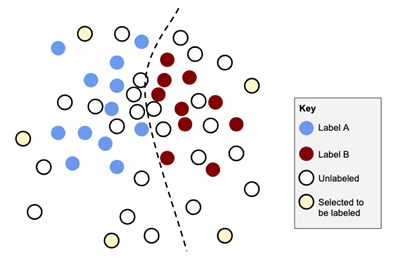

For Uncertainty Sampling, you only wanted to see what was near your current decision boundary: a relatively small and well-defined feature space, like in Figure 4.1. For Diversity Sampling, we want to explore the much larger problem of every corner of our feature space, and expand the decision boundary into new parts of that space. Needless to say, the set of algorithms that you can use are more diverse and sometimes more complicated than for Uncertainty Sampling.

#### 4.1.1   Example data for Diversity Sampling

In this Chapter, we will build on our example from Chapter 2 with disaster response messages. Recall from Chapter 2 that we wanted to label news headlines as “disaster-related” or “not disaster-related”. We implemented a very basic outlier detection algorithm in that chapter, which we will now expand on with more sophisticated Diversity Sampling algorithms.

The code is in the same library that you used for Chapter 2:

[https://github.com/rmunro/pytorch_active_learning](https://github.com/rmunro/pytorch_active_learning)

The code that we will use in this chapter is in this file:

```py
diversity_sampling.py
```

There are many types of diversity that we will cover in this chapter. For our example data, you can imagine that a Machine Learning model could be useful to track disasters as they are being reported and to distinguish eye-witness reports from second-hand or third-hand information. If you want to deploy this kind of system to track disasters in real-time, then you want as diverse a set of past training data items as possible. For example, there might only have been one or two news articles about floods reported in your past training data, which could easily have been missed if you only chose items at random for humans to label.

You can also imagine that there might be completely new types of disasters, like disease outbreaks that have a pattern of infection that hasn’t been observed before. If people are talking about these new disasters in new ways, then you want to ensure that you aren’t missing them and that these new items get human labels as quickly as possible.

Finally, you might also want to start incorporating new sources of data. If some of the new sources are US English vs UK English, or they use different slang, or they are not in English at all, then your model will not be very accurate on those new sources of information. So, you want to make sure that your model can adapt to these new data sources and their stylistic differences as quickly as possible, just like it is adapting to new types of information in the text itself.

It is important to avoid bias at every step. For example, if you use your model predictions to find more examples of floods, but your existing model only has data from floods in Australia, then you might only get more examples from floods in Australia for human review and from no other part of the world. That would mean that you never get away from the initial bias in your model. That is why most Diversity Sampling algorithms are independent of the model we are using. In this chapter, only our first Diversity Sampling algorithm relies on the model, while the next two are unsupervised or draw from the data independent of the current model.

#### 4.1.2   Interpreting neural models for Diversity Sampling

For some of the Sampling strategies in this chapter, we will need new ways to interpret our models.

As recommended in the previous chapter, using a linear activation function in last layer will allow you to better interpret your model’s relationship to the data. If you have access to the raw outputs of a linear activation function, instead of the softmax output, then you can more accurately separate true outliers from items that are the result of conflicting information. An activation function that will also include a negative range, like Leaky ReLU, is ideal, otherwise you might end up with a lot of zero’d-out scores with no way to determine which is the biggest outlier.

You will learn how to access and interpret the different layers of a PyTorch model in the following section. However, you might not have a say about the architecture of the activation function in the final layer: it may be the case that softmax is the most accurate activation function at predicting labels precisely because it can ignore the absolute values of its inputs. In these cases, you might still be able to convince your algorithms team to expose other layers for analysis.

```js
WHAT IF I DON’T CONTROL MY MODEL ARHCITECTURE?
If you don’t have a say into the architecture of the predictive algorithm, then you might be able to convince
your algorithms team to expose the logits or retrain just the final layer of the model with a Leaky ReLU
activation function. Retraining the last layer of the model will be orders of magnitude faster than retraining
an entire model. This should appeal to someone worried about the cost of retraining: they are supporting a new
use case for not much extra work with a fun parallel architecture. If you are using Transformer models, the
same concept applies, but you would train a new Attention head (don’t worry if you are not familiar with
Transformer models, they are not important for this chapter).

If you encounter resistance to the idea of retraining the last layer, or if there are technical barriers, then
your next best option is to use the 2nd-to-last layer of the model. Regardless, it might be interesting to
compare outlier sampling methods on different layers of the model in order to see what works best with your
particular data and model architecture. These kinds of model analytics are some of the most exciting areas of
Machine Learning research today, of interepritability, transfer-learning, and other tasks and we will go deeper
on these methods in later advanced chapters.
```

In this chapter, we will limit ourselves to simple but effective ways to interpret your model, with the two scenarios in Figure 4.2, interpreting the last layer or the 2nd-to-last layer:

```js
Figure 4.2: Two neural architectures and how you can interpret them for outlier detection. In the top example,
you can use the model scores (known as z or logits), which still retain their absolute values before they are
normalized via softmax. In the bottom example, you have lost the absolute values in the final layer because of
the softmax function, so instead you can use the activation in the 2nd-to-last layer to determine whether an
item is an outlier.
```

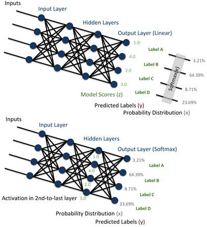

The second method, using the 2nd-to-last layer, will work best on deeper networks where the 2nd-to-last layer more closely resembles the last layer, and where there are fewer neurons in that layer. More neurons will introduce more random variability that can be more difficult to overcome, statistically.

Regardless of which architecture you use, you are left with the same thing: a set (vector/tensor) of numbers representing a level of activation at/near the output of your predictive model. For simplicity, we’ll refer to either vector as z even though z is more typically reserved to mean only the logits from the last layer. We will also use n to indicate the size of that vector (the number of neurons), regardless of whether that happens to be the final layer and therefore also the number of labels, or a middle layer.

Low activation means that this item is more likely to be an outlier. Mathematically, an “outlier” could be any unusual vector: it could be atypically high or atypically low. But when interpreting model predictions to find outliers, we are only concerned with the “low activation” items, that is, items that the model has very little information about today.

#### 4.1.3   Getting information from hidden layers in PyTorch

To get the z values (logits) of the values from hidden layers in the model, we will need to modify our code so that we can access this information. Fortunately, the code is very simple in PyTorch. First, as a reminder, here’s the code from Chapter 2 that you used for the feed-forward steps in training and to generate the confidences and label predictions in inference:

```py
def forward(self, feature_vec):
        # Define how data is passed through the model
 
        hidden1 = self.linear1(feature_vec).clamp(min=0) # ReLU
        output = self.linear2(hidden1)
        return F.log_softmax(output, dim=1)
```

You can see that the middle layer and outputs are variables (`hidden1` and `output`) that hold the activation from each layer (PyTorch tensors in this case, which will be 1D arrays). So, we can simply add a parameter to return all layers, modifying the code accordingly:

```py
def forward(self, feature_vec, return_all_layers=False):
        # Define how data is passed through the model and what gets returned
 
        hidden1 = self.linear1(feature_vec).clamp(min=0) # ReLU
        output = self.linear2(hidden1)
        log_softmax = F.log_softmax(output, dim=1)
 
        if return_all_layers:
            return [hidden1, output, log_softmax]
        else:
            return log_softmax
```

That’s it! You’ll see this modified code in `diversity_sampling.py`  We can now use any part of our model to find outliers within the model. There are other ways that you can query your model’s hidden layers. I prefer encoding the option explicitly in the inference function as with the `forward()` function above. There are many ways that we are going to query our model in future chapters, and this makes for the simplest code to build on.

```js
GOOD CODING PRACTICES FOR ACTIVE LEARNING
As a note on good coding practices, you might want to change the “`return log_softmax`” line in your `forward()`
function to also return an array: “`return [log_softmax]`”. That way, your function is returning the same data
type (an array) no matter what parameters are passed to it, which is a better software development practice. The
downside is that it’s not backwards compatible, so you’ll have to change every piece of code that is calling the
function. If you’re an experienced PyTorch user, you might be accustomed to using a feature where the function
“knows” when it is in training mode or evaluation mode. This can be handy for some common Machine Learning
strategies, like masking neurons when in training but not when predicting. But resist the temptation to use this
feature here: it is bad software development in this context because global variables make unit tests harder to
write and it will make your code harder to read in isolation. Use named parameters like:
`return_all_layers=True/False`
in the example above: you want to extend code in the most transparent way possible!
```

With the addition of the code to allow us to access all layers of the model in inference, we can now use that to determine outliers. Recall that in Chapter 2, you got the log probabilities from your model with this line:

```py
log_probs = model(feature_vec)
```

You can now choose which layer of the model you want to use by calling the function with this line:

```py
hidden, logits, log_probs = model(feature_vector, return_all_layers=True)
```

You have the hidden layer, the logits (z), and the log_probabilities of the model for your item.

Recall from the last chapter that our logits (scores from the last layer) lose their absolute values when converted into probability distributions via softmax. Figure 4.3 reproduces some of these examples:

```js
Figure 4.3: four identical probability distributions that are derived from very different inputs via softmax
with base e.
```

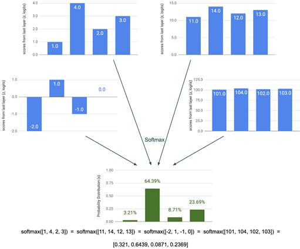

Our probability distributions therefore don’t tell us the difference between uncertainty that derives from the lack of information (as in the left example in Figure 4.3) and uncertainty because of conflicting but highly confident information (as in the right example in Figure 4.3). So, it is better to use the logits (scores from the last layer), where we can differentiate the two types of uncertainty.

Beyond uncertainty, we can find outliers that were certain, but wrong. The most valuable unlabeled items to label are those that were incorrectly predicted and far from the decision boundary. That is, items that the current model is predicting confidently but incorrectly. Low activation across all neurons is often a good signal that there is not yet enough training data with the features found in that item.

---

### 4.2       Model-based outlier sampling

Now that we can interpret our model, we can query our model to find outliers. A model outlier in a neural model is defined as the item with the lowest activation in a given layer. For our final layer, this is simply the logits.

The biggest barrier to choosing the right metric for determining an outlier is knowing the distribution of values from your neurons. You were taught in high school that any data point greater than three standard deviations from the mean is an outlier, but this is only true for normal distributions. Unfortunately, your linear activation functions are not creating normal distributions: they should be bi-modally distributed if they are accurately modeling your task. If you’ve investigated models in the past, you’ll also know that some of the neurons might be modeling noise or simple passing through values, and that this can vary even when training a model twice on identical data.

So, just like we couldn’t trust the absolute values for confidence for Uncertainty Sampling, we can’t trust the absolute values of our neurons to determine outliers. However, just like we could trust the rank order confidence to find the most uncertain predictions, we can also trust the rank order of neuron activation to find the least activated. Ranker order will be a robust method that lets us avoid determining the actual distribution of activation in every neuron.

Here’s a simple example of rank-order for determining how much of an outlier some item is. Let’s assume that we have made predictions for 10 items, and that these were the results from a neuron, ordered (ranked) from largest to smallest:

```py
[2.43, 2.23, 1.74, 1.12, 0.89, 0.23, 0.44, -0.34, -0.36, -0.42]
```

The item with an activation of -0.36 (underlined) is the 9th lowest out of the 10 items, so we can give it an outlier score of 9/10 = 0.9. At either end of the scale, an item with -0.42 activation would have a score of 1.0 and and item with 2.43 activation would have a score of 0. So, we can convert this rank order of activation for each neuron into a scale. The question, then, is what data do we use to generate the ranking?

#### 4.2.1   Use validation data to rank activations

We can’t use the training data for our rankings, as the model has trained on that data and some neurons will have overfit that data more than others.

So, we have to use data from the same distribution as our training data. That is, we have to use a validation data set drawn from the same distribution as our training data. This is not a big difference from an implementation point of view: we simply calculate the rankings on the validation data and then use that ranking to get the outlier score on our unlabeled data, as you’ll see in the code below.

The main difference is that we will get values from the unlabeled data that are between two values in the rankings. We can use simple linear interpolation to calculate these values. For example, let’s assume that our validation data consisted of only 10 items and they happened to be the same as above:

```py
[2.43, 2.23, 1.74, 1.12, 0.89, 0.23, 0.44, -0.34,(-0..35) -0.36, -0.42]
```

Now imagine an unlabeled item had a value of -0.35 (placed above where it would fall in the ranking). That’s halfway between the 8th and 9th lowest out of the 10 items, so we can give it an outlier score of 8.5/10 = 85%. Similarly, if the unlabeled item has a value of -0.355, which is three-quarters of the distance between the 8th and 9th item, then the score would be 87.5%.

We treat values above the first item as 1 and values below the last item as 0, giving us a [0-1] range where the biggest outlier has a value of 100%.

There are different ways to combine the scores across the neurons for each item. It is (statistically) safest to take the average activation across all the neurons for each item. Especially if you are using activation from one of the hidden layers, you might have some neurons that are essentially spitting out random values and will therefore generate a falsely high maximum for what would otherwise be an outlier. Your logits are more likely to be reliable for every value, and so you could experiment with the equivalent of least confidence for logits: the lowest maximum score across all neurons.

To see the results of model-based outlier sampling, run:

```js
> python diversity_sampling.py --model_outliers=95
```

You will see that like in Chapter 2, the code will choose this sampling strategy and select 95 unlabeled items for you to annotate, along with 5 randomly selected items from remaining unlabeled items. As in Chapter 2, we always want to include a small number of random items as a safety net. If you don’t want to evaluate any random items, you can add a random=0 option:

```js
> python diversity_sampling.py --model_outliers=95 --random_remaining=0
```

You can play around with other numbers to see/annotate more or less than 95, too. Note that if you skipped Chapter 2, you will first be asked to annotate a purely random sample until you have enough initial training and test options. This time spent annotating will be important for your evaluation of accuracy and for you to understand the data, so please do these annotations now if you didn’t previously!

Here’s the code for calculating the rank model outlier score, broken up into four chunks of code. The model outlier function takes the current model, the unlabeled data, and held out validation data taken from the same distribution as the training data.

First, we create the rankings on our held-out validation data:

```py
def get_model_outliers(model, unlabeled_data, validation_data, number=5, limit=10000):
    """Get outliers from unlabeled data in training data
    Keyword arguments:
        model -- current Machine Learning model for this task
        unlabeled_data -- data that does not yet have a label
        validation_data -- held out data drawn from the same distribution as the training data
        number -- number of items to sample
        limit -- sample from only this many items for faster sampling.
    An outlier is defined as
    unlabeled_data with the lowest average from rank order of logits
    where rank order is defined by validation data inference
    """
 
    validation_rankings = []
    # 2D array, every neuron by ordered list of output on validation data per neuron   
 
    # Step 1: get per-neuron scores from validation data
    with torch.no_grad():
        v=0
        for item in validation_data:
            textid = item[0]
            text = item[1]
           
            feature_vector = make_feature_vector(text.split(), feature_index)
            hidden, logits, log_probs = model(feature_vector, return_all_layers=True)
   
            neuron_outputs = logits.data.tolist()[0] #logits
           
            # initialize array if we haven't yet
            if len(validation_rankings) == 0:
                for output in neuron_outputs:
                    validation_rankings.append([0.0] * len(validation_data))
                       
            n=0
            for output in neuron_outputs:
                validation_rankings[n][v] = output
                n += 1
                       
            v += 1
      ...
      ...
      ...
```

In the second step, we rank-order each neuron according the scores from the held-out validation data:

```py
def get_model_outliers(model, unlabeled_data, validation_data, number=5, limit=10000):
      ...
      ...
      ...
  
    # Step 2: rank-order the validation scores
    v=0
    for validation in validation_rankings:
        validation.sort()
        validation_rankings[v] = validation
        v += 1
      ...
      ...
      ...
```

In the third step, we rank-order each unlabeled data item according to each neuron:

```py
def get_model_outliers(model, unlabeled_data, validation_data, number=5, limit=10000):
      ...
      ...
      ...
              
 
    # Step 3: iterate unlabeled items
 
    outliers = []
    if limit == -1: # we're drawing from *everything* this will take a while                                              
        print("Get model scores for unlabeled data (this might take a while)")
    else:
        # only apply the model to a limited number of items                                                                           
        shuffle(unlabeled_data)
        unlabeled_data = unlabeled_data[:limit]
 
    with torch.no_grad():
        for item in unlabeled_data:
            textid = item[0]
            if textid in already_labeled:
                continue
 
            text = item[1]
 
            feature_vector = make_feature_vector(text.split(), feature_index)
            hidden, logits, log_probs = model(feature_vector, return_all_layers=True)
           
            neuron_outputs = logits.data.tolist()[0] #logits
              
            n=0
            ranks = []
            for output in neuron_outputs:
                rank = get_rank(output, validation_rankings[n])
                ranks.append(rank)
                n += 1
           
            item[3] = "logit_rank_outlier"
           
            item[4] = 1 - (sum(ranks) / len(neuron_outputs)) # average rank
           
            outliers.append(item)
           
    outliers.sort(reverse=True, key=lambda x: x[4])      
    return outliers[:number:]
```

The ranking function takes the activation value for one unlabeled item for one neuron, and the rankings for that neuron that were calculated on the validation data. You can see the code for rank-ordering each unlabeled item according to the validation rankings here:

```py
def get_rank(value, rankings):
    """ get the rank of the value in an ordered array as a percentage
    Keyword arguments:
        value -- the value for which we want to return the ranked value
        rankings -- the ordered array in which to determine the value's ranking
   
    returns linear distance between the indexes where value occurs, in the
    case that there is not an exact match with the ranked values   
    """
   
    index = 0 # default: ranking = 0
   
    for ranked_number in rankings:
        if value < ranked_number:
            break #NB: this O(N) loop could be optimized to O(log(N))
        index += 1       
   
    if(index >= len(rankings)):
        index = len(rankings) # maximum: ranking = 1
       
    elif(index > 0):
        # get linear interpolation between the two closest indexes
       
        diff = rankings[index] - rankings[index - 1]
        perc = value - rankings[index - 1]
        linear = perc / diff
        index = float(index - 1) + linear
   
    absolute_ranking = index / len(rankings)
 
    return(absolute_ranking)
```

This is simply the implementation of the rank ordering example above. Don’t worry too much about the linear interpolation part: the code is a little opaque when implemented, but it is not capturing anything more complicated than you saw in the examples.

#### 4.2.2   Which layers should I use to calculate model-based outliers?

You might want to try outlier detection on different layers of your model to see if they produce better outliers for sampling.

In general, the earlier the layer, the closer the neurons will be to the raw data. For example, if you chose the input layer from the model, which is the feature vector, then this is almost identical to the outlier detection method that you implemented in Chapter 2. So, any hidden layer is going to fall somewhere between representing the raw data (early layers) and representing the predictive task (later layers).

You could also choose to look at multiple layers at once. This is one of the approaches used in transfer learning with pre-trained models: the model is “flattened” to create one single vector combining all the layers. We’ll cover these in more detail in a later chapter. You could use a flattened model for outlier detection, too, but you might want to normalize by the amount of neurons per layer. For example, in our model the 128 neurons in the hidden layer would become the main contributor to an outlier detection algorithm that also included the 2 neurons from the final layer. So, you might want to calculate the outlier ranking for the layers independently and then combine the two results.

Alternatively, you could sample from both, taking half your model-outliers from the logits and half from the hidden layer. Note that your 128 neurons in the hidden layer probably aren’t very informative if you still only have 1,000 or so training items. You should expect the hidden layers to be noisy and some neurons to be completely random until you have many more labeled training items than neurons in your hidden layer: ideally two or more orders of magnitude more training items than neurons in the layer (10,000+ labeled items).

#### 4.2.3   The limitations of model-based outliers

Here is a summary of the main shortcomings of using your model for sampling outliers:

1. The method can generate outliers that are similar to each other and therefore lack diversity within an Active Learning iteration.
2. It’s hard to escape some statistical biases that are inherent in your model, so you might continually miss some types of outliers.
3. You still need a model in place before you start, and this approach gets better with more training data, so model-based outlier sampling is not suited for a cold start.
4. We are determining an outlier using our unlabeled data. It is easy to accidentally sample the opposite of what we want: things that look the least like the data that we are trying to adapt to with new labels. This is why we use validation data to get our rankings, and this should be your practice for any other kind of model-based outlier detection.

We will cover some solutions to the first issue in later chapters for algorithms that combine Outlier Detection with Transfer Learning. The second, third and fourth issues are harder to overcome. Therefore, if you are sampling model-based outliers, you should consider using other methods of diversity sampling at the same time, including the methods that you can use from a cold start like clustering, which we will cover next.

---

### 4.3       Cluster-based sampling

Clustering can help you target a diverse selection of data from the start. The strategy is fairly straightforward: instead of only sampling training data randomly to begin with, we will also divide our data into a large number of clusters and sample evenly from each cluster.

The intuition for why this works should be equally straightforward. By now, you have probably noticed that there are 10,000s of news articles about local Australian sports teams in the headlines. If we randomly sample the data for human review, we are going to spend a lot of time manually annotating very similar headlines about the results of different sporting matches. However, if we pre-cluster our data, these headlines are likely to end up together in one cluster, and so we will only need to annotate a handful of examples from this sports-related cluster. This will save a lot of time, which can instead be spent annotating data from other clusters. Those other clusters might also represent rarer types of headlines that are important but are so rare that they would have been missed with random sampling. So it is saving time and increasing diversity.

Clustering is by far the most common method for Diversity Sampling in real-world Machine Learning. It is the second method in this chapter purely for educational reasons: you will need to use some of the techniques that you learned in the previous section on interpreting models to get the most out of clustering, especially if you are working with image data. In practice, try this method for Diversity Sampling first.

```js
Figure 4.4: An example of a clustering algorithm applied to the data, splitting it into 5 separate clusters. For
each cluster, the most central item is known as the centroid and the furthest from the centers are outliers.
```

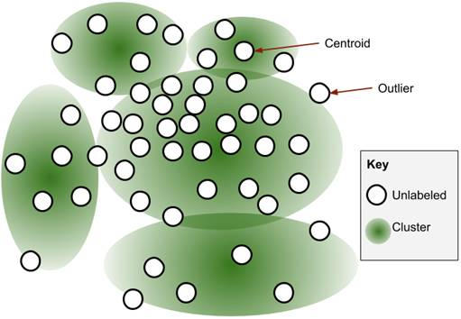

You have probably encountered Unsupervised Learning before, and you’re most likely familiar with K-Means, the clustering algorithm that we will be using. The approaches to unsupervised clustering and clustering for Active Learning are exactly the same, but we will be using the clusters to sample items for human review for labeling, instead of interpreting the clusters or using the clusters themselves in downstream processing.

#### 4.3.1   Cluster members, centroids and outliers

The item that is closest to the center of a cluster is known as the centroid. In fact, some clustering algorithms explicitly measure the distance from the centroid item, rather them from the cluster properties as a whole.

Just like you calculated outliers from the entire dataset in Chapter 2, you can also calculate outliers when using clustering. Outliers are the statistical counterpoint of the centroid: they are the furthest from the center of any cluster.

Figure 4.4 shows an example with 5 clusters, with a centroid and outlier for two of the clusters indicated. The majority of items in Figure 4.4 are in one cluster: the large one in the middle. So, if we sampled randomly instead of by clustering, we would have ended up spending most of the time labeling items that are similar to each other. By clustering first and sampling from each cluster, we can ensure more diversity.

We will sample from clusters in three ways:

1. `Random`: sampling items at random from each cluster. This strategy is close to random sampling, but will spread out our selection across our feature space more evenly than purely random sampling.
2. `Centroids`: sampling the centroids of clusters represent the core of significant trends within our data.
3. `Outliers`: sampling the outliers from our clustering algorithm might also be part of meaningful trends that have been missed in the clusters. Outliers within clustering are sometimes known as “proximity-based” outliers.

Within a single cluster, the ranked centroids are likely to be similar to each other. That is, the item that is the closest to the center is likely to be very similar to that item that is the second-closest to the center. So, we only need to sample one from each cluster.

Similarly, we probably only need to sample a small number of outliers per cluster. It’s possible that the outliers are meaningful trends that the algorithm are missing, but it is more likely that they are genuinely rare: repeated rare words in the case of text or noisy/corrupted images in the case of computer vision. So, you typically only need to sample a small number of outliers: perhaps only one outlier from each cluster if you have a large number of clusters.

To keep it simple in this text, we’ll assume that we are sampling the centroid of each cluster, the single biggest outlier from each cluster, and one additional randomly select item within each cluster.

To run cluster-based sampling, run:

```js
> python diversity_sampling.py --cluster_based=95 --verbose
```

This will sample 95 unlabeled items via cluster-based sampling for you to annotate, along with 5 randomly selected items from remaining unlabeled items.

I recommend running the code with the `verbose` flag, as above, which will print 3 random items from each cluster as the code runs. This will give you an intuition for how well the clusters are capturing meaningful differences, by examining whether the items in the cluster seem semantically related to each other. In turn, this will give you an intuition for how many meaningful different trends in the data are being surfaced for human annotation.

#### 4.3.2   Any clustering algorithm in the universe

As far as I know, no one has studied in-depth whether one clustering algorithm is consistently better than another for Active Learning. There are many pair-wise studies looking at variations on particular clustering algorithms, but not a comprehensive broad one. So if you are interested in this topic, this would make a great research study!

Some clustering algorithms only need a single pass over the data and some can be O(N3) complexity or worse. While the more compute-intensive ones will reach more mathematically well-motivated clusters within your data, that doesn’t necessarily mean that the distribution of information across clusters will be any better or worse for sampling items that need to be labeled.

For the system we will implement here, we don’t want to make the people using the system wait a long time for the clustering algorithm to find the best clusters. So, we’ll choose an efficient clustering algorithm.

```js
Note that while this looks less like “real” clusters than the spheroidal clusters in Figure 4.4, this intuition
is limited by being a 2D example. For higher dimensional sparse data, which you are more likely to be using with
your models, this kind of clustering will often be better than the spheroid one in Figure 4.5. 

Figure 4.5: An example of a clustering algorithm using cosine similarity. For each cluster, the center is defined
as a vector from 0 and the membership of that cluster is the angle between the vector representing the cluster and
the vector representing the item.
```

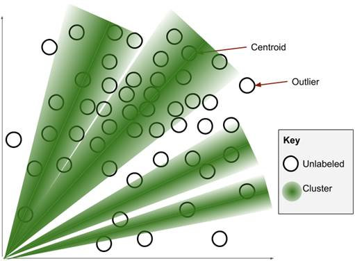

We are going to use a variation of K-Means that uses Cosine similarity as the distance measure, rather than the more typical Euclidean distance. An example is in Figure 4.5. We have high dimensional data and Euclidean distance doesn’t work well in high dimensions. One way to think about this problem is there are very many “corners” in your data. Almost all clustering algorithms are prone to producing unreliable results with high-dimensional data. In our visual examples in this text, like in Figures 4.4, we have two-dimensional examples, and there are only four corners where outliers can hide out away from the center of the data distributions. If we had features in three dimensions, there would obviously be eight corners that outliers could occupy: think of the eight corners of a cube. By the time we get to 300 features, there are 10^90 “corners” in your data, and 10^90 is more than the number of atoms in the observable universe. And you will certainly have more than 300 features in almost any NLP task, so there is a lot of corners of the space in which outliers can occur! For data with 10+ dimensions, 99%+ of the space is in the corners, so if the data is uniformly distributed or even a Gaussian distribution, you will be measuring an artefact of the corners more than the distance, and so it can be unreliable.

You can think of Cosine similarity in terms of looking at stars in the night sky. If you drew a straight line from yourself towards two stars, and measure the angle between those lines, then that angle is used to give the cosine similarity. In the night-time sky example, there are only the three physical dimensions, but in your data there is one dimension for each feature. Cosine similarity is not immune to the problems of high dimensionality, but tends to perform better than Euclidean distance especially for sparse data, like our text encodings.

Cosine similarity measures whether two vectors are pointing in the same direction, but does not measure the “distance”. For example, there might be a small angle between two stars in the sky, but one happens to be much further away. Because you are only measuring the angle, you are treating the stars as equally far away. For this reason, it is sometimes called “Spherical K-Means”, with all data points treated as if they were the same distance from 0 on a multidimensional sphere. This does bring up an issue where data points can accidentally be in the same direction, and therefore erroneously seem similar, but the chance of this is low in high-dimensional data, so this is one area where our high dimensions help. It also makes our calculations simpler. We can calculate a cluster’s vector as the sum of all the vectors (features) of the items in that cluster, and not worry about normalizing by the number of items, because cosine is not sensitive to the absolute values of the distance function.

#### 4.3.3   K-Means clustering with cosine similarity

Given two feature-vectors of the same size, v1 and v2, you can calculate the cosine of the angle between those vectors as:

```js
ϕ CS (v1 ,v2) =(v1 ⋅ v2)  /  max( ||v1 ||2 ⋅ ||v2 ||2)
```

Cosine similarity is a native function in PyTorch, so we won’t go too deeply into the implementation here. The double-line notation indicates the norm of the vector. The intuition of angles between stars in the nighttime sky from the last section, and the example in Figure 4.5, should be enough for you to understand what is going on. If you are interested in reading more about cosine similarity or looking at other distance functions in PyTorch, you can start with the documentation here:

[https://pytorch.org/docs/stable/nn.html#torch.nn.functional.cosine_similarity](https://pytorch.org/docs/stable/nn.html#torch.nn.functional.cosine_similarity)

There are a lot of implementations of clustering algorithms in other popular Machine Learning libraries, too. These other algorithms could work equally as well as the example that you are implementing here. Note that there is a commonly-held belief that clustering algorithms shouldn’t be used for datasets with more than 10,000 items. This isn’t true at all. There have always been clustering algorithms that can work reasonably well with just a single pass of the data, so you shouldn’t think of any limitation according to dataset size, unless you really are trying to trim your processing time to only a few seconds. Even for compute-intensive clustering algorithms, you can often build the clusters in smaller subsets (batches) of the data to build clusters, and the resulting clusters will be almost as good as using the entire data set.

```js
COSINE SIMILARITY AND COSINE DISTANCE ARE THE SAME THING
You might see cosine similarity referred to as “cosine distance” in the literature. These mean exactly the same
thing. In general, clustering algorithms are more likely to use the term “distance” than “similarity”. However,
cosine similarity does not follow the strict definition of the triangle inequality property (Schwarz inequality).
So cosine similarity does not meet the formal definition of a distance metric, hence the name “similarity”. The
terminology is confusing enough in this chapter when we are treat centroids and outliers as complements to get
our [0, 1] range for every sampled item, so don’t let this add to your confusion! Even though “similarity” and
“distance” might seem like opposites, they really mean the same thing in the context of Cosine Similarity and
Cosine Distance.
```

The general strategy for K-Means is as follows:

1. Select the number of clusters you want by working backwards from the number of annotations that you need.
2. Randomly add the data items to one of the initial clusters.
3. Iterate through the items and move them to another cluster if they are closer to that cluster.
4. Repeat 3 until there are no more items to move, or you have reached some predefined limit on the number of epochs through the data.

As noted in the first point above, you should work backwards and choose the number of clusters that makes the most sense given how many items you want to sample from each cluster. For example, if you want to sample 5 items per cluster (1 centroid, 1 outlier, and 3 randomly chosen), and you want to annotate 100 items in this Active Learning iteration through this sampling strategy, then you would select 20 clusters, as 20 x 5 = 100.

For completeness within this text, the full code for K-Means Clustering with Cosine Similarity was implemented. You can see it here in the same code repository within this file:

[https://github.com/rmunro/pytorch_active_learning/blob/diversity_sampling/pytorch_clusters.py[5]](https://github.com/rmunro/pytorch_active_learning/blob/diversity_sampling/pytorch_clusters.py[5])

This K-Means strategy is the same regardless of the distance measure.

The K-Means function takes only two arguments, the data, which can be unlabeled or labeled (in which case the labels are ignored), and the number of clusters you want. You can see the K-Means strategy here:

```py
def get_cluster_samples(data, num_clusters=5, max_epochs=5, limit=5000):
    """Create clusters using cosine similarity
   
    Keyword arguments:
        data -- data to be clustered
        num_clusters -- the number of clusters to create
        max_epochs -- maximum number of epochs to create clusters
        limit -- sample only this many items for faster clustering (-1 = no limit)
   
    Creates clusters by the K-Means clustering algorithm,
    using cosine similarity instead of more common euclidean distance
   
    Creates clusters until converged or max_epochs passes over the data
       
    """
   
    if limit > 0:
        shuffle(data)
        data = data[:limit]
   
    cosine_clusters = CosineClusters(num_clusters)
   
    cosine_clusters.add_random_training_items(data)
   
    for i in range(0, max_epochs):
        print("Epoch "+str(i))
        added = cosine_clusters.add_items_to_best_cluster(data)
        if added == 0:
            break
 
    centroids = cosine_clusters.get_centroids()
    outliers = cosine_clusters.get_outliers()
    randoms = cosine_clusters.get_randoms(3, verbose)
   
    return centroids + outliers + randoms
```

As noted above, you could substitute cosine for any other distance/similarity measure and it might work equally well.

One tactic that you might want to try to speed things up is to create the clusters on a subset of the data, and then assign the rest of the data to its clusters. That gives the best of both worlds: creating clusters quickly and sampling from the entire dataset. You might also want to experiment with different number of clusters and a different number of random selections per cluster.

You’ll remember from high school mathematics that cosine(90°) = 0 and cosine(0°) = 1. This makes our goal of a [0,1] range easy, because cosine similarity already returns values in a [0,1] range when calculated only on positive feature values. For our centroids, this means that we can take the Cosine similarity directly as our diversity score for each item. For the outliers, we will subtract the values from 1 so that we get a value were 1 is the maximum value for the criteria that we are using to sample.

#### 4.3.4   Reduced feature dimensions via embeddings or PCA

Clustering works better for text than for images. If you come from a Computer Vision background, then you know this already. When you looked at the clusters in your examples in this chapter, you could see semantic relationships between items in each cluster. For example, the clusters will all contain news headlines with similar topics. But the same wouldn’t be true if cosine similarity was applied to images, because individual pixels are more abstracted from the content of the images than sequences of characters are from the content of the text. For example, if you applied cosine similarity to images, then you might get a cluster of images that are landscapes, but that cluster might also erroneously include an image of a green car in front of a blue wall.

One way to solve this problem is to use a representation of your data that is less abstract than the pixels. This is one of the strategies that we will cover in a later chapter. This can help with text tasks, too, because a less abstract representation than individual words can have a lower number of features. Fewer features means fewer dimensions for your clustering algorithm, and fewer dimensions will tend to mean better clusters for any type of data for the reasons mentioned earlier.

While most of these strategies are abstract, you have already learned one strategy in this chapter that you can use for clustering images or for lower-dimension features for text: using the hidden layers of your model. Creating a feature representation from internal neurons is known as “embeddings” and the simplest strategy is as follows:

1. Select the number of clusters you want
2. Assign items randomly to your clusters
3. Treat each cluster as a “label” and build a model to classify items into each cluster
4. Iterate through the items and predict which label it has, moving it to the training data of whichever cluster (label) with the highest predicted probability.

You can then use a hidden layer as your feature representation for each item, which you then apply a clustering algorithm to. In this approach, the hidden layers can be thought of as lower dimensional embeddings for image data.

Model design is important here. For text data, your architecture from the last section in this chapter is probably enough: a single hidden layer with 128 neurons. For image data, you probably want more layers and to use a Convolutional Neural Network (CNN) with convolutions and pooling, which will help generalize away from specific pixel locations. In either case, use your intuition from building models for the amount of data you have and the chosen number of clusters (labels).

Another alternative to getting better features is PCA (Principal Component Analysis). PCA is a method to reduce the dimensionality of a data set by combining highly-correlated features. If you have been doing Machine Learning for some time, then you probably thought of PCA as your first option to reduce the dimensionality of the data. PCA was very common for early non-neural Machine Learning for algorithms that would degrade in quality more when there was a high number of dimensions (features) with correlations between features. Neural model-based embeddings are more common in academia today, but PCA is still more common in industry.

Implementing PCA is outside the scope of this book. It’s a good technique to know in Machine Learning, regardless, so I recommend reading more about it so that you have several tools for dimensionality reduction. PCA is not a native function in PyTorch, although I would not be surprised if it was added fairly soon, but the core operation of PCA is SVD "Singular Value Decomposition", which is covered here:

[https://pytorch.org/docs/stable/torch.html#torch.svd](https://pytorch.org/docs/stable/torch.html#torch.svd)

Note that if you have negative values in your vector, like you would if you are clustering on a hidden layer with LeakyReLU as the activation function, then Cosine Similarity will return values in a [-1,1] range instead of a [0,1] range. For consistency, you would therefore want to normalize by adding 1 and halving the result of Cosine Similarity to get a [0,1] range.

For a more dense feature vector, whether that’s from a model or from PCA, you might also consider a distance function other than Cosine. Cosine Similarity is best for large, sparse vectors, like our word representations. You might not want to treat activations of [0.1, 0.1] the same as activations of [10.1,10.1], which Cosine Similarity does. PyTorch also has a built-in distance function for pairwise distance, that might be more appropriate in that case. You can see this function commented out where the cosine function now exists in the `pytorch_clusters.py` file. You can experiment with different distance functions here to see if you get more meaningful clusters. As it says in the code, you might need to normalize your cluster vectors according to the number of items in that cluster, but otherwise you should be able to sub in other distance functions without other changes to the code.

As one final point on advanced clustering for Computer Vision, if you are clustering for Diversity Sampling, it might not matter if the clusters aren’t semantically meaningful. From a sampling point of view, you might get a good diversity of images from across your clusters even if the clusters themselves aren’t semantically consistent. That is, you might be able to ignore embeddings and PCA and just cluster directly on the pixel values. This might give you just as much success. Cosine similarity will create identical vectors for RGB = (50,100,100) and RGB = (100,200,200) so lighter and more saturated versions of the same image might be identical, but this might not matter. But you will probably want to normalize your data because you don’t want extra light images with high RGB values to dominate the clusters. I’m not aware of any in-depth research into whether pixel-level clustering for images is always worse than using a reduced dimension when sampling for Active Learning. So, this would be a valuable research topic for anyone interested in pursuing it!

#### 4.3.5   Other clustering algorithms

In addition to other variations of K-Means, there are some other clustering algorithms and related Unsupervised Machine Learning algorithms that you might want to experiment with:

1. Proximity-based clustering, like K-Nearest Neighbors (K-NN) and Spectral Clustering.
2. Gaussian Mixture Models (GMM).
3. Topic Modeling.

It is outside the scope of this book to talk about every popular clustering algorithm: there are many good books just on clustering. However, we will take a high level look at three algorithms that are often used: K-Nearest Neighbor, Gaussian Mixture Model, and Topic Modeling.

You are probably familiar with K-Nearest Neighbor (KNN) algorithms already. KNN forms clusters based on proximity between a small number of items in that cluster (K items), instead of that cluster as a whole. A strength and limitation of K-Means is that all clusters have a meaningful center, the “mean” itself. You can imagine “L”-shaped clusters or other patterns where there is no meaningful center. KNN therefore allows you to capture these kinds of clusters. The same is true for Spectral Clustering, which is a vector-based clustering method that can also discover more complicated cluster shapes by representing the feature space in new vectors.

However, there is no clear evidence that Proximity-based Clustering is consistently better than K-Means clustering for Active Learning. You might want to separately capture data points at two different extremes in an “L”, because they are sufficiently different even if there is an unbroken link of items between them. Furthermore, your K-Means algorithms will be discovering different kinds of shapes in your features if you build your clusters on hidden layers or PCA-derived vectors, like you learned earlier. Your K-Means algorithm will only discover simple spheroid clusters in the vectors that it learns from, but if those vectors are abstracted from a greater number of features, then your clusters would be more complicated if they are mapped back into those features. In fact, applying K-Means to a vector from a hidden layer is similar to how Spectral Clustering is able to discover different cluster shapes. So, there is no clear advantage for Spectral Clustering for Active Learning, or at least, no one has yet researched this in depth, to the point that one method is clearly better in most use cases.

A Gaussian Mixture Model (GMM) allows an item to be a member of multiple clusters at once. This can lead to more mathematically well-motivated clusters, compared to K-Means which will try to force a cluster boundary where two clusters naturally overlap. You might see GMMs and related algorithms referred to as “soft” vs “hard” clustering or as “fuzzy” clustering. As with Proximity-based Clustering, there’s no strong evidence that GMMs will produce better samples for Active Learning than K-Means. Early in my career I worked with Mixture Models and Active Learning at the same time, but never combined the two: I never felt like other Active Learning techniques were falling short in a way that needed GMMs or similar algorithms to overcome them. So from practical experience I can report that I never found it necessary, but that also means that I haven’t tested GMMs for Active Learning in depth, either: it is another potentially exciting research area!

Topic Modeling is used almost exclusively for text. Topic models explicitly discover sets of related words in a “topic” and the distributions of those topics across documents. The most popular algorithm is Latent Dirichlet Allocation (LDA) and you might simply see Topic Modeling referred to as LDA in the literature. Unlike GMMs, I have seen Topic Modeling used a lot in practice and it is especially common in social media monitoring tools. The related words in a single topic are often semantically related, so an expert user can generate topics and then select the most “interesting” topics for further analysis. This is a form of “Light Supervision”, which is an important Human-in-the-Loop strategy that we will return to in more advanced chapters. Within Diversity Sampling, you could generate “clusters” as topics and sample items from each topic just like with any other clustering mechanism.

For any clustering algorithm, while it might not be better than K-Means for modeling the data, it will be different. This will increase diversity. So, if you have multiple clustering algorithms producing samples for Active Learning, then you are less likely to have biases resulting from the mathematical assumptions of any one clustering method. If you’re already using clustering algorithms on your data for some other reason, try them out as a sampling strategy!

---

### 4.4       Representative Sampling

Representative Sampling refers to explicitly calculating the difference between the training data and the application domain that we want to deploy the model to. In the past two methods, model-based outliers and cluster-based sampling, we did not explicitly try to model the gap between our model and the data where we are evaluating our model’s accuracy.

So, the natural next step is to try to find items that fit this profile: what unlabeled data looks most like the domain where we deploy our model?

```js
Figure 4.6: An example of a representative sampling, showing that the current training data is from a different
distribution of the data than the application domain. Representative sampling maximizes sampling of items that
look the most like the application domain relative to the current training data. 
```

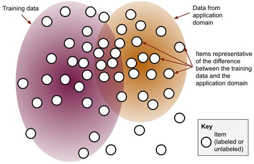

#### 4.4.1   Representative Sampling is rarely used in isolation

It would be understandable if you assumed that Representative Sampling is the best method for Active Learning. If we can sample everything from our unlabeled data that looks the most like data where we want to deploy our models, isn’t that the best approach to become accurate in the domains where we want to deploy our models?

Unfortunately not. Representation Sampling is one of the most powerful Active Learning strategies but also one of the most prone to errors and over-fitting.

For one, in most real-world scenarios your unlabeled data is not from the same domain as where you will deploy your model. If you are deploying a model to identify future news headlines (like in our example here) or to help autonomous vehicles navigate on the road at some point in the future, then you do not have a sample of data from your target domain, you have a sample from an earlier intermediate time. This will be true for most real-world scenarios: you are deploying your model in the future.

So, if you tune your training data too closely to your unlabeled data, then your model will be “stuck in the past” when it is deployed to future data. In some deployment scenarios, like a centralized model processing news headlines, you might be able to adapt to new data in near-real time, so it won’t be a big problem. For other cases, like autonomous vehicles, adapting the model in near real-time and deploying it to every vehicle will be impossible. In either case, you still need a greater diversity of training items than only those that look the most like your current unlabeled data.

Representative Sampling is also the most prone to noise of all the Active Learning strategies in this book. If you have clean training data, then it will often be the noise in your unlabeled data that is the most “different” from that training data. In NLP tasks, this would include corrupted text; text from a language that is not part of your target domain; text that came from a list of places names that didn’t exist in your training data, etc. For Computer Vision, this would include corrupted image files; photos taken accidently (like a camera clicked while pointing at the ground); and artifacts that arise from using different cameras, resolutions or compression techniques. Chances are, none of these types of noise are actually interesting to your task, and so they will not produce an interesting or diverse range of samples to label.

Finally, Representative Sampling can do more harm than good if you apply it only during later cycles of the Active Learning process, especially when you don’t have a domain adaptation problem. For example, imagine that you used Uncertainty Sampling for a few iterations of Active Learning and then applied Representative Sampling for later iterations. You have over-sampled items near the decision boundary in early iterations, so Representative Sampling will over-sample items away from the decision boundary in later iterations. It will be worse than random sampling if you implement it this way.

For these reasons, Representative Sampling is rarely used in isolation, and most often used in algorithms or processes that combine Representative Sampling with Uncertainty Sampling. For example, you might use Representative Sampling only for items that are also near the decision boundary. In some of the foundational academic papers on Representative Sampling you might see that this is exactly what they mean by “Representative Sampling”: a combination of diversity and uncertainty. We will return to combinations of approaches in the advanced chapters, which is where we will get the most out of all the sampling techniques that you are you have been learning here. In this chapter, we’ll introduce Representative Sampling in isolation so that you can understand the basic principles, before learning how to combine it with other methods later.

With these caveats on the limitations, Representation Sampling can be very useful for domain adaptation. In academic research, there is a focus on domain adaptation without any additional labels, where it is often called “Discrepancy” rather than “Representation”. In industry, I am yet to encounter Domain Adaptation without additional human intervention. So, it should become an important tool in your belt.

#### 4.4.2   Simple Representative Sampling 

Like our Clustering example in the previous section, there are many algorithms that you can use for Representative Sampling. We mentioned one already in Chapter 2, where a small modification to our outlier detection method could calculate whether something was an outlier for the training data but not an outlier for the unlabeled data.

Here, we’ll step up the sophistication a little from Chapter 2 and use Cosine Similarity from our training data to our unlabeled data:

Beeart nxv rlsuect tinnogcain ory ngirnait rbcc
Yeerat c snedoc cstrlue natcnoigni uor lenelubad rpss
Smaepl emsti ihwch esdv rkp seartget ruleoti ecsro tkml grk itnnirga erliteva vr trhie eoirult ceosr emtl rdx lledebanu zryz
To try representative sampling, run:

```js
> python diversity_sampling.py --representative=95
```

This will sample 95 unlabeled items using representative sampling for you to annotate, along with 5 randomly selected items from remaining unlabeled items.

The representative sampling function takes the training data and unlabeled data as arguments, in order to find the unlabeled data items that are the most representative of the unlabeled data relative to the training data. Using our Cluster Code above, we can see that this is only a few lines of code:

```py
def get_representative_samples(training_data, unlabeled_data, number=20, limit=10000):
    """Gets the most representative unlabeled items, compared to training data
    Keyword arguments:
        training_data -- data with a label, that the current model is trained on
        unlabeled_data -- data that does not yet have a label
        number -- number of items to sample
        limit -- sample from only this many items for faster sampling (-1 = no limit)
    Creates one cluster for each data set: training and unlabeled
   
   
    """
       
    if limit > 0:
        shuffle(training_data)
        training_data = training_data[:limit]
        shuffle(unlabeled_data)
        unlabeled_data = unlabeled_data[:limit]
       
    training_cluster = Cluster()
    for item in training_data:
        training_cluster.add_to_cluster(item)
   
    unlabeled_cluster = Cluster()
    for item in unlabeled_data:
        unlabeled_cluster.add_to_cluster(item)
 
   
    for item in unlabeled_data:
        training_score = training_cluster.cosine_similary(item)
        unlabeled_score = unlabeled_cluster.cosine_similary(item)
       
        representativeness = unlabeled_score - training_score
       
        item[3] = "representative"            
        item[4] = representativeness
           
                
    unlabeled_data.sort(reverse=True, key=lambda x: x[4])      
    return unlabeled_data[:number:]
```

As with the clustering code, if you are applying this sampling strategy to images, then you might want to use a lower dimension vector that has abstracted the image away from individual pixels. Nothing in the code needs to change if you are using a different dimensionality of features: you are just plugging that new data vector directly into the algorithm.

#### 4.4.3   Adaptive Representative Sampling

A small change to our code means that we can make our Representation Sampling strategy adaptive within each Active Learning iteration. Once we have sampled the most “representative” item, we know that item will later get a label, even if we don’t know that that label will be yet. So, we can add that single item to the hypothetical training data and then run Representative Sampling again for the next item.

This will help prevent Representative Sampling from only sampling items that are very similar to each other.

To try adaptive representative sampling, run:

```js
> python diversity_sampling.py --adaptive_representative=95
```

This will sample 95 unlabeled items using adaptive representative sampling for you to annotate, along with 5 randomly selected items from remaining unlabeled items.

The new code here is even shorter, taking the same arguments and calling the representative sampling function once for each new item:

```py
def get_adaptive_representative_samples(training_data, unlabeled_data, number=20, limit=5000):
    """Adaptively gets the most representative unlabeled items, compared to training data
   
    Keyword arguments:
        training_data -- data with a label, that the current model is trained on
        unlabeled_data -- data that does not yet have a label
        number -- number of items to sample
        limit -- sample from only this many items for faster sampling (-1 = no limit)
       
    Adaptive variant of get_representative_samples() where the training_data is updated
    after each individual selection in order to increase diversity of samples
   
    """
   
    samples = []
   
    for i in range(0, number):
        print("Epoch "+str(i))
        representative_item = get_representative_samples(training_data, unlabeled_data, 1, limit)[0]
        samples.append(representative_item)
        unlabeled_data.remove(representative_item)
       
    return samples
```

With our building blocks of clusters and representative sampling, it is therefore a small extension code-wise to start implementing more sophisticated Active Learning strategies. We will cover more of these advanced techniques in detail in the next chapter. The code will be as short in most cases, but it is important to know the building blocks.

Note that this function will take a while to run. It needs to re-evaluate the representative score for every unlabeled data point that you are sampling. So if you are running this on a smaller server or personal computer, you might want to lower the `number` of items to sample or the `limit` on items to consider, so that you can see the results of this sampling strategy without waiting for a long time.

---

### 4.5       Sampling for real-world diversity

Strategies for identifying and removing bias from Machine Learning models are complicated and they could fill a book of their own. In this text, we will concentrate on the data problem: ensuring that training data represents real-world diversity as fairly as possible. As you read in the introduction for this chapter, we expect more from Machine Learning in some cases than we do from people. For example, a typical English speaker knows about 40,000 words from English’s 200,000-word vocabulary, which is only 20% of the language. However, if you deploy a Machine Learning algorithm that understands English, then you probably want that algorithm to understand a fuller diversity of the English language than most people: not just 40,000 words.

So, this section covers the current best practice for ensuring that models are fair from an Active Learning point of view, knowing that it is a complicated field that still has a long way to do.

4.5.1   Common problems in training data diversity
Three commons problems for fairness in data are summarized in Figure 4.7. Each of the three demographics in Figure 4.7 show common problems that you will find when trying to create training data:

1. A demographic that is over-represented in your training data, but not from the same distribution as your training data (X).
2. A demographic that is from a distribution similar to the overall data distribution, but is not yet represented in a balanced way in the training data (O).
3. A demographic that is underrepresented in the training data in such a way that the resulting model might be worse than if random sampling was used (Z).

```js
By contrast, demographic Z is clustered outside the current training data. Even worse, there is a Z data point
inside the current training data that looks to be an outlier for Z. So, it is not just the case that the model
doesn’t have information about Z, it might actually be modelling Z incorrectly. Z is typical of an underrepresented
demographic, like an underrepresented ethnicity that does not appear in the dataset except where that person happens
to share features with a more privileged demographic.
Demographic O is partially in the training data today and partially outside of it. O is distributed across the 
entire feature range fairly even. So, if we can collect training data that is representative of the entire feature 
space, we are the least worried about O. O is typical of a demographic with minimal bias (positive or negative),
like time-based demographics where each item was collected carefully over a period of time.

Demographic X looks pretty good. All the examples we have so far are within the current training data. X is not the
same distribution as the training data as a whole. This isn’t typically a problem with neural models, but it could
be a problem with simpler models like Naive Bayes. X is typical of a privileged demographic with a positive bias,
like standard English data within a multilingual datasets.

Figure 4.7: An example of the problems that Diversity Sampling tries to address. Here, we have items mapped to three
real-world demographics that we’re calling X, O & Z.
```

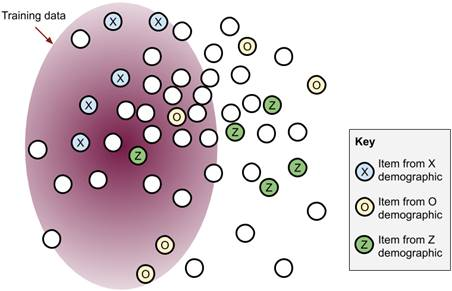

Machine Learning algorithms themselves are not prone to many inherent biases. Most of the bias comes from the training data, so if you are responsible for the training data in your organization, then model fairness is your responsibility more than anyone else.

#### 4.5.2   Stratified sampling to ensure diversity of demographics

Without a reference data set of unlabeled items from each demographic, you need to apply Active Learning strategies that you have applied before, now in a stratified manner across all your data:

1. Apply Least-Confidence for every demographic, selecting an equal number of items in each demographic where that demographic was the most confident prediction.
2. Apply Margin of Confidence sampling for every demographic, selecting an equal number of items in each demographic where that demographic was the most confident or second most confident (recall that Margin of Confidence is explicitly looking at the top two most confident)
3. Apply Model-based Outlier Detection for each demographic.
4. Apply Cluster-Based Sampling within each demographic.

Basically, in the same way that wanted the best possible dataset from your unlabeled data as a whole, you now want to do this for each demographic, while being careful to stratify the sampling across those demographics.

There is no separate code for this in this chapter: you should be able to divide up the data according to demographics that you care about and apply the sampling strategies only to data for each demographic.

#### 4.5.3   Represented and Representative: which matters?

There is a subtle but important difference between data that is representative of a demographic, and having the demographic be well-represented in the data. The distinction is especially important depending on the type of model you are using, so we will tease them apart here:

1. `Representative Demographic Data`: your data is representative of a demographic if it is drawn from the same distribution as that demographic. In statistical terms, your labeled data is representative if it is independent and identically distributed (IDD) from a data set that fairly represents that demographic.
2. `A Demographic that is Well-Represented`: A demographic is well-represented if there is sufficient data representing that demographic for your model to perform fairly, but does not require that data is IDD.

If you know that your unlabeled data fairly represents the demographic you care about and it is accurately encoded for that demographic, then you can create an additional evaluation data set that that draws randomly from within each demographic. If your demographics are not equally frequent, this will be faster than creating evaluation data by randomly sampling from across the entire data set. However, you can only use this data set for evaluating your per-demographic accuracy (see a later section on this chapter for more on this).

Remember, your unlabeled data may not be representative of each demographic. For example, our data in this chapter came from an Australian media organization, and so it focuses on news within Australia and from countries that are geographically or politically close to Australia. So, for example, articles about Uganda are not going to be representative of actual events in Uganda: it will be biased towards events that are more important for Australia. It is not possible to get “representative” data for Uganda in this case. Instead, you should use clustering to get as diverse a set of articles about Uganda as possible, so that at the very least, articles about Uganda are well-represented.

If you are using a neural model, then you might be ok if you have well-represented data that is not representative. Provided there is enough data, a neural model can be accurate for all items in a given demographic even if trained on data that was imbalanced within that demographic. For example, the Uganda news articles might be balanced too much towards sports-related articles. Provided there are sufficient examples of the other types of news from Uganda for your model to be accurate on those topics, then it won’t matter that sports-related news is over-represented: your model will be accurate on all types of news from Uganda.

However, if you are using generative models, especially simpler ones like Naïve Bayes, then your model is explicitly trying to model the classification task by assuming representative data. In these cases, you would need to work harder to ensure that your data is representative or to try to encode representativeness in your model by manipulating parameters like the prior probability of certain data types.

#### 4.5.4   Limitations of sampling for real-world diversity

The biggest shortcoming of sampling for real-world diversity is that there is no way to guarantee the model will be perfect, but you can obviously ensure that it will be much fairer than if you only used random sampling. In the section on evaluating accuracy below, you will also see some new ways for calculating accuracy on a per demographic basis.

Sometimes, you won’t be able to make up for the bias, simply because there isn’t enough unlabeled data available. For example, I have worked in disaster response in languages like Haitain Kreyol and Urdu, which were not in large enough volumes to cover the full breadth of potential disasters that we have for the English headlines. There is no way to fix this problem with labeling alone, and so we will return to these kinds of problems in later chapters focused on creating synthetic training data.

---

### 4.6       Diversity Sampling with different types of models

You can apply Diversity Sampling to any type of Machine Learning architecture. As you learned with Uncertainty Sampling in the last chapter, sometimes this is no different than in Neural models, and sometimes Diversity Sampling is unique to a given type of Machine Learning model.

#### 4.6.1   Model-based outliers with different types of models

For models using Linear Regression, you can calculate model outliers in the same way as for a Neural Model: which items have the least activation across all labels? Use the pre-normalized prediction scores, if you have access to them, like you did with the logits in this chapter.

In the case of Bayesian models, a model-based outlier has the lowest overall probability of each label. As with our neural models here, you could calculate “lowest overall” as the lowest average or the lowest maximum, depending on what makes the most sense for your use case.

In the case of Support Vector Machines, you can look for predictions that are near the hyperplane (decision boundary) but are the maximal distance from the support vectors themselves: the training items that determine the decision boundary. These items will be the equivalent of the model outliers that have high uncertainty in neural models.

#### 4.6.2   Clustering with different types of models

You can use the unsupervised clustering methods in this chapter, like K-Means, to sample for any supervised Machine Learning algorithm. There is no need to change the K-Means approach for different types of supervised Machine Learning algorithms, so you can start with the ones in this chapter and then think about refining them based on your model and data.

If you do want to go deeper into cluster-based sampling, there was a lot of research into Diversity Sampling in the 2000’s. Support Vector Machines (SVMs) were at their peak popularity at the same time, so you will need to brush on your SVM knowledge to get the most out of the research at that time.

#### 4.6.3   Representative Sampling with different types of models

Like we mentioned earlier in the chapter, you could use Naive Bayes or Euclidean Distance for Representative Sampling instead of Cosine Similarity. Any distance function could be as good for your particular data, and we only used Cosine Similarity in this book because of the continuity from the previous section on clustering. If you changed the distance function in the clustering algorithm from Cosine Similarity to the probability of cluster membership, then this edit of just a few lines of code would be enough to try Bayesian Clustering.

Decision Trees offer a unique type of Diversity Sampling. You can look at where the number of predictions in different leaves differs from training to evaluation data. For example, let’s imagine that your decision tree has 10 leaves, and all 10 leaves have an equal number of items when predicting your validation data. Now imagine that when you apply the model to your unlabeled data, 90% of that data ends up in just one leaf. That one leaf obviously represents the type of data in your target domain much better than your training data so far. So, you should sample more items from within the leaf with 90% of the data, knowing that data is more important for where you will deploy your model.

#### 4.6.4   Sampling for real-world diversity with different types of models

The strategies for improving diversity in your neural models can all be applied to other types of Machine Learning models: you want to ensure that you are optimizing for the same number of labels for each demographic and for equal accuracy for each demographic.

---

### 4.7       Evaluating models for Diversity Sampling

We can extend the Precision, Recall, F-Score and AUC accuracy metrics that we learned in Chapter 2 to better capture accuracy across the diversity of our data set. In this section we will look at Micro vs Macro Precision, Recall, and F-Score; calculating Precision, Recall, and F-Score across real-world demographics; and Micro vs Macro AUC.

#### 4.7.1   Micro and Macro Precision, Recall, and F-Score

In Chapter 2, we calculated the Precision, Recall, and F-Score for one of the labels, ‘disaster related’

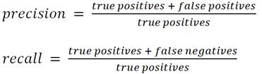

For the general equation to calculate precision and recall across multiple labels, we take our true positives (TP), false positives (FP), and false negatives (FN), and simply sum them across all labels (n). By treating every data point equally for our calculation we can calculate our precision (P) and recall (R) as:

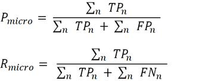

They are known as the “Micro Precision” and “Micro Recall” because they are calculating accuracy at the “micro” level, that is, at the level of each data point. If you have seen someone describe the overall precision and recall for a model in the past where they had multiple labels, then they were most likely reporting the Micro Precision and Recall.

Note that if you’re including every label then your Micro Precision and Micro Recall will be the same number, because every False Positive for one label is also a False Negative for another label. In many real-world situations, you’ll have a catch-all label equivalent to “not relevant” that you don’t want to explicitly include in your accuracy score, except where it contributes to False Negatives or False Positives for other labels. You might also want to declare an uncertainty threshold for which you don’t predict any label, in which case those items would be counted as False Negatives but not as False Positives. In both these real-world scenarios, your Micro Precision and Micro Recall will most likely be different numbers.

The Micro F-Score (F), like in Chapter 2, takes the harmonic mean of Precision and Recall:

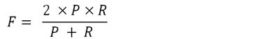

If you have one label that is much more frequent than the other, then that will contribute the most to the Micro Precision, Micro Recall and Micro F-Scores. This might be what you want in some cases, as it gives you an accuracy number that is weighted by the labels in your test data.

However, what if you know that your test data is not balanced across the labels that your model will encounter in the real-world, or that you want your model to be equally accurate in predicting all labels regardless of how frequent they are?

The solution is to calculate each Precision and Recall value separately for each label, and then average them:

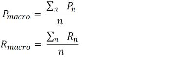

Because we are calculating the accuracy at the label level, rather than at the individual item level, this method is known as Macro Precision and Macro Recall.

Depending on your data, you will need to decide if some labels are inherently more difficult for a model to label correctly, or if Active Learning to select more examples of that label is needed to bring up the accuracy for that label.

As a side note, for multi-class problems there are two different ways to calculate Micro Precision and Recall values: per item and per prediction. This distinction is rare: I’ve only seen it in a handful of academic papers and never in industry. If you have an equal number of predictions per item, it doesn’t matter. But if you have more labels predicted for some items, then you might be weighting more heavily towards that item if you are counting each prediction. Both the per-prediction and per-item are equally valid from a statistical point-of-view, so it will come down to what is the best way to measure accuracy for your data and use case.[[6]](https://livebook.manning.com/book/human-in-the-loop-machine-learning/chapter-4/v-6/id_ftn6)

#### 4.7.2   Per-demographic accuracy

If we have real-world demographics in our data, we can calculate a variation of Macro Accuracy according to those demographics.

For each item belonging to a certain demographic, how many of those were predicted correctly for their given labels? Note that each “error” will be both a False Positive and a False Negative. So, unless you are excluding certain labels from your accuracy or you are setting a threshold for trusted predictions, then you will have identical Precision and Recall values for per-demographic accuracy (the same situation as for Micro Precision and Recall above).

Let `d` indicate each demographic. The Precision and Recall are therefore:

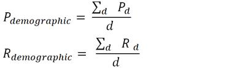

I haven’t seen this used very often in industry, but that doesn’t mean that it shouldn’t be adopted. Most studies of demographic inequality have tended to be ad-hoc. For example, for face recognition, there are many examples of popular media organizations selecting a small number of images from people representing different ethnicities and looking for different levels of accuracy across those ethnicities. In those use cases, the media organizations are texting Precision, only, and on a small and possibly non-representative sample. That works for a media story, but not if we are serious about improving the fairness of our models.

If you are responsible for building the model and ensuring that it is as fair as possible, you should look at a broader range of ways to measure accuracy. You might want to refine demographic-based accuracy further, according to your use case. Here are some options:

1. `Minimum Accuracy`: the lowest Precision, Recall, and/or F-score of any demographic. If you want to treat your model as only being only as strong as its weakest link in terms of fairness across demographics, you should take the minimum accuracy. You could take the minimum F-score from one demographic, or for a harsher metric take the minimum Precision and minimum Recall, possibly from different labels, and apply the F-score to those.
2. `Harmonic Accuracy`: the Harmonic Mean of the per-demographic accuracy. This will be harsher than the average demographic accuracy, but not as harsh as taking the minimum (unless there are 0 values). To look at it another way, just like we take the Harmonic Mean of Precision and Recall to get the F-Score, instead of the Arithmetic Mean, we could also take the Harmonic Mean. The Harmonic Mean will punish outlier low accuracies more than it rewards outlier high accuracies, but not as much as taking the minimum.

#### 4.7.3   Macro and Micro AUC

Just like we can calculate Micro and Macro Precision, Recall, and F-score, we can calculate Micro and Macro AUC. Recall from Chapter 2 that AUC is the probability that of any two randomly selected item predictions, the correct label was predicted with higher confidence.

I’ll omit the new equations, as they are no different to what you have already seen for AUC in Chapter 2 and the equations above, and simply summarize them here:

1. `Micro AUC`: Calculate the AUC, but instead of calculating it for items in just one label, calculate it for all items across all labels.
2. `Macro AUC`: Calculate the AUC for each label separately, then take the average AUC of all labels.

---

### 4.8       Deciding on the right number of items for human review

#### 4.8.1   Deciding on the right ratio of samples from Diversity Sampling and Uncertainty Sampling

The separation of Uncertainty Sampling and Diversity Sampling in the last two chapters was to introduce the two concepts separately. In most real-world situations, you will employ strategies that combine the two. There are some advanced Active Learning algorithms in the next Chapter that combine aspects of each into a single sampling algorithm.

In the code example in Chapter 2, you saw that Uncertainty Sampling was used to sample more items than Diversity Sampling. This has generally been true in the Active Learning systems that I have seen in practice: people have favored Uncertainty Sampling as their primary technique for Active Learning and augmented it with a smaller amount of Diversity Sampling to ensure that nothing important has been completely overlooked. However, some of these same systems have run into trouble for their lack of real-world diversity, so maybe Diversity Sampling needs more attention going forward.

---

### 4.9  Summary

- There are four common approaches to Diversity Sampling that we covered in this chapter: Model-based Outlier Sampling, Cluster-based Sampling, Representative Sampling, and Sampling for Real-World Diversity. These can help you understand the different kinds of “unknown unknowns” in your models.

- Model-based Outlier Sampling allows you to sample items that are unknown to your model in its current state. This helps you expand your model’s knowledge where it is currently “blind”.

- Cluster-based Sampling allows you to sample items that are statistically representative of the entire distribution of your data. This helps you expand your model’s knowledge to capture all the meaningful trends in your data, including the rarer ones that would likely be missed with random sampling.

- Representative Sampling can be used to sample items that are maximally representative of where you are going to deploy your model. This helps you adapt your model to domains that are different from your current training data, which is a common problem in real-world Machine Learning.

- To support Real-World Diversity, you need to deploy all of your techniques from Uncertainty Sampling and Diversity Sampling. This will make your applications more accurate across a diverse set of users and therefore more fair.

- Interpreting the layers of a neural model for Diversity Sampling lets you access as much information as possible for Active Learning. This gives you more options for calculating model outliers and provides a building block for more advanced transfer learning techniques.

- Implementing Diversity Sampling is possible in with any Supervised Machine Learning algorithms, including Neural Models, Bayesian Models, SVMs, and Decision Trees. This means that you can implement Active Learning with any type of Machine Learning algorithm that you are currently using and don’t need to switch to the Neural models that are the focus of the examples in this book. You might even decide to try some of these additional algorithms for Active Learning, to take advantage of some of their unique properties.

- The strategies for deciding how many items should be reviewed by humans when implementing Diversity Sampling are different from Uncertainty Sampling, because in some cases they can be adaptive within in each iteration of Active Learning. This allows you to make the Human-in-the-Loop Machine Learning feedback loop more efficient, because you don’t have to wait for your model to retrain.

- Different accuracy metrics such as Micro and Macro F-Score capture how well your model is performing across a diverse range of data. This gives you better insight into how your model is improving over the data and labels that you care the about most.

### Reference

[[5]](https://livebook.manning.com/book/human-in-the-loop-machine-learning/chapter-4/v-6/id_ftnref5) To be be moved out of the diversity_sampling branch after review

[[6]](https://livebook.manning.com/book/human-in-the-loop-machine-learning/chapter-4/v-6/id_ftnref6) For an example, see: [https://arxiv.org/pdf/1609.00288.pdf](https://arxiv.org/pdf/1609.00288.pdf)